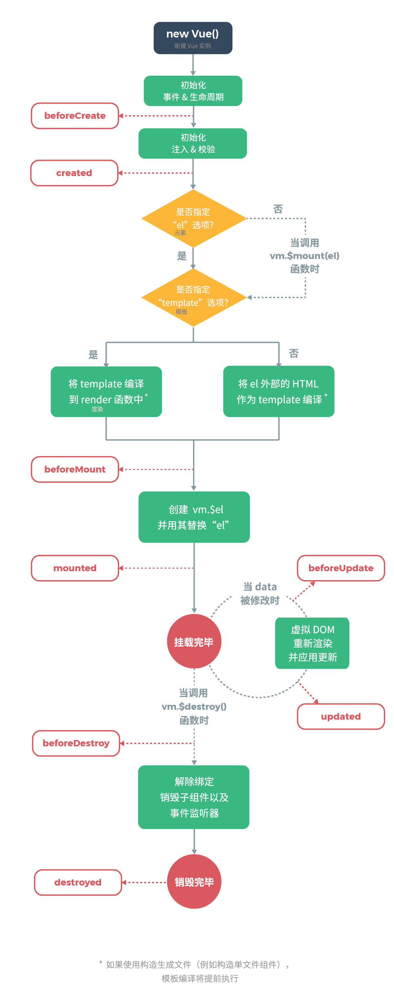
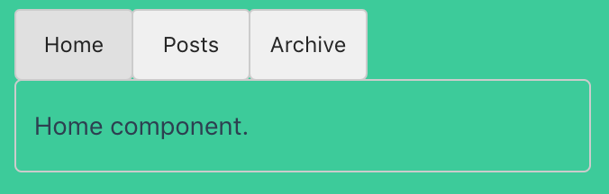

# 01 基础 

## 目录(Catalog)
- 1.1 安装
    + 1.1.1 `Vue Devtools`
    + 1.1.2 直接用 `<script>` 引入
        + 1.1.2.1 `CDN`
    + 1.1.3 `NPM`
    + 1.1.4 命令行工具
    + 1.1.5 对不同构建版本的解释
        - 1.1.5.1 术语
        - 1.1.5.2 运行时 + 编译器 vs. 只包含运行时
        - 1.1.5.3 开发环境 vs. 生产环境模式
        - 1.1.5.4 `CSP` 环境
    + 1.1.6 开发版本
    + 1.1.7 `Bower`
    + 1.1.8 `AMD` 模块加载器
- 1.2 介绍
    + 1.2.1 `Vue.js` 是什么?
    + 1.2.2 起步
    + 1.2.3 声明式渲染
    + 1.2.4 条件与循环
    + 1.2.5 处理用户输入
    + 1.2.6 组件化应用构建与自定义元素的关系
    + 1.2.7 你准备好了吗?
- 1.3 `Vue` 实例
    + 1.3.1 创建一个 `Vue` 实例
    + 1.3.2 数据与方法
    + 1.3.3 实例声明周期钩子
    + 1.3.4 生命周期图示
- 1.4 模板语法
    + 1.4.1 插值
        - 1.4.1.1 文本 
        - 1.4.1.2 原始 `HTML`
        - 1.4.1.3 `Attribute`
        - 1.4.1.4 使用 `JavaScript` 表达式
    + 1.4.2 指令
        - 1.4.2.1 参数 
        - 1.4.2.2 动态参数
        - 1.4.2.3 修饰符
    + 1.4.3 缩写
        - 1.4.3.1 `v-bind` 缩写
        - 1.4.3.2 `v-on` 缩写
- 1.5 `计算属性`和`侦听器` (`Computed Properties` and `Watchers`)
    + 1.5.1 计算属性
        - 1.5.1.1 基础例子
        - 1.5.1.2 计算属性缓存 vs 方法
        - 1.5.1.3 计算属性 vs 侦听属性
        - 1.5.1.4 计算属性的 setter
    + 1.5.2 侦听器
- 1.6 `class` 与 `style` 绑定
    + 1.6.1 绑定 `HTML class`
        - 1.6.1.1 对象语法 
        - 1.6.1.2 数组语法
        - 1.6.1.3 用在组件上
        - 1.6.1.4 - Added
    + 1.6.2 绑定内联样式
        - 1.6.2.1 对象语法
        - 1.6.2.2 数组语法
        - 1.6.2.3 自动添加前缀
        - 1.6.2.4 多重值 
- 1.7 条件渲染
    + 1.7.1 `v-if`
        - 1.7.1.1 在 `<template>` 元素上使用 `v-if` 条件渲染分组
        - 1.7.1.2 `v-else`
        - 1.7.1.3 `v-else-if`
        - 1.7.1.4 用 `key` 管理可复用的元素
    + 1.7.2 `v-show` 
    + 1.7.3 `v-if` vs `v-show`
    + 1.7.4 `v-if` 与 `v-for` 一起使用
- 1.8 列表渲染
    + 1.8.1 用 `v-for` 把一个数组对应为一组元素 
    + 1.8.2 在 `v-for` 里使用对象
    + 1.8.3 维护状态
    + 1.8.4 数组更新检测
        - 1.8.4.1 变异方法
        - 1.8.4.2 替换数组
        - 1.8.4.3 注意事项
    + 1.8.5 对象变更检测注意事项
    + 1.8.6 显示过滤/排序后的结果
    + 1.8.7 在 `v-for` 里使用值范围
    + 1.8.8 在 `<template>` 上使用 `v-for`
    + 1.8.9 `v-for` 与 `v-if` 一同使用
    + 1.8.10 在组件上使用 `v-for`
- 1.9 事件处理
    + 1.9.1 监听事件 
    + 1.9.2 事件处理方法
    + 1.9.3 内联处理器中的方法
    + 1.9.4 事件修饰符
    + 1.9.5 按键修饰符
        - 19.5.1 按键码
    + 1.9.6 系统修饰键
        - 1.9.6.1 `.exact` 修饰符
        - 1.9.6.2 鼠标按钮修饰符
    + 1.9.7 为什么在 `HTML` 中监听事件?
- 1.10 表单输入绑定
    + 1.10.1 基础用法 
        - 1.10.1.1 文本
        - 1.10.1.2 多行文本
        - 1.10.1.3 复选框
        - 1.10.1.4 单选按钮
        - 1.10.1.5 选择框
    + 1.10.2 值绑定
        - 1.10.2.1 复选框
        - 1.10.2.2 单选按钮
        - 1.10.2.3 选择框的选项
    + 1.10.3 修饰符
        - 1.10.3.1 `.lazy`
        - 1.10.3.1 `.number`
        - 1.10.3.1 `.trim`
    + 1.10.4 在组件上使用 `v-model`
- 1.11 组件基础
    + 1.11.1 基础示例 
    + 1.11.2 组件的复用
        - 1.11.2.1 `data` 必须是一个函数
    + 1.11.3 组件的组织
    + 1.11.4 通过 `Prop` 向子组件传递数据
    + 1.11.5 单个根元素
    + 1.11.6 监听子组件事件
        - 1.11.6.1 使用事件抛出一个值
        - 1.11.6.2 在组件上使用 `v-model`
    + 1.11.7 通过插槽分发内容 
    + 1.11.8 动态组件
    + 1.11.9 解析 `DOM` 模板时的注意事项


## 生词(New Words)
- **reverse [rɪ'vɜːs] --adj.相反的. --v.逆转, 颠倒. --n.相反, 背面**
    + Reverse Proxy 反向代理, 逆向代理
    + We should see the reverse as well as the obverse of things. 我们应该看到事物的反面和正面. 
- **obverse ['ɒbvɜːs]  --n.表面; 正面,前面. --adj.表面的; 正面的**
    + We should see the reverse as well as the obverse of things. 
      我们不但应该看到事物的正面, 也要看到事物的反面. 
- **as well as  --也；除...之外；不仅...而且**
    + He called on you as well as me. 他不仅拜访了我, 也拜访了你. 
    + He is a friend in word as well as in deed
        ([diːd] --n.行动, 功绩, 证书). 他是个言行如一的朋友. 
- **throttle ['θrɒt(ə)l] --n.节流(阀); 喉咙; 风门.**
- **debounce [di'bauns] --n.防抖**
- **prevent [pri'vɛnt] --vt.防止; 预防; 阻止; 避免;**
    + prevent progress. 妨碍进步[进行].
    + prevent traffic accidents. 防止交通事故.
    + We prevented the fire from spreading. 我们阻止火势蔓延.
    + I was prevented from attending by a cold. 感冒使得我不能出席.
    + Business prevented his going = Business prevented him going. 他因有事而不能去.
- **propagation [ˌprɒpə'ɡeɪʃən] --n.传播; 繁殖;**
    + the propagation of the principles of science. 科学原理的传播.
- **passive ['pæsɪv] --adj.被动的, 消极的, 被动语态的.  --n.被动语态**
    + passive DNS. 被动 DNS
    + passive smoking 被动吸烟; 吸二手烟
    + We should translate this sentence in passive voice. 我们应该用被动语态翻译这个句子.
- **exact [ɪg'zækt] --adj.精确的, 确切的**
    + Do you have any idea of the exact date? 你知道具体是在哪一天吗？
    + See `npm help json` for definitive documentation on these fields and exactly what they do.
      请参阅 `npm help json` 以获取有关这些字段的权威文档及其确切功能.
- **toggle ['tɒg(ə)l] --vt.切换, 转换 --n.触发器**
    + You can toggle it while running a game by using the "F5" key. 你可以在游戏运行时按 F5 切换是否使用此功能. 
- **enlarge [ɪn'lɑrdʒ] --vt.使增大; 扩大; 放大. --vi.扩大; 放大**
    + enlarge(vt) a photograph. 放大照片.
- **dwindle ['dwɪndl] --vi.渐渐变小; 逐渐变小**
    + The population is dwindling. 人口在逐渐减少.
- **tab [tæb] --n.标签; 账单; 制表**
    + The first tab is appended at this time. 第一个标签页是在这个时候加载的.
    + Quick Tab. 快速标签.
- **post [post] --n.邮件; 职位; 柱子; 标杆. --v.邮寄; 公布; 张贴. --vi.快速行进**
    + tab posts. 标签页
    + The post(n) hasn't come yet. 邮件还没来.
    + I had a heavy post(n) yesterday. 我昨天收到很多邮件.
    + the Sunday Post(n). 星期日邮报.
    + I posted(vt) him a Christmas card. 我寄给他一张圣诞卡.
- **archive [ˈɑ:kaiv] --v.存档  --n.档案文件**
    + tab archive. 标签档案.
    + This repository has been archived by the owner. It is now read-only. 该存储库已由所有者归档. 他现在是只读的. 


## 1.1 安装
兼容性: `Vue` 不支持 `IE8` 及以下版本, 因为 `Vue` 使用了 `IE8` 无法模拟的 `ECMAScript 5` 特性. 但它支持所有兼容 `ECMAScript 5` 的浏览器. 


语义化版本控制：Vue 在其所有项目中公布的功能和行为都遵循[语义化版本控制](https://semver.org/lang/zh-CN/)。对于未公布的或内部暴露的行为，其变更会描述在[发布说明](https://github.com/vuejs/vue/releases)中。


更新日志: 

+ 最新稳定版本: xx.xx
+ 每个版本的更新日志见: [Github](https://github.com/vuejs/vue/releases)


### 1.1.1 Vue Devtools

在使用 Vue 时，我们推荐在你的浏览器上安装 [Vue Devtools](https://github.com/vuejs/vue-devtools#vue-devtools)。它允许你在一个更友好的界面中审查和调试 Vue 应用。


### 1.1.2 直接用 `<script>` 引入

直接下载并用 `<script>` 标签引入，`Vue` 会被注册为一个全局变量。

在开发环境下不要使用压缩版本，不然你就失去了所有常见错误相关的警告!

[开发版本](https://cn.vuejs.org/js/vue.js)  (包含完整的警告和调试模式)

[生产版本](https://cn.vuejs.org/js/vue.min.js)  (删除了警告，33.46KB min+gzip)


#### 1.1.2.1 CDN

对于制作原型或学习, 你可以这样使用最新版本:
```html
<script src="https://cdn.jsdelivr.net/npm/vue@2.6.14/dist/vue.js"></script>
```

对于生产环境, 我们推荐链接到一个明确的版本号和构建文件, 以避免新版本造成的不可预期的破坏:
```html
<script src="https://cdn.jsdelivr.net/npm/vue@2.6.14"></script>
```

如果你使用原生 ES Modules, 这里也有一个兼容 ES Module 的构建文件:
```html
<script type="module">
  import Vue from 'https://cdn.jsdelivr.net/npm/vue@2.6.14/dist/vue.esm.browser.js'
</script>
```

你可以在 [cdn.jsdelivr.net/npm/vue](https://cdn.jsdelivr.net/npm/vue/) 浏览 NPM 包的源代码。

Vue 也可以在 [unpkg](https://unpkg.com/vue@2.6.14/dist/vue.js) 和 [cdnjs](https://cdnjs.cloudflare.com/ajax/libs/vue/2.6.14/vue.js) 上获取 (cdnjs 的版本更新可能略滞后)。

请确认了解[不同构建版本](https://cn.vuejs.org/v2/guide/installation.html#对不同构建版本的解释)并在你发布的站点中使用**生产环境版本**，把 `vue.js` 换成 `vue.min.js`。这是一个更小的构建，可以带来比开发环境下更快的速度体验。

### 1.1.3 `NPM`
在用 Vue 构建大型应用时推荐使用 NPM 安装[[1\]](https://cn.vuejs.org/v2/guide/installation.html#footnote-1)。NPM 能很好地和诸如 [webpack](https://webpack.js.org/) 或 [Browserify](http://browserify.org/) 模块打包器配合使用。同时 Vue 也提供配套工具来开发[单文件组件](https://cn.vuejs.org/v2/guide/single-file-components.html)。

```shell
# 最新稳定版
$ npm install vue
```

### 1.1.4 命令行工具 (CLI)

Vue 提供了一个[官方的 CLI](https://github.com/vuejs/vue-cli)，为单页面应用 (SPA) 快速搭建繁杂的脚手架。它为现代前端工作流提供了开箱即用的构建设置。只需要几分钟的时间就可以运行起来并带有热重载、保存时 lint 校验，以及生产环境可用的构建版本。更多详情可查阅 [Vue CLI 的文档](https://cli.vuejs.org/)。

Notice: CLI 工具假定用户对 Node.js 和相关构建工具有一定程度的了解。如果你是新手，我们强烈建议先在不用构建工具的情况下通读[指南](https://cn.vuejs.org/v2/guide/)，在熟悉 Vue 本身之后再使用 CLI。

### 1.1.5 对不同构建版本的解释

| -- | UMD | CommonJS| ES Module(基于构建工具使用)| ES Module(直接用于浏览器)|
|:------|:------|:------|:------|:------|
|完整版本|`vue.js`|`vue.common.js`|`vue.esm.js`|`vue.esm.browser.js`|
|只包含运行时版| `vue.runtime.js`| `vue.runtime.common.js` | `vue.runtime.esm.js`||
|完整版(生产环境)|`vue.min.js`| | | `vue.esm.browser.min.js` |
|只包含运行时版(生产环境)| `vue.runtime.min.js` ||||
####  1.1.5.1 [术语](https://cn.vuejs.org/v2/guide/installation.html#术语)

- **完整版**：同时包含编译器和运行时的版本。
- **编译器**：用来将模板字符串编译成为 JavaScript 渲染函数的代码。
- **运行时**：用来创建 Vue 实例、渲染并处理虚拟 DOM 等的代码。基本上就是除去编译器的其它一切。
- **[UMD](https://github.com/umdjs/umd)**：UMD 版本可以通过 `<script>` 标签直接用在浏览器中。jsDelivr CDN 的 https://cdn.jsdelivr.net/npm/vue@2.6.14 默认文件就是运行时 + 编译器的 UMD 版本 (`vue.js`)。
- **[CommonJS](http://wiki.commonjs.org/wiki/Modules/1.1)**：CommonJS 版本用来配合老的打包工具比如 [Browserify](http://browserify.org/) 或 [webpack 1](https://webpack.github.io/)。这些打包工具的默认文件 (`pkg.main`) 是只包含运行时的 CommonJS 版本 (`vue.runtime.common.js`)。
- **[ES Module](http://exploringjs.com/es6/ch_modules.html)**：从 2.6 开始 Vue 会提供两个 ES Modules (ESM) 构建文件：
    - 为打包工具提供的 ESM：为诸如 [webpack 2](https://webpack.js.org/) 或 [Rollup](https://rollupjs.org/) 提供的现代打包工具。ESM 格式被设计为可以被静态分析，所以打包工具可以利用这一点来进行“tree-shaking”并将用不到的代码排除出最终的包。为这些打包工具提供的默认文件 (`pkg.module`) 是只有运行时的 ES Module 构建 (`vue.runtime.esm.js`)。
    - 为浏览器提供的 ESM (2.6+)：用于在现代浏览器中通过 `<script type="module">` 直接导入。

#### 1.1.5.2 运行时 + 编译器 vs. 只包含运行时

如果你需要在客户端编译模板(比如传入一个字符串给 `template` 选项,
或挂载到一个元素上并以其 DOM 内部的 HTML 作为模板), 那么就需要加上编译器. 即完整版:

(Additional Description: 这一段实际上想表达的是, 只要你用到了 `template` 
模板相关的语法, 就需要使用带有 `编译器` 的版本, 因为 `运行时` 版本里不带`编译器`.
如果你待插入到页面中的 DOM 像下面代码一样是使用 `render()` 函数渲染的,
那么就不需要 `编译器`, 因为 `render()` 函数就是一个 js 方法, 所以不需要.)
```js
  // - 需要编译器
  new Vue({
      template: '<div>{{ hi }}</div>'
  });

  // - 不需要编译器
  new Vue({
      render(h) {
          return h('div', this.hi)
      }
  })
```
当使用 `vue-loader` 或 `vueify` 的时候, `*.vue`
文件内部的模板会在构建时预编译成 JavaScript.
你在最终打好的包里实际上是不需要编译器的, 所以只用运行时版本即可. (Notiec:
这里所说的运行时版本, 大概就是上面表格中的 `vue.runtime.js`).

因为运行时版本相比完整版体积要小大约 30%, 所以应该尽可能使用这个版本.
如果你仍然希望使用完整版, 则需要在打包工具里配置一个别名:

Webpack:
```js
  module.exports = {
      // other code...
      resolve: {
          alias: {
              // - 用 webpack 1 时需要 `vue/dist/vue.common.js`
              'vue$': `vue/dist/vue.esm.js`,
          }
      }
  }
```

Rollup:
```js
  const alias = require('rollup-plugin-alias');
  rollup({
      // ...
      plugins: [
          alias({
              'vue': require.resolve('vue/dist/vue.esm.js')
          })
      ]
  })
```

Browserify: 添加到你项目的 `package.json` 中:
```js
  {
      // ...
      "browser": {
          "vue": "vue/dist/vue.common.js"
      }
  }
```

Parcel: 添加到你项目的 `package.json` 中:
```js
  {
      // ...
      "alias": {
          "vue": "./node_modules/vue/dist/vue.common.js"
      }
  }
```

#### 1.1.5.3 开发环境 vs. 生产环境模式

对于 UMD 版本来说, 开发(development)环境/生产(production)环境模式是硬编码好的: 开发环境下用未压缩的代码, 生产环境下使用压缩后的代码.
(Note: UMD 见: `../../# Webpack-Learning/Webpack-README.MD`)

CommonJS 和 ES Module 版本是用于打包工具的, 因为我们不提供压缩后的版本. 你需要自行将最终的包进行压缩.

CommonJS 和 ES Module 版本同时保留原始的 `process.env.NODE_ENV` 检测, 以决定它们应该运行在什么模式下. 你应该使用适当的打包工具配置来替换这些环境变量以便控制 Vue 所运行的模式. 把 `process.env.NODE_ENV` 替换为字符串字面量同时可以让 UglifyJS 之类的压缩工具完全丢掉仅供开发环境的代码, 以减少最终的文件尺寸.

Webpack: 在 `webpack 4+` 中, 你可以使用 `mode` 选项:
```js
  module.exports = {
      mode: 'production'
  }
```
但是在 `webpack 3` 及其更低版本中, 你需要使用 `DefinePlugin`:
```js
  var webpack = require('webpack');
  module.exports = {
      // ...
      plugins: [
          // ...
          new webpack.DefinePlugin({
              'process.env': {
                  NODE_ENV: JSON.stringify('production')
              }
          })
      ]
  }
```

Rollup 使用 `rollup-plugin-replace`:
```js
  const replace = require('rollup-plugin-replace');
  rollup({
      // ...
      plugins: [
          replace({
              'process.env.NODE_ENV': JSON.stringify('production')
          })
      ]
  }).then(...)
```

Browserify` 为你的包应用一次全局的 `envify` 转换.
```shell
  NODE_ENV=production browserify -g envify -e main.js | uglifyjs -c -m > build.js
```

你也可以移步到 "生产环境部署": `./05-工具.md/5.4 生产环境部署`


#### 1.1.5.4 CSP 环境
有些环境, 如 Google Chrome Apps, 会强制应用 `内容安全策略 (CSP: Content Security Policy)` 不能使用 `new Function()` 对表达式求值. 这时可以用 CSP 兼容版本. 完整版本依赖于该功能来编译模板, 所以无法在这些环境下使用.

另一方面, 运行时版本则是完全兼容 CSP 的. 当通过 `webpack` + `vue-loader` 或者 `Browserify` + `vueify` 构建时, 模板(template)将被编译为 `render` 函数, 可以在 CSP 环境中完美运行.

### 1.1.6 开发版本
重要: `GitHub` 仓库的 `/dist` 文件夹只有在新版本发布时才会提交. 
如果想要使用 `GitHub` 上 Vue 最新的源码, 你需要自己构建！

```shell
  git clone https://github.com/vuejs/vue.git node_modules/vue
  cd node_modules/vue
  npm install
  npm run build
```

### 1.1.7 Bower
Bower 只提供 UMD 版本. 
```shell
  # 最新稳定版本
  bower install vue
```

### 1.1.8 AMD 模块加载器
所有 UMD 版本都可以直接用作 AMD 模块.
(Note: AMD 见: `../../00-Webpack-Learning/Webpack-README.MD`)


## 1.2 介绍
### 1.2.1 `Vue.js` 是什么?
- Vue (读音 `/vjuː/`, 类似于 view) 是一套用于构建用户界面的渐进式框架.
  与其它大型框架不同的是, Vue 被设计为可以自底向上逐层应用. Vue 的核心库只关注视图层,
  不仅易于上手, 还便于与第三方库或既有项目整合. 另一方面, 
  当与现代化的工具链以及各种支持类库结合使用时, 
  Vue 也完全能够为复杂的单页应用提供驱动. 
### 1.2.2 起步
- 略
### 1.2.3 声明式渲染
- Vue.js 的核心是一个允许采用简洁的模板语法来声明式地将数据渲染进 DOM 的系统,
  看下面这个示例:
  ```vue
    // - Notice: Vue 官网文档是使用的 `script` 方式加载 Vue 的,
    //   所以示例都是在 `*.html` 中的写法; 但是上面说了, 我们使用 Vue CLI
    //   生成的模板项目, 所以我们写的代码都是在 `*.vue` 组件内的写法. 
    //   后面的代码同理. 测试示例见: `../../Vue-Examples/vue-document-example`
    //   Vue CLI 生成模板项目见 Vue CLI 文档.  
    <template>
        <div id="app">
            {{ message }}
        </div>
    </template>
  
    <script>
        export default {
            name: 'App',
            // - Notice: 在 Vue 中, 组件中的 data 属性, 一定要写成函数形式,
            //   因为组件是要复用的; 例如已创建了 Vue 构造函数, 接下来我们创建 3 个
            //   Vue 构造函数的实例(e.g. vm1, vm2, vm3), Vue 内部会把当前
            //   `export default {}` 这个字面量对象(即: `options`), 处理后, 赋值给
            //   `Vue.prototype.$data`(即: Vue 原型上的 `$data`) 属性,
            //   但是 JS 原型上的属性是被所有实例共享的, 如果 `data` 此时是一个对象
            //   (即: `data: {message: 'Hello Vue!'}`) 
            //   赋值给 $data 那么就会变成这种情形: 
            //   `Vue.prototype.$data = {message: 'Hello Vue!'}`;
            //   现在问题就出现了, 当第一个 vm1 设置了自己想要的 message 值后走开了, 
            //   接着第二个 vm2 就通过 vm2.$data.message = "I have changed!", 
            //   轻而易举就把 message 给更改了... 所以为了解决这种问题, Vue 规定
            //   组件中的 data 属性必须是一个函数(方法), 此函数利用 `return {}`
            //   的方式返回了一个创建的对象字面量对象, 因此每个实例(vm1, vm2,
            //   vm3)可以维护一份被返回对象的独立的拷贝. 
            // - 如果上面没看懂也先不用着急, 详细会在后面的
            //   `1.11.2.1 data 必须是一个函数` 中做详细的示例讲解.
            data() {
                return {
                    message: 'Hello Vue!'
                }
            }
        }
    </script>
  ```
  ```js
    // - ../../Vue-Examples/vue-document-example/src/main.js
    import Vue from 'vue';
    import App from './App.vue';
    Vue.config.productionTip = false;
    new Vue({
        render: h => h(App),
    }).$mount('#app')
  ```
- 除了上面的 `文本插值`, 我们还可以像这样来绑定元素 `attribute`(特性): 
    + **Added**: attribute 的讲解见仓库: 
      `JS-book-learning/《JavaScript高级程序设计》/Chapter06-面向对象的程序设计`
      `/DOM元素的特性(attribute)和属性(property).md`
  ```vue
    // - 示例路径: `../../Vue-Examples/vue-document-example/src/components/1.2.3.vue`
    <template>
        <div>
            <span v-bind:title="message">
                鼠标悬停几秒钟会显示此处动态绑定的提示信息!
            </span>
        </div>
    </template>
  
    <script>
        export default {
            data() {
                return {
                    message: '页面加载于' + new Date().toLocaleString()
                }
            }
        }
    </script>
  ```
  这里我们遇到了一点新东西. 你看到的 `v-bind` attribute(特性) 被称为 `指令`.
  指令带有前缀 `v-`, 以表示它们是 Vue 提供的特殊 `attribute(特性)`. 可能你已经猜到了,
  它们会在渲染的 DOM 上应用特殊的响应式行为. 在这里, 该指令的意思是: 将这个元素节点的
  `title` attribute(特性)和 Vue 实例的 `message` 属性保持一致.

  当然你可以在浏览器中更改 `message` 的值, 安装 `Vue-DevTools` 插件后,
  在 `Components` 组件下, 点击 `<App>` 展开下拉后, 点击 `<Chapter123>`,
  更改右侧的 `message` 后, 点击保存. 鼠标再次移动上面的文字上, 提示内容已经更新了.  

### 1.2.4 条件与循环
- 控制切换一个元素是否显示也相当简单:
  ```vue
    // - 示例路径: `../../Vue-Examples/vue-document-example/src/App.vue`
    <template>
        <div id="app">
            
            <p v-if="seen">现在你看到我了!</p>
            <HelloWorld msg="Welcome to Your Vue.js App"/>
            <Demo123/>
        </div>
    </template>
  
    <script>
        import HelloWorld from './components/HelloWorld.vue';
        import Demo123 from './components/1.2.3.vue';
  
        export default {
            name: 'App',
            data() {
                return {
                    seen: true,
                }
            },
            components: {
                HelloWorld,
                Demo123
            }
        }
    </script>
  ```
  继续按照上面的方式在浏览器的 `Vue-DevTools` 中更该 `seen = false`,
  便会发现上面的显示消息消失了.

  这个例子演示了我们不仅可以把数据绑定到 DOM 文本或 attribute, 还可以绑定到 DOM 结构.
  此外, Vue 也提供一个强大的过度效果系统,
  可以在 Vue 插入/更新/移除元素时自动应用`过渡效果`(`./03-过渡与动画.md`)

  还有其它很多指令, 每个都有特殊的功能. 例如, `v-for`
  指令可以绑定数组的数据来渲染一个项目列表:
  ```vue
    // - `App.vue`
    <template>
        <!--其他代码省略-->
        <Demo124/>
    </template>
    <script>
        // 其他 import 省略
        import Demo124 from './components/1.2.4';
        export default {
            name: 'App',
            data() {
                // ...
            }
            components: {
                HelloWorld,
                Demo123,
                Demo124,
            }
        }
    </script>
  ```
  ```vue
    // - 示例路径: `../../Vue-Examples/vue-document-example/src/components/1.2.4.vue`
    <template>
        <div class="app-4">
            <h2>1.2.4: v-for</h2>
            <ol>
                <li v-for = 'todo in todos' :key="todo.index">
                    {{ todo.text }}
                </li>
            </ol>
        </div>
    </template>
  
    <script>
        export default {
            name: 'Demo124',
            data() {
                return {
                    todos:[
                        {text: '学习 JavaScript', index: 0},
                        {text: '学习 Vue', index: 1},
                        {text: '建个项目', index: 2},
                    ]
                }
            }
        }
    </script>
  
    <style scoped>
        .app-4 {
            margin: 10px auto;
            height: 200px;
            width: 400px;
            float: left;
            background: #33cc99;
        }
    </style>
  ```
  在控制台里的 `Vue-DevTools` 左侧选中 `<Demo124>`, 在右侧的 `data` 下的 `todos`
  数组中点击 `+` 号添加一项: `{"text":"添加一项","index":3}`
  (tip: 注意这里添加到数据格式是 `JSON`, 不是对象字面量), 上面的视图中便自动更新.

### 1.2.5 处理用户输入
- 为了让用户和你的应用进行交互, 我们可以使用 `v-on` 指令添加一个事件监听器,
  通过它调用在 Vue 实例中定义的方法:
  ```js
    // - App.vue: `../../Vue-Examples/vue-document-example/src/App.vue`
    // - 示例路径: `../../Vue-Examples/vue-document-example/src/components/1.2.5.vue`
  ```
  注意在 `reverseMessage` 方法中, 我们更新了应用的状态, 但并没有触碰 DOM --
  所有的 DOM 操作都由 Vue 来处理, 你编写的代码只需要关注逻辑层面即可.

  Vue 还提供了 `v-model` 指令, 它能轻松实现表单输入和应用状态之间的双向绑定.
  ```js
    // - App.vue: `../../Vue-Examples/vue-document-example/src/App.vue`
    // - 示例路径: `../../Vue-Examples/vue-document-example/src/components/1.2.5.vue`
  ```
### 1.2.6 组件化应用构建与自定义元素的关系
- 组件系统是 Vue 的另一个重要概念, 因为它是一种抽象, 
  允许我们使用小型、独立和通常可复用的组件构建大型应用. 仔细想想,
  几乎任意类型的应用界面都可以抽象为一个组件树:

  

  在 Vue 里, **一个组件本质上是一个拥有预定义选项的一个 Vue 实例**.
  在 Vue 中注册组件很简单:
  ```js
    // -定义名为 todo-item 的新组件
    Vue.component('todo-item', {
        template: '<li>这是一个代办项</li>'
    })
    var app = new Vue(...)
  ```
  现在你可以用它构建另一个组件模板:
  ```vue
    <ol>
        <!-- 创建一个 todo-item 组件的实例 -->
        <todo-item></todo-item>
    </ol>
  ```
  ......

  Vue 文档中接下来给出了一个组件示例, 我觉得实际上并不合适, 因为其中牵扯到很多东西,
  组件后面会讲到, 这个示例就暂时先略过......
- **与自定义元素的关系**: 
    + 你可能已经注意到 Vue 组件非常类似于**自定义元素**
      (e.g. `App.vue` 文件 `template` 内的 `<HelloWorld>`) --
      它是 `Web 组件规范`的一部分, 这是因为 Vue 的组件语法部分参考了该规范.
      例如 Vue 组件实现了 `Slot API` 与 `is` attribute.
      但是, 还是有几个关键差别:
        - Web Components 规范已经完成并通过, 但未被所有浏览器原生实现. 目前
          Safari 10.1+、Chrome 54+ 和 Firefox 63+ 原生支持 Web Components.
          相比之下, Vue 组件不需要任何 polyfill, 并且在所有支持的浏览器
          (IE9 及更高版本) 之下表现一致. 必要时, 
          Vue 组件也可以包装于原生自定义元素之内. 
        - Vue 组件提供了纯自定义元素所不具备的一些重要功能,
          最突出的是跨组件数据流、自定义事件通信以及构建工具集成. 
    + 虽然 Vue 内部没有使用自定义元素, 不过在应用使用自定义元素、
      或以自定义元素形式发布时, 依然有很好的互操作性. Vue CLI 也支持将 Vue
      组件构建成为原生的自定义元素. 
### 1.2.7 你准备好了吗?
- 我们刚才简单介绍了 Vue
  核心最基本的功能——本教程的其余部分将更加详细地涵盖这些功能以及其它高级功能,
  所以请务必读完整个教程!


## 1.3 `Vue` 实例
### 1.3.1 创建一个 `Vue` 实例
- 每个 Vue 应用都是从创建一个新的 `Vue` 构造函数的实例开始的, 如下:
  ```js
    var vm = new Vue({
        // - 选项
    })
  ```
  虽然没有完全遵循 `MVVM` 模型, 但是 Vue 的设计也受到了它的启发. 
  因此在文档中经常会使用 `vm` (`ViewModel 视图模型`) 这个变量名表示 Vue 实例. 

  当创建一个 Vue 实例时, 你可以传入一个**选项对象 (options)**.
  这篇教程主要描述的就是如何使用这些选项来创建你想要的行为. 作为参考,
  你也可以在 `API 文档` 中浏览完整的选项列表. 

  一个 Vue 应用由一个通过 `new Vue` 创建的**根 Vue 实例**, 以及可选的嵌套的, 
  可复用的组件树组成. 举个例子, 一个 todo 应用的组件树可以是这样的:
  ```base
    根实例
    |- TodoList
        |- TodoItem
        |   |- DeleteTodoButton
        |   |- EditTodoButton
        |- TodoListFooter
        |   |- ClearTodosButton
        |   |- TodoListStatistics
  ```
  我们会在稍后的 `组件系统`(当前文件的 `1.11 组件基础`) 章节具体展开. 不过现在,
  你只需要明白所有的 Vue 组件都是 Vue 实例, 并且接受相同的选项对象
  (一些根实例特有的选项除外).
### 1.3.2 数据与方法
- 当一个 Vue 实例被创建时, 它将 `data`对象中所有的属性加入到 Vue 的
  `响应式系统`(`./07-内在(深入响应式原理).md`). 当这些属性的值发生改变时,
  视图将会产生 "响应", 即匹配更新为新的值.
  ```js
    // - Added Before: 下面这些代码是运行在, 以 `<script>` 方式引入 Vue 的单个 
    //   `*.html` 文件中的. 在上面的 `1.1.5 对不同构建版本的解释` 中说过,
    //   通过 `<script>` 方式引入的 Vue 是完整版的(即: 同时包含 "编译器" 和
    //   "运行时" 的), 然而我们现在以 02-Vue CLI 的方式生成的模板项目, 编译是在控制台中
    //   运行 npm ... 编译代码实现的. 下列代码, 如果想测试, 可自行创建一个 html
    //  引入 Vue 来执行即可.
  
    // - 我们的数据对象
    var data = { a: 1 };
    // - 把该对象加入到一个 Vue 实例中
    var vm = new Vue({
        data: data
    });
    // - 获取这个实例上的属性, 返回源数据中对应的字段
    vm.a = data.a;  // true
    // - 设置属性也会影响到原始数据
    vm.a = 2;
    console.log(data.a);    // 2
    // - 反之亦然
    data.a = 3;
    console.log(vm.a);  // 3
  ```
  当这些数据改变时, 视图会进行重渲染. 值得注意的是只有当实例被创建时就已经存在于
  `data` 中的属性才是响应式的. 也就是说如果你添加一个新的属性, 比如:
  ```js
     vm.b = 'hi';
  ```
  那么对 `b` 的改动将不会触发任何视图的更新. 如果你知道你会在晚些时候需要一个属性,
  但是一开始它为空活不存在, 那么你仅需要设置一些初始值. 比如:
  ```js
    data: {
        newTodoText: '',
        visitCount: 0,
        hideCompletedTodos: false,
        todos: [],
        error: null
    }
  ```
  但是, 这里唯一的例外是使用 `Object.freeze()`, 这会阻止修改现有的属性,
  也意味着响应系统无法再追踪变化.
  ```js
    var obj = {
        foo: 'bar'
    };
    Object.freeze(obj);
    new Vue({
        el: '#app',
        data: obj
    })
  ```
  ```html
    <div id="app">
        <p>{{ foo }}</p>
        <!-- 这里的 `foo` 不会更新 -->
        <button @click="foo = 'baz'"></button>
    </div>
  ```
  除了数据属性, Vue 实例还暴露了一些有用的实例属性与方法. 它们都有前缀 `$`, 
  以便于用户定义的属性区分开来. 例如:
  ```js
    var data = { a: 1};
    var vm = new Vue({
        el: '#example',
        data: data
    });
    vm.$data === data;  // true
    vm.$el === document.getElementById('example');  // true
  
    // - $watch 是一个实例方法
    vm.$watch('a', function(newValue, oldValue) {
        // - 这个回调将在 `vm.a` 改变后调用.
    })
  ```
  以后你可以在 `API 参考` 中查阅到完整的实例属性和方法的列表.
### 1.3.3 实例声明周期钩子
- 每个 Vue 实例在被创建时都要经过一系列的初始化过程 -- 例如, 需要设置数据监听,
  编译模板, 将实例挂载到 DOM 并在数据变化时更新 DOM 等.
  同时在这个过程中也会运行一些叫做 `生命周期钩子` 的函数,
  这给了用户在不同阶段添加自己代码的机会.

  比如, `created` 钩子可以用来在一个实例被创建之后执行代码:
  ```vue
    // - App.vue: `../../Vue-Examples/vue-document-example/src/App.vue`
    // - 示例路径: `../../Vue-Examples/vue-document-example/src/components/1.3.3.vue`
    <template>
        <div id="app-133">
            <h2>1.3.3: 实例生命周期钩子</h2>
        </div>
    </template>
  
    <script>
        export default {
            name: 'Demo133',
            data() {
                return {
                    a: 1
                }
            },
            created() {
                // `this` 指向 vm 实例
                console.log('a is:' + this.a)   // "a is: 1"
            }
        }
    </script>
  ```
  也有一些其他的钩子, 在实例生命周期的不同阶段被调用, 如 `mounted`, `updated` 和
  `destroyed`. 生命周期钩子的 `this` 上下文指向调用它的 Vue 实例.
- **Warning**: 不要在选项属性或回调上使用箭头函数, 比如
  `created: () => console.log(this.a)` 或
  `vm.$watch('a', newValue => this.myMethod())`. 因为箭头函数并没有 `this`,
  `this` 会作为变量一直向上级词法作用域查找, 直至找到为止, 经常导致
  `Uncaught TypeError: Cannot read property of undefined` 或 
  `Uncaught TypeError: this.myMethod is not a function` 之类的错误. 
### 1.3.4 生命周期图示
- 下图展示了实例的生命周期. 你不需要立马弄明白所有的东西, 不过随着你的不断学习和使用,
  它的参考价值会越来越高.

  

  如果使用构造生成文件(例如: 构造单文件组件), 模板编译将提前执行.


## 1.4 模板语法
- Vue.js 使用基于 HTML 的模板语法, 它允许你声明式地将渲染的 DOM 绑定至底层 Vue
  实例的数据(Note: 通俗的理解: 要渲染的 DOM 都是建立在 Vue 实例的数据之上的).
  所有 Vue.js 的模板都是合法的 HTML, 所以能被遵循规范的浏览器和 HTML 解析器解析.
  
  在底层的实现上, Vue 将模板编译成虚拟 DOM 渲染函数. 结合响应系统,
  Vue 能够智能地计算出最少需要重新渲染多少组件, 并把 DOM 操作次数减到最少. 

  如果你熟悉虚拟 DOM 并且偏爱 JavaScript 的原始力量, 你也可以不用模板,
  直接写 `渲染(render)函数`(`./04-可复用性与组合.md` - `4.3 渲染函数 & JSX`),
  使用可选的 JSX 语法. 

### 1.4.1 插值
- 1.4.1.1 文本
    + 数据绑定最常见的形式就是使用 `Mustache`(胡子)语法(双大括号)的文本插值:
      ```vue
        <span>Message: {{ msg }}</span>
      ```
      Mustache 标签将会被 Vue 实例中对应数据上的 `msg` 属性的值所替换. 无论何时,
      绑定的数据对象上的 `msg` 属性只要发生了改变, 插值出的内容也会立即发生改变.

      通过使用 [`v-once`指令](https://cn.vuejs.org/v2/api/#v-once),
      你也能执行一次性的插值, 当数据改变时, 插值处的内容不会更新.
      但请留心这会影响到该节点上的其它数据绑定:
      ```vue    
        <span v-once>这个将不会改变: {{ msg }}}</span>
      ```
- 1.4.1.2 原始 `HTML`
- 双大括号会将数据解释为普通文本, 而非 HTML 代码. 为了输出真正的 HTML, 你需要使用
  [`v-html`指令](https://cn.vuejs.org/v2/api/#v-html):
  ```vue
    // - 示例: `../../Vue-Examples/vue-document-example/src/components/1.4.1.2.vue`
    <template>
        <div id="app-1412" class="default-div">
            <h2>1.4.1.2: 原始 HTML</h2>
            <p>使用 Mustache: {{rawHtml}}</p>
            <p>使用 v-html 指令: <span v-html="rawHtml"></span></p>
        </div>
    </template>
  
    <script>
        export default {
            name: 'app-1412',
            data() {
                return {
                    rawHtml: '<span style="color:red">This should be red.</span>'
                }
            }
        }
    </script>
  ```
- **Warning**: 你的站点上动态渲染的任意 HTML 可能都会非常危险, 因为它很容易导致
  [XSS 攻击](https://www.wikiwand.com/zh/%E8%B7%A8%E7%B6%B2%E7%AB%99%E6%8C%87%E4%BB%A4%E7%A2%BC).
  请只对可信任内容使用 HTML 插值, **绝不要**对用户提供的内容使用插值.
- 1.4.1.3 `Attribute`(特性)
    + Mustache 语法不能作用在 HTML attribute 上, 遇到这种情况应该使用 `v-bind` 指令:
      ```vue
        <div v-bind:id="dynamicId"></div>
      ```
      对于布尔 attribute(默认: 它们只要存在就意味着为 `true`), `v-bind`
      工作起来略有不同, 看下这个例子:
      ```vue
        <button v-bind:disabled="isButtonDisabled">Button</button>
      ```
      如果 `isButtonDisabled` 的值是 `null`, `undefined` 或 `false`, 则
      `disabled` 属性甚至不会被包含在渲染出来的 `<button>` 元素中.
- 1.4.1.4 使用 `JavaScript` **表达式**
    + **Added**: 表达式是什么?
        - (1) [MDN](https://developer.mozilla.org/zh-CN/docs/Web/JavaScript/Guide/Expressions_and_Operators)
          文档给出的回答是: 表达式是一组代码的集合,它返回一个值.
          每个合法的表达式都能计算成某个值. 例如:

          `x = 7` 是一个表达式, 该表达式使用 `=` 运算符将值 7 赋值给变量 `x`.
          这个表达式自己的值等于 7.
          
          `3 + 4` 也是一个表达式, 该表达式使用 `+` 运算符把 3 和 4 加到一起,
          但并没有把结果 7 赋值给一个变量.

          JavaScript 有一下表达式类型:
            + <1> 算数: 得出一个数字, 例如: 3.14159.
            + <2> 字符串: 得出一个字符串. 例如: 'Fred' 或 '234'.
            + <3> 逻辑值: 得出 `true` / `false`.
            + <4> 基本表达式: JS 中基本的关键字和一般表达式.
                - Q: JS 的基本关键字是可以查到, 但 "一般表达式" 是什么鬼?
            + <5> 左值表达式: 分配给左值.
                - Q: 这个左值表达式是指 `=`(赋值操作符)? 这文档写的是给人看的吗? 
        - (2) 第一种 MDN 给出的解释有点杂乱, 所以我添加上之前在
          `《C++ Primer》` 中看到的对 "表达式" 下的定义:
            + 表达式(expression): 在 C++ 中, 一个表达式产生一个计算结果,
              它由一个或多个运算对象和(通常是)一个运算符组成. (是不是清晰很多!!!)
    + 迄今为止, 在我们的模板中, 我们一直都只绑定简单的属性键值. 但实际上,
      对于所有的数据绑定, Vue.js 都提供了完全的 JavaScript 表达式支持. 例如:
      ```vue
        <!--(1)-->
        {{ number + 1 }}
      
        <!--(2)-->
        {{ ok ? 'YES' : 'NO' }}
      
        <!--(3)-->
        {{ message.split('').reverse().join('') }}
      
        <!--(4)-->
        <div v-bind:id="'list-' + id"></div>
      ```
      这些表达式会在所属 Vue 实例的数据作用域下作为 JavaScript 被解析. 有个限制是,
      每个绑定都只能包含 **单个表达式**, 所以下面的例子都不会生效.
      ```vue
        <!--这是语句, 不是表达式-->
        {{ var a = 1 }}
      
        <!--流控制语句也不会生效, 请使用三元表达式(三目运算符)-->
        {{ if(ok){return message }}
      ```
    + **Warning**: 模板表达式都被放在沙盒中, 只能访问
      [全局变量的一个白名单](https://github.com/vuejs/vue/blob/v2.6.10/src/core/instance/proxy.js#L9),
      如 `Math` 和 `Date`. 你不应该在模板表达式中试图访问用户定义的全局变量.
### 1.4.2 指令
- `指令(Directives)` 是带有 `v-` 前缀的特殊 attribute. 指令 attribute
  的预期值是 **单个 JavaScript 表达式** (`v-for` 是例外情况, 稍后我们再讨论).
  指令的职责是, 当表达式的值改变时, 当其产生的连带影响, 响应式地作用于 DOM.
  回顾我们在介绍中看到的例子:
  ```vue
    <p v-if="seen">现在你看到我了</p>
  ```
  这里, `v-if` 指令将给句表达式 `seen` 值的真假来插入/移除 `<p>` 元素.
  
  **Added**: 注意这里的 **插入/移除 `<p>` 元素**,
  Vue 从新编译后确实是把 `<p>` 元素从页面中移除了而不是隐藏,
  在下面的文档中会讲 `v-show`指令(`1.7.2 v-show`), `v-show` 才是把元素隐藏.)
- 1.4.2.1 参数
    + 一些指令(directives)能够接受一个 "参数", 在指令名称之后以冒号表示.
      例如, `v-bind` 指令可以用于响应式地更新 HTML attribute:
      ```html
        <a v-bind:href="url">...</a>
      ```
      在这里 `href` 就是参数, 告知 `v-bind` 指令将该元素的 `href`属性
      与表达式 `url` 的值绑定.
    + 另一个例子是 `v-on` 指令, 它用于监听 DOM 事件:
      ```html
        <a v-on:click="doSomething">...</a>
      ```
      在这里参数是监听的事件名. 我们在后面也会更详细地讨论事件处理.
- 1.4.2.2 动态参数
    + > 2.6.0 新增
    + 从 2.6.0 开始, 可以用方括号括起来的 JavaScript 表达式作为一个指令的参数:
      ```vue
        <!-- 注意, 参数表达式的写法存在一些约束, 如下面的要讲的
          "对动态参数表达式的约束" 中所述.-->
        <a v-bind:[attributeName]="url">...</a>
      ```
      这里的 `attributeName` 会被作为一个 JavaScript 表达式进行动态求值,
      求得的值将会作为最终的参数来使用. 例如, 如果你的 Vue 实例有个 `data`
      属性 `attributeName`, 其值为 `href`, 那么这个绑定将等价于 `v-bind:href`.

      同样地, 你可以使用动态参数为一个动态的事件名绑定处理函数:
      ```vue
        <a v-on:[eventName]="doSomething">...</a>
      ```
      在这个示例中, 如果 `eventName` 的值为 `focus`, `v-on:[eventName]`
      就等价于 `v-on:focus`.
    + **动态参数`值`约束**:
      
      动态参数预期会求出一个字符串, 异常情况下值为 `null` 这个特殊的 `null`
      值可以被显性地用于移除绑定. 任何其它非字符串类型的值都将会触发一个警告.
    + **动态参数`表达式`约束**:
      
      动态参数表达式有一些语法约束, 因为某些字符, 如`空格`和`引号`, 放在 HTML
      属性(attribute) 名里是无效的. 例如:
      ```html
        <!-- 这会触发一个编译警告 -->
        <a v-bind:['foo' + bar]="value">...</a>
      ```
      变通的方法是使用没有空格或引号的的表达式, 或用计算属性替代这些复杂表达式.

      在 DOM 中使用模板时 (直接在一个 HTML 文件里撰写模板),
      还需要避免使用大写字符来命名键名, 因为浏览器会把 attribute
      名全部强制转换为小写:
      ```vue
        <!-- 在 DOM 中使用模板时这段代码会被转换为 `v-bind:[someattr]`.
        除非在实例中有一个名为 `someattr` 的 property, 否则代码不会工作. -->
        <a v-bind:[someAttr]="value">...</a>
      ```
    
- 1.4.2.3 修饰符
    + `修饰符(modifier)` 是以半角句号 `.` 指明的特殊后缀,
      用于指出一个指令应该以特殊方式绑定. 例如: `.prevent` 修饰符告诉 `v-on`
      指令对于触发的事件调用 `event.preventDefault()`(取消事件的默认行为):
      ```vue
        <form v-on:submit.prevent="onSubmit">...</form>
      ```
      在接下来对 `v-on` 和 `v-for` 等功能的探索中, 你会看到修饰符的其他例子.

### 1.4.3 缩写
- `v-` 前缀作为一种视觉提示, 用来识别模板中 Vue 特定的 属性(attribute).
  当你在使用 Vue.js 为现有标签添加 动态行为(dynamic behavior) 时, `v-`
  前缀很有帮助, 然而, 对于一些频繁用到的指令来说, 就会感到使用繁琐. 同时,
  在构建由 Vue 管理所有模板的
  [单页面应用程序](https://www.wikiwand.com/en/Single-page_application)
  (`SPA - single page application`)时, `v-` 前缀也变得没那么重要了.
  因此, Vue 为 `v-bind` 和 `v-on` 这两个最常用的指令, 提供了特定简写:
- 1.4.3.1 `v-bind` 缩写
  ```html
    <!-- 完整语法 -->
    <a v-bind:href="url">...</a>
    
    <!-- 缩写 -->
    <a :href="url">...</a>
  
    <!-- 动态查宿的缩写 (2.6.0+) -->
    <a :[key]="url">...</a>
  ```
- 1.4.3.2 `v-on` 缩写
  ```html
    <!-- 完整语法 -->
    <a v-on:click="doSomething">...</a>
    
    <!-- 缩写 -->
    <a @click="doSomething">...</a>
  
    <!-- 动态参数的缩写 (2.6.0+) -->
    <a @[event]="doSomething">...</a>
  ```

  它们看起来可能与普通的 HTML 略有不同, 但 `:` 与 `@` 对于 attribute
  名来说都是合法字符, 在所有支持 Vue 的浏览器都能被正确地解析。而且, 
  它们不会出现在最终渲染的标记中。缩写语法是完全可选的, 
  但随着你更深入地了解它们的作用, 你会庆幸拥有它们. 


## 1.5 `计算属性`和`侦听器` (`Computed Properties` and `Watchers`)
- Hint: 计算属性(Computed properties) 是 Vue 中的自定义属性, 但实际上我们知道,
  JS 语法都是根据 ECMAScript 规范定义的, 在 ES5 中只定义 2 种属性: `数据属性` 和
  `访问器属性`; 那么 Vue 此处的计算属性是哪种属性的封装? 答案很明显,
  那就是 `访问器属性`, 因为 Vue 是个响应式的框架, 数据默认都是响应的,
  在 ES6 之前, JS 中定义响应式数据, 就只能使用 `Object.defineProperty()` 方法,
  而这个方法在内部实现响应式的原理就是需要定义 `getter` 和 `setter` 函数
  (tip: 不过 <JS高程> 上说这两个函数都不是必须的.), 在接下来的文档代码里, 你会看到
   `计算属性的 getter` 这种字眼, 那时你就不会迷茫了.
   (更多信息见: 《JavaScript高级程序设计》的第 6 章 -- 面向对象的程序设计.)
### 1.5.1 `计算属性 (Computed Properties)`
- 模板内的表达式非常便利, 但是设计它们的初衷是用于简单运算的.
  在模板中放入太多的逻辑会让模板过重且难以维护. 例如：
  ```html
    <div id="example">
        {{ message.split('').reverse().join('') }}
    </div>
  ```
  在这个地方, 模板不再是简单的声明式逻辑. 你必须看一段时间才能意识到,
  这里是想要显示变量 message 的翻转字符串. 当你想要在模板中多次引用此处的翻转字符串时,
  就会更加难以处理. 所以, 对于任何复杂逻辑, 你都应当使用计算属性. 
- 1.5.1.1 基础例子
    + 示例见: `../../Vue-Examples/vue-document-example/src/components/1.5.1.1.vue`,
      (Tip: 记得不要忘记把 `1.5.1.1.vue` 在 `App.vue` 中 `import`)
      ```vue
        <template>
            <div id="app-1511" class="default-div">
                <h2>1.5.1.1 计算属性-基础示例</h2>
                <div id="example">
                    <!-- Tip: 从下面的 JS 代码中可以看到 `reversedMessage`
                    是一个方法属性, 但是在当前模板中, 如果不给 `reversedMessage`
                    传递参数, 不需要在其后添加 `()`, Vue 源码内部会帮我们做处理,
                    我想这样是 Vue 称呼其名叫 `计算属性` 属性的原因,
                    传递参数的写法见, 见下个 `p` 标签.-->
                    <p>Original message: "{{ message }}"</p>
                    <p>Passing parameters to Computed Properties:
                        {{ passPar(666)}}
                    </p>
                    <p>Computed reversed message: "{{ reversedMsg() }}"</p>
                </div>
            </div>
        </template>
      
        <script>
            export default {
                name: 'Demo1511',
                data() {
                    return {
                        message: 'Hello'
                    }
                },
                computed: {
                    // - 计算属性的 getter
                    reversedMessage: function() {
                        // - this 执行 vm 实例
                        // - String.split(): 基于指定的分隔符, 把字符串转换为数组
                        return this.message.split('').reverse().join('')
                    },
                    passPar() {
                        return function(num) {
                            return num;
                        }
                    }
                },
                methods: {
                    reversedMsg: function() {
                        return this.message.split('').reverse().join('')
                    }
                }
            }
        </script>
      
      ```
      这里我们声明了一个计算属性 `reversedMessage`, 我们提供的函数将用作属性
      `vm.reversedMessage` 的 `getter` 函数.
      你可以像绑定普通属性一样在模板中绑定计算属性. Vue 知道 `vm.reversedMessage`
      依赖于 `vm.message`, 因此当 `vm.message` 发生改变时, 所有依赖 `vm.reversedMessage` 的绑定也会更新.
      而且最妙的是我们已经以声明的方式创建了这种依赖关系: 计算属性的 `getter`
      函数是没有副作用 (`side effect`) 的, 这使它更易于测试和理解. 
- 1.5.1.2 计算属性缓存 vs 方法(`methods`)
    + 我们可以通过在表达式中调用方法来达到同样的效果. 示例仍然见: 
      `../../Vue-Examples/vue-document-example/src/components/1.5.1.1.vue`
      ```vue
        <!-- 示例 `1.5.1.1.vue` 中的部分代码: -->
        <template>
            <div id="app-1511" class="default-div">
                <h2>1.5.1.1 计算属性-基础示例</h2>
                <div id="example">
                    <p>Computed reversed message: "{{ reversedMsg() }}"</p>
                </div>
            </div>
        </template>
      
        <script>
            export default {
            
                // 省略....
      
                methods: {
                    reversedMessage: function() {
                        return this.message.split('').reverse().join('')
                    }
                }
            } 
        </script>
      ```
      我们可以将同一函数定义为一个方法或者是一个计算属性.
      两种方式的最终结果确实是完全相同的(tip: 模板中的调用略有不同).
      那么这 2 种方式有什么区别呢? 答: 区别是:
      **计算属性是基于它们的响应式依赖进行缓存的,**
      只有它们的相关响应式依赖发生改变它们才会重新求值. 对应上面的示例就是,
      如果 `data` 内的 `message` 不发生改变, 那么 `computed` 属性内的
      `reversedMessage` 属性方法就不会重新求值; 不管我们访问多少次
      `reversedMessage` 计算属性, 它都会立即返回之前的计算结果, 而不必再次执行函数.

      这样就意味着下面的计算属性将不会更新, 因为 `Date.now` 不是响应式依赖:
      ```js
        computed: {
            now: function() {
                return Date.now()
            }
        }
      ```

      相比之下, 每当触发重新渲染时, 调用方法 (methods) **总是**会字词执行函数. 

      我们为什么需要缓存? 假设我们有一个性能开销比较大的计算属性 A,
      它需要遍历一个巨大的数组并做大量的计算. 然后我们可能有其他的计算属性依赖于 A.
      如果没有缓存, 我们将不可避免的多次执行 A 的 getter!. 如果你不希望有缓存,
      请用方法来替代. 

- 1.5.1.3 计算属性(`Computed`) vs 侦听属性(`Watched Property`)
    + Vue 提供了一种更通用的方式来观察和响应 Vue 实例上的数据变动: **侦听属性**.
      当你有一些数据需要随着其他数据变动而变动时, 你很容易滥用 `watch` --
      特别是如果你之前使用过 AngularJS. 然而更好的做法是使用计算属性而不是命令式的
      `watch` 回调. 细想下面这个例子.

      示例见: `../../Vue-Examples/vue-document-example/src/components/1.5.1.3.vue`
      ```vue
        <template>
            <div id="app-1513" class="default-div">
                <h2>1.5.1.3: 计算属性 vs 侦听属性</h2>
                <p id="demo">{{ firstName }} {{ lastName }} </p>
            </div>
        </template>
      
        <script>
            export default {
                name: 'Demo1513',
                data() {
                    return {
                        firstName: 'Foo',
                        lastName: 'Bar',
                        fullName: '',
                    }
                },
                watch: {
                    firstName: function(val) {
                        this.fullName = val + ' ' + this.lastName
                    },
                    lastName: function(val) {
                        this.fullName = this.first + ' ' + val
                    }
                }
            }
        </script>
      ```
      上面代码是命令式且重复的. 现在将它与计算属性的版本进行比较:
      ```vue
        <template>
            <div id="app-1513" class="default-div">
                <h2>1.5.1.3: 计算属性 vs 侦听属性</h2>
                <p>{{ fullName }}</p>
            </div>
        </template>
      
        <script>
            export default {
                name: 'Demo1513',
                data() {
                    return {
                        firstName: 'Foo',
                        lastName: 'Bar',
                    }
                },
                computed: {
                    fullName: function() {
                        return this.firstName + ' ' + this.lastName
                    }
                },
            }
        </script>
      ```

- 1.5.1.4 计算属性的 `setter`
    + 计算属性默认只有 `getter`, 不过在需要时你也可以提供一个 `setter`: 
      
      示例见: `../../Vue-Examples/vue-document-example/src/components/1.5.1.4.vue`;
      ```vue
        <template>
            <div id="app-1514" class="default-div">
                <h2>1.5.1.4: 计算属性的 setter</h2>
                <p><input v-model="fullName" placeholder="请输入一个姓名"></p>
                <p>{{ fullName }}</p>
            </div>
        </template>
      
        <script>
            export default {
                name: 'Demo1514',
                data() {
                    return {
                        name: 'Evan You'
                    }
                },
                computed: {
                    fullName: {
                        // - getter
                        get: function() {
                            return this.name;
                        },
                        // - setter
                        set: function(newName) {
                            this.name = newName;
                        }
                    }
                },
            }
        </script>
      ```
### 1.5.2 侦听器(`Watchers`)
- 虽然`计算属性`在大多数情况下更合适, 但有时也需要一个自定义的侦听器. 这就是为什么 Vue
  通过 `watch` 选项提供了一个更通用的方法来响应数据的变化.
  当需要在数据变化时执行异步或开销较大的操作时, 这个方式是最有用的.
- Added: 由于我们的示例是使用 `Vue CLI` 生成的模板项目, 默认并没有安装 `axios`
  和 `lodash` 下面这个示例需要使用这两个插件, 所以现在
  `../../Vue-Examples/vue-document-example` 项目中利用 `npm` 来安装.
  ```shell
    # 安装 axios
    npm install axios
  
    # 安装 lodash
    npm install lodash
  ```
- 接着我们在 `1.5.2.vue` 中分别引入这两个插件. 下面是详细代码:
  ```vue
    <template>
        <div id="app152" class="default-div">
            <h2>1.5.2: 侦听器(Watchers)</h2>
            <div id="watch-example">
                <p>
                    Ask a yes/no question:
                    <input v-model="question">
                </p>
                <p>{{ answer }}</p>
            </div>
        </div>
    </template>
  
    <script>
        // - 使用 ES6 的方式引入 axios 和 lodash.
        // - 注意: 下面都是用的 `_` 来表示的 lodash.
        import axios from 'axios';
        import _ from 'lodash';
  
        export default {
            name: 'Demo152',
            data() {
                return {
                    question: '',
                    answer: 'I cannot give you an answer until you ask a question!'
                }
            },
            watch: {
                // - 如果 `question` 发生改变, 这个函数就会运行
                question: function(newQuestion, oldQuestion) {
                    console.log('newQuestion:', newQuestion);
                    console.log('oldQuestion', oldQuestion);
                    this.answer = 'Waiting for you to stop typing...';
                    this.debouncedGetAnswer()
                }
            },
            created: function() {
                // - `_.debounce` 是一个通过 Lodash 限制操作频率的函数. 在这个例子中,
                //   我们希望限制访问 yesno.wtf/api 的频率; AJAX 请求直到用户输入完毕
                //   才会发现. 想要了解更多关于 `_.debounce` 函数
                //   (及其近亲 `_.throttle`) 的知识,
                //   请参考: https://lodash.com/docs#debounce
  
                // - 函数节流和函数防抖的简单参考:
                //   `/js-sundry-goods/20190224-函数节流和防抖/函数节流和防抖.md`
                this.debouncedGetAnswer = _.debounce(this.getAnswer, 500)
            },
            methods: {
                getAnswer: function() {
                    if (this.question.indexOf('?') === -1) {
                        this.answer =
                            'Questions usually contain a question mark. ;-)';
                        return;
                    }
                    this.answer = 'Thinking...';
                    let vm = this;
                    axios.get('https://yesno.wtf/api')
                        .then(function(response) {
                            vm.answer = _.capitalize(response.data.answer)
                        })
                        .catch(function(error) {
                            vm.answer = 'Error! Could not reach the API. ' + error;
                        })
                }
            }
        }
    </script>
  ```
  在这个示例中, `watch` 选项允许我们执行异步操作(访问一个 API),
  限制我们执行该操作的频率, 并在我们得到最终结果前, 设置中间状态,
  这些都是计算属性无法做到的.
    + Notice: `watch` 属性内的 `question` 方法名是和 `data` 中的 `question`
      属性相对应的; `create()` 方法内可以直接通过 `this.getAnswer` 访问 `methods`
      的原因是 Vue 在源码中做了处理, 具体的源码实现, 将来会在本仓库的
      `../../《Vue技术内幕-逐行级别的Vue源码分析》` 中做讲解.

  除了 `watch` 选项之外, 你还可以使用命令式的
  [vm.$watch API](https://cn.vuejs.org/v2/api/#vm-watch)


## 1.6 `class` 与 `style` 绑定
- 操作元素的 `class` 列表和内联样式(`style`) 是数据绑定的一个常见需求.
  因为它们都是**属性**, 所以我们可以用 `v-bind` 指令来处理它们:
  只需要通过**表达式**计算出字符串结果即可. 不过, 字符串拼接麻烦且易错. 因此,
  在将 `v-bind` 用于 `class` 和 `style` 时, Vue.js 做了专门的增强.
  表达式结果的类型除了字符串之外, 还可以是对象或数组.
### 1.6.1 绑定 `HTML class`
- 1.6.1.1 对象语法 
    + 我们可以传给 `v-bind:class` 一个对象, 以动态地切换 class:
      ```html
        <!-- Tip: 为了书写方便, 此处开始使用 `1.4-模板语法.md`中讲过的 `v-bind:`
             的简写形式 `:` -->
        <div :class="{'active-style': isActive}"></div>
      ```
      上面的语法表示 `active` 这个 class 存在与否将取决于数据属性 `isActive` 的
      [truthiness](https://developer.mozilla.org/zh-CN/docs/Glossary/Truthy).
        + Note: `truthiness` 的跳转链接是 MDN 的文档, 但是 `truthiness` Wiki
          给的翻译是 `感实性`: 这一词是用来形容一种 "感觉上是真实" 的特质.
          相对于真实性, 感实性与事实和逻辑无关.
          对一事物之感实性的唯一衡量是单以直觉来感受此事物有多正确或可信. 
      
      你可以在对象中传入更多属性来动态切换多个 class. 此外 `v-bind:class`
      指令也可以与普通的 class 属性共存. 当有如下模板:
      ```html
        <div
            class="static"
            :class="{'active-style': isActive, 'text-danger': hasError}"
        ></div>
      ```
      和如下 data:
      ```js
        data: {
            isActive: true,
            hasError: false
        }
      ```
      结果渲染为: 
      ```html
        <div class="static active-style"></div>
      ```
      当 `isActive` 或者 `hasError` 变化时, class 列表将相应地更新. 例如, 如果
      `hasError` 的值为 `true`, class 列表将变为 `"static active text-danger"`.

      要动态绑定的**数据对象**也不必内联定义在模板里, 如下:
      ```html
        <div :class="classObject"></div>
      ```
      ```js
        data: {
            classObject: {
                'active-stye': true,
                'text-danger': false
            }
        }
      ```
      渲染的结果与上面一样, 我们也可以在这里绑定一个返回对象的 `计算属性`
      (`./1.5-计算属性和侦听器.md`). 这是一个常用且强大的模式:
      ```html
        <div :class="classObjectComputed"></div>
      ````
      ```js
        data: {
            isActive: true,
            error: null
        },
        computed: {
            classObjectComputed: function() {
                return {
                    'active-style': this.isActive && !this.error,
                    'text-danger': this.error && this.error.type === 'fatal'
                }
            }
        }
      ```
- 1.6.1.2 数组语法
    + 我们可以把一个数组传给 `v-bind:class`, 以应用一个 calss 列表, 请看如下示例:
      ```html
        <div :class="[activeClass, errorClass]"></div>
      ```
      ```js
        data: {
            activeClass: 'active-style',
            errorClass: 'text-danger'
        }
      ```
      渲染为: 
      ```html
        <div class="active-style text-danger"></div>
      ```
      如果你也想根据条件切换列表中的 class, 可以使用三元表达式(三目运算符):
      ```html
        <div :class="[isActive ? activeClass: '', errorClass]"></div>
      ```
      这样写将始终添加 `errorClass`, 但是只有在 `isActive` 是 `truthy`[1]
      时才添加 `activeClass`.
        + 译者注: [1]: truthy 不是 `true`, 详见
          [MDN-Truthy]((https://developer.mozilla.org/zh-CN/docs/Glossary/Truthy))
      
      不过, 当有多个条件 class 时这样写有些繁琐. 所以在数组语法中也可以使用对象语法:
      ```html
        <div :class="[{'active-style': isActive}, errorClass]"></div>
      ```
- 1.6.1.3 用在组件上
    + 这个章节假设你已经对 `Vue 组件`(`./1.11-组件基础.md`) 有一定的了解,
      当然你也可以先跳过这里, 稍后再回过头来看.
    + 当一个自定义组件上使用 `class` 属性时, 这些 class
      将被添加到该组件的根元素上面. 这个元素上已经存在的 class 不会被覆盖.

      我们来添加一个示例:
      ```html
         // - App.vue
         <Demo1613 class="another-bg-color"/>
      ```
      完整示例见: `../../Vue-Examples/vue-document-example/src/components/1.6.1.3.vue`
      ```vue
        <template>
            <div id="app1613" class="default-div">
                <h2>1.6.1.3: v-bind:class 用在组件上</h2>
                <p class="font-size" :class="[customBg, customColor]">
                    .another-bg-color 样式, 在 App.vue 中导入组件时被添加,
                    也就是说这个 class 被添加到该组件的根元素上. v-bind 动态绑定的也是可以的.
                </p>
            </div>
        </template>
      
        <script>
            export default {
                name: 'Demo1613',
                data(){
                    return {
                        customBg: 'custom-bg',
                        customColor: 'custom-color'
                    }
                }
            }
        </script>
      
        <style scoped>
            .font-size {
                font-size: 15px;
            }
            .custom-bg {
                background: #fcfcfc;
            }
            .custom-color {
                color: #f0ad4e;
            }
            .another-bg-color {
                background: #009999
            }
        </style>
      ```
- 1.6.1.4 - Added: `v-bind:class` 动态绑定样式, 也可以与 `methods`
  属性相关连, 这种使用方式在开发中也很常见. 这里给出一个示例:
  ```vue
    <template>
        <div id="app1614" class="default-div">
            <h2>1.6.1.4: v-bind:class + methods </h2>
            <p :class="{'zero-style': zeroStyle,
                'greater-zero-style': greaterZeroStyle}">
                {{ num }}
            </p>
            <button @click="changeNum()">改变数字大小和样式</button>
        </div>
    </template>
    <script>
        export default {
            name: 'Demo1614',
            data(){
                return {
                    num: 0,
                    zeroStyle: true,
                    greaterZeroStyle: false,
                }
            },
            methods: {
                changeNum: function() {
                    if (this.num === 0) {
                        this.num = 10;
                    }
                    else {
                        this.num = 0;
                    }
                    this.zeroStyle = !this.zeroStyle;
                    this.greaterZeroStyle = !this.greaterZeroStyle
                }
            }
        }
    </script>
    <style scoped>
        .zero-style {
            font-weight: bold;
            font-size: 16px;
            text-align: center;
        }
        .greater-zero-style {
            font-size: 24px;
            color: #e96900;
            font-weight: bold;
            text-align: center;
        }
    </style>
  ```

### 1.6.2 绑定内联样式
- 1.6.2.1 对象语法
    + `v-bind:style` 的对象语法十分直观--看着非常像 CSS, 但其实是一个 JavaScript
      对象. CSS 属性名可以用驼峰式(camelCase) 或 短横线分隔 (kebab-case,
      记得用引号括起来) 来命名:
      ```html
        <div :style="{color: activeColor, fontSize: fontSize + 'px'}"></div>
      ```
      ```js
        data: {
            activeColor: 'red',
            fontSize: 30
        }
      ```
      不过直接绑定一个样式对象通常更好, 这会让模板更清晰:
      ```html
        <div :style="styleObject"></div>
      ```
      ```js
        data: {
            styleObject: {
                color: 'red',
                fontSize: '13px'
            }
        }
      ```
      同样的, 对象语法常常结合返回对象的计算属性使用.
- 1.6.2.2 数组语法
    + `v-bind:style` 的数组语法可以将多个样式对象应用到同一个元素上:
      ```html
        <div :style="[baseStyle, overridingStyles]"></div>
      ```
- 1.6.2.3 自动添加前缀
    + 当 `v-bind:style` 使用需要添加
      [浏览器引擎前缀](https://developer.mozilla.org/zh-CN/docs/Glossary/Vendor_Prefix)
      的 CSS 属性时, 如 `transform`, Vue.js 会自动侦测并添加相应的前缀.
- 1.6.2.4 多重值 
    + > 2.3.0+
    + 从 2.3.0 起你可以为 `style` 绑定中的属性提供一个包含多个值的数组,
      常用于提供多个带前缀的值, 例如:
      ```html
        <div :style="{display: ['-webkit-box', '-ms-flexbox', 'flex']}">
        </div>
      ```
      这样写只会渲染数组中最后一个被浏览器支持的值. 在本例中,
      如果浏览器支持不带浏览器前缀的 flexbox, 那么久只会渲染 `display: flex`.


## 1.7 条件渲染
###  1.7.1 `v-if`
- `v-if` 指令用于条件性渲染一块内容. 这块内容只会在指令的表达式返回 `truthy`
  值的时候被渲染. 例如:
  ```html
    <h1 v-if='awesome'>Vue is awesome!</h1>
  ```
  ```js
    data: {
        awesome: true
    }
  ```
  也可以用 `v-else` 添加一个 "else 块":
  ```html
    <h1 v-if="awesome">Vue is awesome!</h1>
    <h1 v-else>Oh no ;-)</h1>
  ```
- 1.7.1.1 在 `<template>` 元素上使用 `v-if` 条件渲染分组
    + 因为 `v-if` 是一个指令, 所以必须将他添加到一个元素上, 但是如果想切换多个元素呢?
      此时可以把一个 `<template>` 元素当做不可见的包裹元素, 并在上面使用 `v-if`.
      最终的渲染结果将不包含 `<template>` 元素.
      ```vue
        <template>
            <div id="app1711" class="default-div">
                <h2>1.7.1.1: 在包裹元素上使用 v-if 条件渲染分组 </h2>
                <template v-if='ok'>
                    <h3>Title: 我是 v-if 模板中的内容</h3>
                    <p>Paragraph 1</p>
                    <p>Paragraph 2</p>
                </template>
      
                <template v-else>
                    <h3>Title: 我是 v-else 模板中的内容</h3>
                </template>
            </div>
        </template>
        <script>
            export default {
                name: 'Demo1711',
                data() {
                    return {
                        ok: true,
                    }
                }
            }
        </script>
      ```
- 1.7.1.2 `v-else`
  
    + 你可以使用 `v-else` 指令来表示 `v-if` 的 "else 块". 示例同上:
- 1.7.1.3 `v-else-if`
    + `v-else-if` 顾名思义, 充当 `v-if` 的 "else-if 块", 可以连续使用:
      ```html
        <div v-if="type === 'A'"> A </div>
        <div v-else-if="type === 'B'"> B </div>
        <div v-else-if="type === 'C'"> C </div>
        <div v-else> Note A/B/C </div>
      ```
      类似于 `v-else`, `v-else-if` 也必须紧跟在带有 `v-if` 或 `v-else-if`
      的元素之后.
- 1.7.1.4 用 `key` 管理可复用的元素
    + Vue 会尽可能高效地渲染元素, 通常会复用已有元素而不是从头开始渲染.
      这么做除了使 Vue 变得非常快之外, 还有其它一些好处. 例如,
      如果你允许用户在不同的登录方式之间切换:

      见示效果见:
      `../../Vue-Examples/vue-document-example/src/components/1.7.1.4.vue`
      ```vue
        <template>
            <div id="app1714" class="default-div">
                <h2>1.7.1.4: 用 key 管理可复用的元素</h2>
                <template v-if="loginType === true">
                    <div class="add-flex">
                        <label>Username:</label>
                        <input placeholder="Enter your username">
                    </div>
                </template>
                <template class="add-flex" v-else>
                    <div class="add-flex">
                        <label>Email:</label>
                        <input placeholder="Enter your email address">
                    </div>
                </template>
                <button @click="loginType = !loginType">Toggle login Type</button>
            </div>
        </template>
        <script>
            export default {
                name: 'Demo1714',
                data() {
                    return {
                        loginType: true
                    }
                },
            }
        </script>
        <style scoped>
            .add-flex {
                display: flex;
                margin-bottom: 10px;
                justify-content: left;
            }
            .add-flex > label {
                flex-basis: 26%;
                display: flex;
                justify-content: left;
                /* - align-items 设置交叉轴为 center 实现文字垂直居中 */
                align-items: center;
            }
            input { width: 200px; }
        </style>
      ```
      在上面的代码中点击按钮切换 `loginType`, 但 `<label>` 和 `<input>`
      不会被重新渲染, Vue 在做切换的时候复用了这两个元素, 大概的原理应该是这样的:
      当我们触发点击事件, Vue 会在后台重新运行并对比两个 `template`, 如果发现
      `v-else` 内的元素是和当前渲染的 `v-if` 中的相同, 就直接利用现有元素,
      但是更新元素上的 `attribute(特性)`, 如果 `v-if` 中有新增和删除元素,
      那就再做相应的操作.
      
      (Notice: 此处我是用模板组件的形式来写的示例, 和 Vue 官网文档是有差别的;
      详情见 [Vue文档](https://cn.vuejs.org/v2/guide/conditional.html),
      官网文档说利用这种方式, 并不会清除用户已经输入的内容, 但是我这个示例却不行,
      不知示例中哪里写的不对, 望看到的大神能指点迷津!)
      
      上面的示例虽然性能更好, 但与我们开发中需要的情形并不相同, 因为一般情况下,
      `用户名` 和 `邮箱` 输入框内所填写的内容是不相同的,
      我们不希望用户从用户名输入框切换到邮箱输入框后, 里面填写的内容还是存在的
      (tip: 此种说法是按照官网给出的示例来解说的), 所以 Vue
      为你提供了一种可以表示 "这 2 个元素是完全独立的, 不要复用它们" 的方式. 
      我们只需要加一个具有唯一值的 `key` 属性即可: 代码如下(根据上面的示例更改):
      ```html
        <div id="app1714" class="default-div">
            <h2>1.7.1.4: 用 key 管理可复用的元素</h2>
            <template v-if="loginType === true">
                <div class="add-flex">
                    <label>Username:</label>
                    <input placeholder="Enter your username"
                        key="username-input">
                </div>
            </template>
            <template class="add-flex" v-else>
                <div class="add-flex">
                    <label>Email:</label>
                    <input placeholder="Enter your email address"
                        key="email-input">
                </div>
            </template>
            <button @click="loginType = !loginType">Toggle login Type</button>
        </div>
      ```
      **Added**: 运行示例在浏览器的控制台中定位到元素, 点击切换按钮,
      便可以看到浏览器重新渲染 `<label>` 和 `<input>` 的过程.

###  1.7.2 `v-show` 
- 另一个用于根据条件展示元素的选型是 `v-show` 指令. 用法大致一样:
  ```html
    <h1 v-show='ok'>Hello!</h1>
  ```
  但不同的是带有 `v-show` 的元素始终会被渲染并保留在 DOM 中. `v-show`
  只是**简单地切换元素 CSS 属性的 `display`.**
- **注意:** `v-show` 不支持 `template` 元素, 也不支持 `v-else`.
  示例见: `../../Vue-Examples/vue-document-example/src/components/1.7.2.vue`.

###  1.7.3 `v-if` vs `v-show`
- `v-if` 是 "真正" 的条件渲染,
  因为它会确保在切换过程中条件块内的事件监听器和子组件适当地被销毁和重建.

  `v-if` 也是惰性的: 如果在初始渲染时条件为假, 则什么也不做——直到条件第一次变为真时,
  才会开始渲染条件块.

  相比之下, `v-show` 就简单得多——不管初始条件是什么, 元素总是会被渲染,
  并且只是简单地基于 CSS 进行切换.

  一般来说, `v-if` 有更高的切换开销, 而 `v-show` 有更高的初始渲染开销.
  因此, 如果需要非常频繁地切换, 则使用 `v-show` 较好；如果在运行时条件很少改变,
  则使用 `v-if` 较好. 

###  1.7.4 `v-if` 与 `v-for` 一起使用
- **不推荐**同时使用 `v-if` 和 `v-for`. 请查阅
  [风格指南](https://cn.vuejs.org/v2/style-guide/) 中
  "避免 v-if 和 v-for 用在一起" 以获得更多信息.

  当 `v-if` 和 `v-for` 一起使用时, `v-for` 具有比 `v-if` 更高的优先级.
  请查阅 `列表渲染指南`(`./1.8-列表渲染.md`) 以获取详细信息.
  

## 1.8 列表渲染
### 1.8.1 用 `v-for` 把一个数组对应为一组元素 
- 我们可以用 `v-for` 指令基于一个数组来渲染一个列表. `v-for` 指令需要使用
  `item in items` 形式的特殊语法, 其中 items 是源数据数组, 
  而 `item` 则是被迭代的数组元素的别名. 示例代码如下:
  ```vue
    <template>
        <div id="app181" class="default-div">
            <h2>1.8.1: 用 `v-for` 把一个数组对应为一组元素 </h2>
            <ul id='example-1'>
                <li v-for="(item, index) in items" :key="index">
                    {{ item.message }}
                </li>
            </ul>
        </div>
    </template>
    <script>
        export default {
            name: 'Demo181',
            data() {
                return {
                    parentMessage: 'Parent',
                    items: [
                        {message: 'Foo'},
                        {message: 'Bar'},
                    ]
                }
            }
        }
    </script>
  ```
  在 `v-for` 块中, 我们可以访问所有父作用域的属性. `v-for` 还支持一个可选的第二个参数,
  即当前项的索引. 例如:
  ```vue
    <template>
        <div id="app181" class="default-div">
            <h2>1.8.1: 用 `v-for` 把一个数组对应为一组元素 </h2>
            <ul id='example-1'>
                <li v-for="(item, index) in items" :key="index">
                    {{ parentMessage }} - {{ index }} - {{ item.message }}
                </li>
            </ul>
        </div>
    </template>
    <script>
        export default {
            name: 'Demo181',
            data() {
                return {
                    parentMessage: 'Parent',
                    items: [
                        {message: 'Foo'},
                        {message: 'Bar'},
                    ]
                }
            }
        }
    </script>
  ```
  你也可以用 `of` 替代 `in` 作为分隔符, 因为它更接近 JavaScript 迭代器的语法:
  ```html
    <div v-for='item of items'></div>
  ```
  
### 1.8.2 在 `v-for` 里使用对象
- 你也可以用 `v-for` 来遍历一个对象的属性. 除了默认的 `value` 参数,
  还可以接受额外的两个参数: 第 2 个参数为属性名(键名); 第 3 个参数 `index`
  作为索引. 来看一个示例:
  ```vue
    <template>
        <div id="app182" class="default-div">
            <h2>1.8.2: 在 `v-for` 里使用对象</h2>
            <ul id='v-for-object' class="demo">
            <li v-for="(value, name, index) in object" :key="index">
                {{ index + 1 }}. {{ value }}
            </li>
            </ul>
        </div>
    </template>
    <script>
        export default {
            name: 'Demo182',
            data() {
                return {
                    object: {
                        title: 'How to do lists in Vue',
                        author: 'Jane Doe',
                        publishedAt: '2016-04-10',
                    }
                }
            }
        }
    </script>
  ```
- 在遍历对象时, 会按 `Object.keys()` 的结果遍历, 但是不能保证渲染出的结果在不同的
  JavaScript 引擎下都是一致的.
### 1.8.3 维护状态 (Maintaining State)
- 当 Vue 更新使用 `v-for` 渲染的元素列表时, 它默认使用 "就地更新" 的策略.
  如果数据项的顺序被改变, Vue 默认不会移动 DOM 元素来匹配更该后的数据项的顺序,
  而是就地更新每个元素, 并且确保更新的操作反映了应该在该特定索引处要呈现的内容.
  (tip: 这段内容中文文档翻译感觉不通顺, 所以略加修改.)

  这个默认的模式是高效的, 但是**只适用于不依赖子组件状态或临时 DOM 状态(例如:
  表单输入值) 的列表渲染输出.**

  为了给 Vue 一个提示, 以便它能跟踪每个节点的特性, 从而重用和重新排序现在元素,
  你需要为每项提供一个唯一的 `key` 属性:
  ```html
    <div v-for="item in items" v-bind:Key="item.id">
        <!-- 内容 -->
    </div>
  ```
  建议尽可能在使用 `v-for` 时提供 `key` attribute(特性), 除非遍历输出的 DOM
  内容非常简单, 或者是刻意依赖默认行为以获取性能上的提升.

  因为它是 Vue 识别节点的一个通用机制, `key` 并不仅与 `v-for` 特别关联.
  后面我们将在指南中看到, 它还具有其它用途.

  注: 不要使用对象或数组之类的非基本类型值作为 `v-for` 的 `key`.
  请用字符串或数值类型的值.

  更过 `key` attribute 的细节用法请移步至 `key`
  [的 API 文档](https://cn.vuejs.org/v2/api/#key).


### 1.8.4 数组更新检测
- 1.8.4.1 变异方法(mutation method)
    + Vue 将被侦听的数组的变异方法进行了包裹, 所以它们将会触发试图更新.
      这些被包裹过的方法包括:
        - (1) `push()`
        - (2) `pop()`
        - (3) `shift()`
        - (4) `unshift()`
        - (5) `splice()`
        - (6) `sort()`
        - (7) `reverse()`
- 1.8.4.2 替换数组
    + 变异方法, 顾名思义, 会改变调用了这些方法的原始数组. 相比之下,
      也有非变异(non-mutating method) 方法, 例如 `filter()`, `concat()`
      和 `slice()`. 它们不会改变原始数组, 而**总是返回一个新数组**.
      当使用非变异方法时, 可以用新数组替换旧数组. 看下面这个示例:
      ```vue
        <template>
            <div id="app1842" class="default-div">
                <h2>1.8.4.2: 替换数组</h2>
                <ul id='v-for-object' class="demo">
                <li v-for="(value, index) in items" :key="index">
                    {{ index + 1}}. {{ value.message }}
                </li>
                </ul>
                <button @click="replacingAnArray">替换数组</button>
            </div>
        </template>
        <script>
            export default {
                name: 'Demo1842',
                data() {
                    return {
                        items: [
                            {message: 'Foo'},
                            {message: 'Bar'},
                        ]
                    }
                },
                methods: {
                    replacingAnArray: function() {
                        this.items = this.items.filter(function(item) {
                            return item.message.match(/Foo/);
                        })
                    }
                }
            }
        </script>
      ```
      你可认为这将导致 Vue 丢弃现有 DOM 并重新渲染整个列表. 幸运的是, 事实并非如此.
      Vue 为了使得 DOM 元素得到最大范围的重用而实现了一些智能的启发时方法,
      所以用一个含有相同元素的数组去替换原来的数组是非常高效的操作.
- 1.8.4.3 注意事项
    + 由于 JavaScript 的限制, Vue 不能检测以下数组的变动:
        - (1) 当你利用索引直接设置一个数组项时, 例如:
          `vm.items[indexOfItem] = newValue`.
        - (2) 当你修改数组的长度时, 例如:
          `vm.items.length = newLength`
        - 举个例子:
          ```html
            <!DOCTYPE html>
            <html lang="en">
            <head>
                <meta charset="UTF-8">
                <title>Vue.js study</title>
                <style type="text/css">
                    .container{
                        width:20rem;
                        height:10rem;
                        margin:5rem;
                        background:#00AA88;
                    }
                </style>
                <script src="https://cdn.jsdelivr.net/npm/vue/dist/vue.js"></script>
            </head>
            <body>
                <div class="container">
                    <ul id="my-ul">
                        <li v-for="(item, index) in items" :key="index+1">
                            {{ item}}
                        </li>
                    </ul>
                </div>
          
                <script type="text/javascript">
                    const vm = new Vue({
                        el: "#my-ul",
                        data: {
                            items: ['a', 'b', 'c']
                        }
                    });
                    vm.items[1] = 'x';      // 不是响应性的
                    vm.items.length = 2;    // 不是响应性的
                </script>
            </body>
            </html>
          ```
          为了解决第一类问题, 以下 2 种方式都可以实现和
          `vm.items[indexOfItem] = newVale` 相同的效果,
          同时也将在响应式系统内触发状态更新:
          ```js
            // Vue.set
            Vue.set(vm.items, indexOfItem, newValue)
          ````
          或
          ```js
            // Array.prototype.splice
            vm.items.splice(indexOfItem, 1, newValue)
          ```
          你也可以使用 `vm.$set` 实例方法, 该方法是全局方法 `Vue.set` 的另一个别名:
          ```js
            vm.$set(vm.items, indexOfItem, newValue)
          ```
          为了解决第二个类问题, 你可以使用 `splice`:
          ```js
            vm.items.splice(newLength)
          ```

### 1.8.5 对象变更检测注意事项
- 还是由于 JavaScript 的限制, **Vue 不能检测对象属性的添加或删除**:
  ```js
    var vm = new Vue({
        data: {
            a: 1
        }
    })
    // `vm.a` 现在是响应式的
  
    vm.b = 2
    // `vm.b` 不是响应式的
  ```
  对于已经创建的实例, Vue 不允许动态添加**根级别**的响应式属性. 但是, 
  可以使用 `Vue.set(object, propertyName, value)` 方法向嵌套对象添加响应式属性. 
  例如, 对于:
  ```js
    var vm = new Vue({
        data: {
            userProfile: {
            name: 'Anika'
            }
        }
    })
  ```
  你可以添加一个新的 `age` 属性到嵌套的 `userProfile `对象:
  ```js
    Vue.set(vm.userProfile, 'age', 27)
  ```
  你还可以使用 `vm.$set` 实例方法, 它只是全局 `Vue.set` 的别名:
  ```js
    vm.$set(vm.userProfile, 'age', 27)
  ```
  有时你可能需要为已有对象赋值多个新属性, 比如使用 `Object.assign()` 或
  `_.extend()`. 在这种情况下, 你应该用两个对象的属性创建一个新的对象. 所以, 
  如果你想添加新的响应式属性, 不要像这样:
  ```js
    Object.assign(vm.userProfile, {
        age: 27,
        favoriteColor: 'Vue Green'
    })
  ```
  你应该这样做:
  ```js
    vm.userProfile = Object.assign({}, vm.userProfile, {
        age: 27,
        favoriteColor: 'Vue Green'
    })
  ```

### 1.8.6 显示过滤/排序后的结果
- 有时, 我们想要显示一个数组经过过滤或排序后的版本, 而不实际改变或重置原始数据.
  在这种情况下, 可以创建一个计算属性, 来返回过滤或排序后的数组.
  例如: 
  ```vue
    <template>
        <div id="app1842" class="default-div">
            <h2>1.8.6: 显示过滤/排序后的结果</h2>
            <ul>
                <li v-for="(num, index) in evenNumbers" :key="index">
                    {{ num }}
                </li>
            </ul>
        </div>
    </template>
    <script>
        export default {
            name: 'Demo186',
            data() {
                return {
                    numbers: [1, 2, 3, 4, 5, 6, 7, 8, 9]
                }
            },
            computed: {
                evenNumbers: function() {
                    // - 返回偶数(even)项
                    return this.numbers.filter(function(number) {
                        return number % 2 === 0
                    })
                }
            }
        }
    </script>
  ```
  在计算属性不适用的情况下(例如: 在嵌套 `v-for` 循环中) 你可以使用一个方法. 例如:
  ```vue
    <template>
        <div id="app1842" class="default-div">
            <h2>1.8.6: 显示过滤/排序后的结果</h2>
            <ul>
                <li v-for="(num, index) in odd(numbers)" :key="index">
                    {{ num }}
                </li>
            </ul>
        </div>
    </template>
    <script>
        export default {
            name: 'Demo186',
            data() {
                return {
                    numbers: [1, 2, 3, 4, 5, 6, 7, 8, 9]
                }
            },
            methods: {
                odd: function(numbers) {
                    return numbers.filter(function(number) {
                        return number % 2 === 1
                    })
                }
            }
        }
    </script>
  ```

### 1.8.7 在 `v-for` 里使用值范围
- `v-for` 也可以接受整数. 在这种情况下, 它会把模板重复对应次数. 例如
  ```html
    <div>
        <span v-for="num in 10" :key="num">
            {{ num }}
        </span>
    </div>
  ```
  结果: `1 2 3 4 5 6 7 8 9 10`

### 1.8.8 在 `<template>` 上使用 `v-for`
- 上面很多示例都是使用 `template` 模板来书写的, 所以这里省略.

### 1.8.9 `v-for` 与 `v-if` 一同使用
- 注意我们**不推荐**在同一元素上使用 `v-if` 和 `v-for`. 更多细节可查阅
  [风格指南](https://cn.vuejs.org/v2/style-guide/) 中
  "避免 v-if 和 v-for 用在一起" 以获得更多信息.

  当它们处于同一节点, `v-for` 的优先级比 `v-if` 更高, 这意味着 `v-if`
  将分别重复运行于每个 `v-for` 循环中. 当你只想要为 *部分项渲染节点* 时,
  这种优先级的机制会十分有用. 看如下代码:
  ```html
    <li v-for="todo in todos" v-if="!todo.isComplete">
        {{ todo }}
    </li>
  ```
  上面的代码只渲染未完成的 todo. 我们用 js 模拟一下上面代码的执行过程, 大致如下:
  ```js
    this.todos.map(function(todo) {
        if (!todo.isComplete) {
            return todo
        }
    })
  ```
  而如果你的目的是有条件地跳过循环的执行, 那么可以将 `v-if` 置于外层元素
  (或 `<template>`) 上. 如:
  ```html
    <ul v-if="todos.length">
        <li v-for="todo in todos">
            {{ todo }}
        </li>
    </ul>
    <p v-else>No todos left!</p>
  ```

### 1.8.10 在组件上使用 `v-for`
- **注意**: 这部分内容假定你已经了解 `组件`(`./1.11-组件基础.md`) 相关知识. 
  你也完全可以先跳过它, 以后再回来查看.
  
  在自定义的组件上, 你可以像在任何普通元素上一样使用 `v-for`. 例如:
  ```html
    <my-component v-for="item in items" :key="item.id"></my-component>
  ```
  **注意:** 2.2.0+ 的版本里, 当在组件上使用 `v-for` 时, `key` 现在是必须的.

  然而, 任何数据都不会被自动传递到组件里, 因为组件有自己独立的作用域,
  为了把迭代数据传递到组件里, 我们要使用 `prop` (`./1.11-组件基础.md`):
  ```html
    <my-component 
        v-for="(item, index) in items"
        :item="item"
        :index="index"
        :key="item.id"
    ></my-component>
  ```
  不自动将 `item` 注入到组件里的原因是, 这会使的组件与 `v-for` 的运作紧密耦合.
  明确组件数据的来源能够使组件在其他场合重复使用.
- **I added:** 上面的讲解没懂没关系, 可以先跳过这一部分, 继续往下学习,把 基本
  部分的最后一节 `./1.11-组件基础.md` 学完就明白了,
  如果你像我一样已经使用过 单文件组件 了, 那就一起学习文档中给的:
  **简单的 todo 列表** 的完整例子吧.:
  
  示例见: `../../Vue-Examples/vue-document-example/src/components/1.8.10/todo-list.vue`.


## 1.9 事件处理
### 1.9.1 监听事件 
- 可以用 `v-on` 指令监听 DOM 事件, 并在触发时运行一些 JavaScript 代码.示例:
  ```vue
    <template>
        <div id="app191" class="default-div">
            <h2>1.9.1: 监听事件</h2>
            <div id="example-1">
                <button @click="counter += 1">Add 1</button>
                <p>The button above has been clicked {{ counter }} times.</p>
            </div>
        </div>
    </template>
    <script>
        export default {
            name: 'Demo191',
            data() {
                return {
                    counter: 0
                }
            }
        }
    </script>
  ```

### 1.9.2 事件处理方法
- 然而许多事件处理逻辑会更为复杂, 所以直接把 JavasScript 代码写在 `v-on`
  指令中是不可行的. 因此 `v-on` 还可以接收一个需要调用的方法名称. 示例如下:
  ```vue
    <template>
        <div id="app192" class="default-div">
            <h2>1.9.2: 事件处理方法</h2>
            <div id="example-2">
                <!-- `greet` 是下面定义的方法名 -->
                <button @click="greet">Greet</button>
                <p> {{ target }}</p>
            </div>
        </div>
    </template>
    <script>
        export default {
            name: 'Demo191',
            data() {
                return {
                    counter: 0,
                    target: ''
                }
            },
            methods: {
                greet: function(event) {
                    // `this` 在方法里指向当前 Vue 实例
                    console.log('Hello ' + this.name + '!');
                    // `event` 是原生 DOM 事件
                    if (event) {
                        this.target
                            = "Getting from " + event.target.tagName + "'s greeting!"
                    }
                }
            }
        }
    </script>
  ```

### 1.9.3 内联处理器中的方法
- 除了直接绑定到一个方法, 也可以在内联 JavaScript 语句中调用方法. 例如:
  ```vue
    <template>
        <div id="example-3">
            <button @click="say('hi')">Say hi</button>
            <button @click="say('what')">Say what</button>
        </div>
    </template>
    <script>
        export default {
            name: 'Demo193',
            methods: {
                say: function(message) {
                    console.log(message)
                }
            }
        }
    </script>
  ```
  有时也需要在内联语句处理器中访问原始的 DOM 事件. 可以用特殊变量 `$event`
  把它传入方法中:
  ```vue
    <template>
        <div class="default-div">
            <h2>1.9.3: 内联处理器中的方法 + `$event`</h2>
            <p>
                <button @click="warn('Form cannot be submitted yet!', $event)">
                    Submit
                </button>
            </p>
            <p>{{ msg }}</p>
        </div>
    </template>
    <script>
        export default {
            name: 'Demo193',
            data() {
                return {
                    msg: ''
                }
            },
            methods: {
                warn: function(message, event) {
                    // - 现在我们可以访问原生事件对象
                    if (event) {
                        event.preventDefault()
                    }
                    this.msg = message + ' ' + event.target.tagName;
                }
            }
        }
    </script>
  ```

### 1.9.4 事件修饰符
- 在事件处理程序中调用 `event.preventDefault()` 或 `event.stopPropagation()`
  是非常常见的需求. 尽管我们可以在方法中轻松实现这点, 但更好的方式是:
  方法只有纯粹的数据逻辑, 而不是去处理 DOM 事件细节.
    + **Added:** "DOM2 级事件" 定义了两个方法,
      用于处理指定和删除事件处理程序的操作: `addEventListener()` 和
      `removeEventListener()`. 所有 DOM 节点中都包含这两个方法,
      并且它们都接受 3 个参数:
        + (1) 要处理的事件名,
        + (2) 作为事件处理程序的函数和一个布尔值.
        + (3) 最后这个布尔值参数如果是 `true`,
          表示在"捕获阶段(capture)"调用事件处理程序; 如果是 `false`,
          表示在"冒泡阶段(bubble)"调用事件处理程序. 
          要在按钮上为 click 事件添加事件处理程序, 可以使用下列代码:
          ```js
            var btn = document.getElementById("myBtn");
            btn.addEventListener("click", function(){
                console.log(this.id);
            }, false);
          ```
    + **More:** 事件的详细讲解见: 《JavaScript高级程序设计》的 第 13 章.

  为了解决这个问题. Vue.js 为 `v-on` 提供了 **事件修饰符**. 之前提过,
  修饰符是由点开头的指令后缀来表示的.
    + `.stop`: 等于 `event.stopPropagation()` 取消事件的进一步捕获或冒泡.
    + `.prevent`:  等于 `event.preventDefault()` 取消事件的默认行为.
    + `.capture`: 添加事件监听时使用事件捕获模式.
        - "DOM2及事件" 规定的事件流包括 3 个阶段: `事件捕获阶段`,
          `处于目标阶段` 和 `事件冒泡阶段`. 更多信息见 <JS高程> 13.1.3.
    + `.self`: 只当 `event.target` 是当前元素自身时才会触发处理函数.
    + `.once`: 2.1.4 新增. 表示事件只触发一次. (Note: 详细可以见仓库:
      `JS-book-learning/《JavaScript高级程序设计》/Chapter13-事件/chapter13-事件.md`)
    + `.passive`: 解释见下面
- 我们来看下大致的使用方式:
  ```html
    <!-- 阻止单击事件继续传播 -->
    <a @click.stop="doThis"></a>
  
    <!-- 提交事件不再重载页面 -->
    <form @submit.prevent="onSubmit"></form>
  
    <!-- 修饰符可以串联 -->
    <a @click.stop.prevent="doThat"></a>
  
    <!-- 只有修修饰符 -->
    <form @submit.prevent></form>
  
    <!-- 添加事件监听器时使用事件捕获模式 -->
    <!-- 即内部元素触发的事件先在此处理, 然后才交由内部元素进行处理 -->
    <div @click.captue="doThis">...</div>
    
    <!-- 只当 event.target 是当前元素自身时触发处理函数 -->
    <!-- 即事件不是从内部元素触发的 -->
    <div @click.self="doThat">...</div>
  ```

  **注意:** 使用修饰符时, 顺序很重要; 相应的代码会以同样的顺序产生. 因此,
  用 `@click.prevent.self` 会组织**所有的点击**, 而 `@click.self.prevent`
  追回阻止对元素自身的点击.

  > 2.1.4 新增
  ```html
    <!-- 点击事件只会触发一次 -->
    <a @click.once="doThis"></a>
  ```
  不像其它只能对原生的 DOM 事件起作用的修饰符, `.once`
  修饰符还能被用到`自定义组件事件`(`../02-深入了解组件/2.3-自定义事件.md`)上.
  如果你还没有阅读关于组件的文档, 现在大可不必担心.

  > 2.3.0 新增

  Vue 还对 `addEventListener` 中的 `passive`
    [选项](https://developer.mozilla.org/zh-CN/docs/Web/API/EventTarget/addEventListener)
    提供了 `.passive` 修饰符.
    - Tip: `passive`值为 `Boolean`. 设置为 `true` 时, 表示 `listener`
      永远不会调用 `preventDefault()`.
  ```html
    <!-- 滚动事件的默认行为 (即滚动行为) 将会立即出发, 而不会等待 `onScroll`
      完成. 这其中包含 `event.preventDefault()` 的情况. -->
    <div @scroll.passive="onScroll">...</div>
  ```
  这个 `.passive` 修饰符尤其能够提升移动端的性能.
  
  **注意:** 不要把 `.passive` 和 `.prevent` 一起使用, 因为 `.prevent`
  将会被忽略, 同时浏览器可能会向你展示一个警告. 请记住, `.passive`
  会告诉浏览器你不想阻止事件的默认行为.

### 1.9.5 按键修饰符
- 在监听键盘事件时, 我们经常需要检查详细的按键. Vue 允许为 `v-on`
  在监听键盘事件时添加按键修饰符:
  ```html
    <!-- 只有 `key` 是 `Enter` 时调用 `vm.submit()` -->
    <input @keyup.enter="submit">
  ```
  你也可以直接将 `KeyboardEvent.key` 暴露的任意有效按键名转换为 kebab-case
  来作为修饰符.
  ```html
    <input @click.page-down="onPageDown">
  ```
  在上述示例中, 处理函数只会在 `$event.key` 等于 `PageDown` 时被调用.
- 19.5.1 按键码
    + **Warning:** `keyCode`的事件用法
      [已经被废弃了](https://developer.mozilla.org/en-US/docs/Web/API/KeyboardEvent/keyCode)
      并可能不会被最新的浏览器支持.
    + 使用 `keyCode`(按键码) attribute(特性)也是允许的:
      ```html
        <input @keyup.13="submit">
      ```
      为了在必要的情况下支持旧浏览器, Vue 提供了绝大多数常用的按键码的别名:
        - (1) `.enter`
        - (2) `.tab`
        - (3) `.delete` (捕获 `删除` 和 `退格` 键)
        - (4) `.esc`
        - (5) `.space`
        - (6) `.up`
        - (7) `.down`
        - (8) `.left`
        - (9) `.right`
    + **注意:** 有一些按键(`.esc` 以及所有的方向键) 在 IE9 中有不同的 `key` 值,
      如果你想支持 IE9, 这些内置的别名应该是首选.
    + 你也可以通过全局 `config.keyCodes` 对象
      [自定义按键修饰符别名](https://cn.vuejs.org/v2/api/#keyCodes):
      ```js
        // - 可以使用 `v-on:keyup.f1`
        Vue.config.keyCodes.f1 = 112
      ```

### 1.9.6 系统修饰键
- > 2.1.0 新增
  
  可以用如下修饰符来实现仅在按下相应按键时才出发鼠标或键盘事件的监听器.
    + (1) `.ctrl`
    + (2) `.alt`
    + (3) `.shift`
    + (4) `.meta`
- **注意:** 在 Mac 系统键盘上, meta 对应 command 键(⌘). 在 Windows
  系统键盘 meta 对应 Windows 徽标键(⊞). 在 Sun 操作系统键盘上, meta
  对应实心宝石键(◆). 在其他特定键盘上, 尤其在 MIT 和 Lisp 机器的键盘,
  以及其后继产品, 比如 Knight 键盘、space-cadet 键盘, meta 被标记为“META”.
  在 Symbolics 键盘上, meta 被标记为“META”或者“Meta”. 
- 例如:
  ```html
    <!-- Alt + C -->
    <input @keyup.alt.67="clear">
  
    <!-- Ctrl + Click -->
    <div @click.ctrl="doSomething">Do Something</div>
  ```
- **Warning:** 请注意修饰键与常规按键不同, 在和 `keyup` 事件一起用时,
  事件触发时修饰键必须处于按下状态. 换句话说, 只有在按住 `ctrl` 的情况下释放其它按键,
  才能触发 `keyup.ctrl`. 而单单释放 `ctrl` 也不会触发事件. 如果你想要这样的行为,
  请为 `ctrl` 换用 keyCode: `keyup.17`. 

- 1.9.6.1 `.exact`(精确的) 修饰符
    + `.exact` 修饰符允许你控制由精确的系统修饰符组合触发的事件.
      ```html
        <!-- 本例式 `@click.ctrl` 为 按下 `Ctrl + A` 键事件会被触发,
            但是即使 Alt 或 Shift 被一同按下也是可以被触发的.  -->
        <button @click.ctrl="onClick">A</button>
        
        <!-- 有且只有 Ctrl 被按下的时候才会被触发 -->
        <button @click.ctrl.exact="onCtrlClick">A</button>
        
        <!-- 没有任何系统修饰符被按下的时候才触发 -->
        <button @click.exact="onclick">A</button>
      ```
- 1.9.6.2 鼠标按钮修饰符
    + > 2.2.0 新增
      
      (1) `.left`
      (2) `.right`
      (3) `.middle`

      这些修饰符会限制处理函数仅响应特定的鼠标按钮.

### 1.9.7 为什么在 `HTML` 中监听事件?
- 你可能注意到这种事件监听的方式违背了关注点分离(separation of concern)
  这个长期以来的优良传统. 但不必担心, 因为所有的 Vue.js
  事件处理方法和表达式都严格绑定在当前视图的 ViewModel 上, 它不会导致任何维护上的困难.
  实际上, 使用 v-on 有几个好处:
    1. 扫一眼 HTML 模板便能轻松定位在 JavaScript 代码里对应的方法.
    2. 因为你无须在 JavaScript 里手动绑定事件, 你的 ViewModel(视图模型)
       代码可以是非常纯粹的逻辑, 和 DOM 完全解耦, 更易于测试.
    3. 当一个 ViewModel 被销毁时, 所有的事件处理器都会自动被删除.
       你无须担心如何清理它们.


## 1.10 表单输入绑定
### 1.10.1 基础用法 
- 你可以用 `v-model` 指令在表单 `<input>`, `<textarea>` 及 `<select>`
  元素上创建双向数据绑定. 它会根据控件类型自动选择正确的方法来更新元素. 尽管有些神奇,
  但 `v-model` 本质上不过是语法糖(即: 双向数据绑定). 它负责监听用户的输入事件以更新数据,
  并对一些极端场景进行一些特殊处理.
  
  **Warning:** `v-model` 会忽略所有表单元素的 `value`, `checked`, `selected`
  特性的初始值而总是将 Vue 实例的数据作为数据来源. 你应该通过 JavaScript 在组件的
  `data` 选项中声明初始值.
  
  `v-model` 在内部为不同的输入元素使用不同的属性并抛出不同的事件:
    + (1) `text` 和 `textarea` 元素使用 `value` 属性和 `input` 事件;
    + (2) `checkbox` 和 `radio` 使用 `checked` 属性和 `change` 事件;
    + (3) `select` 字段将 `value` 作为 prop 并将 `change` 作为事件.
  
  > **Added**: 双向绑定是对表单来说的, 表单的双向绑定, 说到底不过是 value 的单向绑定
  加 `onChange` 事件侦听的一个语法糖.
  
  **Warning:** 对于需要使用
  [输入法](https://zh.wikipedia.org/wiki/%E8%BE%93%E5%85%A5%E6%B3%95)
  (如中文, 日文, 韩文等)的语言, 你会发现 `v-model` 不会在输入法组合文字过程中得到更新.
  如果你也想处理这个过程, 请使用 `input` 事件.
- 1.10.1.1 文本
    + ```html
        <template>
            <div id="app11011" class="default-div">
                <input v-model="message" placeholder="edit me">
                <p>Message is: {{ message }}</p>
            </div>
        </template>
        <script>
            export default {
                name: 'Demo11011',
                data() {
                    return{
                        message: ''
                    }
                }
            }
        </script>
      ```
- 1.10.1.2 多行文本
    + ```html
        <template>
            <div id="app11011" class="default-div">
                <h2>1.10.1.2: `v-model` textarea 多行文本的双向数据绑定</h2>
                <span>Multiline message is:</span>
                <p style="white-space: pre-line;">{{ message }}</p>
                <br>
                <textarea v-model="message" cols="26" rows="4"></textarea>
            </div>
        </template>
        <script>
            export default {
                name: 'Demo11011',
                data() {
                    return {
                        message: ''
                    }
                }
            }
        </script>
      ```
- 1.10.1.3 复选框(checkbox)
    + 单个复选框, 绑定到布尔值:
      ```vue
        <template>
            <div id="app11011" class="default-div">
                <h2>1.10.1.3: `v-model` checkbox 复选框双向数据绑定</h2>
                <input type="checkbox" id="checkbox" v-model="checked">
                <label for="checkbox">{{ checked }}</label>
            </div>
        </template>
        <script>
            export default {
                name: 'Demo11011',
                data() {
                    return {
                        checked: false
                    }
                }
            }
        </script>
        <style scoped>
            input {
                margin-right: 5px;
            }
        </style>
      ```
    + 多个复选框, 绑定到同一个数组:
      ```vue
        <template>
            <div id="app11013" class="default-div">
                <h2>1.10.1.3: `v-model` 多个(multi)复选框(checkbox)</h2>
                <input type="checkbox" id="jack" value="Jack" v-model="checkedNames">
                <label for="jack">Jack</label>
                <input type="checkbox" id="john" value="John" v-model="checkedNames">
                <label for="john">John</label>
                <input type="checkbox" id="mike" value="Mike" v-model="checkedNames">
                <label for="mike">Mike</label>
                <br>
                <span>checked Names: {{ checkedNames }}</span>
            </div>
        </template>
        <script>
            export default {
                name: 'Demo11013',
                data() {
                    return {
                        checkedNames: []
                    }
                }
            }
        </script>
      ```
- 1.10.1.4 单选按钮
    + ```html
        <template>
            <div id="app11013" class="default-div">
                <h2>1.10.1.4: `v-model` 单选按钮(type="radio")</h2>
                <p>
                    <input type="radio" id="one" value="One" v-model="picked">
                    <label for="one">One</label>
                    <input type="radio" id="two" value="Two" v-model="picked">
                    <label for="two">Two</label>
                </p>
                <p class="result">
                    <span>Picked: </span>
                    <i>{{ picked }}</i>
                </p>
            </div>
        </template>
        <script>
            export default {
                name: 'Demo11013',
                data() {
                    return {
                        picked: ''
                    }
                }
            }
        </script>
      ```
- 1.10.1.5 选择框
    + 单选时:
      ```vue
        <template>
            <div id="app11015" class="default-div">
                <h2>1.10.1.5: `v-model` 选择框</h2>
                <div id="example-5">
                    <select v-model="selected">
                        <option value="">请选择</option>
                        <option>A</option>
                        <option>B</option>
                        <option>C</option>
                        <option>D</option>
                    </select>
                    <span>Selected: {{ selected }}</span>
                </div>
            </div>
        </template>
        <script>
            export default {
                name: 'Demo11015',
                data() {
                    return {
                        selected: ''
                    }
                }
            }
        </script>
      ```
    + **Warning:** 如果 `v-model` 表达式的初始值未能匹配任何选项, `<select>`
      元素将被渲染为 "未选中" 状态. 在 iOS 中, 这会使用户无法选择第一个选项.
      因为这样的情况下, iOS 不会触发 change 事件. 因此,
      更推荐像上面这样提供一个值为空的禁用选项.
    + 多选时(绑定到一个数组): 
      ```vue
        <template>
            <div id="app11015" class="default-div">
                <h2>1.10.1.5: `v-model` select-option 多选</h2>
                <div id="example-6">
                    <select v-model="selected" multiple style="width: 50px;">
                        <option>A</option>
                        <option>B</option>
                        <option>C</option>
                        <option>D</option>
                    </select>
                    <span>Selected: {{ selected }}</span>
                </div>
            </div>
        </template>
        <script>
            export default {
                name: 'Demo11015',
                data() {
                    return {
                        selected: []
                    }
                }
            }
        </script>
      ```
    + 用 `v-for` 渲染的动态选型:
      ```vue
        <template>
            <div id="app11015" class="default-div">
                <h2>1.10.1.5: `v-model` select-option 多选</h2>
                <div id="example-7">
                    <select v-model='selected'  multiple style="width: 50px;">
                    <!-- 选中的 option 会把 value 赋值给外围 select 上利用
                        v-model 添加的双向数据绑定的 selected 属性上 -->
                        <option
                            v-for="option in options"
                            :value="option.value"
                            :key="option.value"
                        >
                            {{ option.text }}
                        </option>
                    </select>
                    <!-- 上面 select 的 selected
                        属性值发生改变此处的值也会发生改变. -->
                    <span>Selected: {{ selected }}</span>
                </div>
            </div>
        </template>
        <script>
            export default {
                name: 'Demo11015',
                data() {
                    return {
                        selected: [],
                        options: [
                            {text: 'One', value: 'A'},
                            {text: 'Two', value: 'B'},
                            {text: 'Three', value: 'C'},
                            {text: 'Four', value: 'D'}
                        ]
                    }
                },
                created() {
                    this.$nextTick(function() {
                        this.selected.push(this.options[0].value);
                        console.log(this.select);
                    })
                },
            }
        </script>
      ```

### 1.10.2 值绑定
- 对于单选按钮(radio), 复选框(checkbox)以及选择框(select)的选项, `v-model`
  绑定的值通常是静态字符串(对于复选框也可以是布尔值). 看下面几个代码中的使用情形:
  ```html
    <!-- Notice: 此代码参考上面 `1.10.1.4 单选按钮` 示例中的代码.
      当选中 radio 时, 数据属性 `picked` 的值为当前 input的 value 值. -->
    <input type="radio" v-model="picked" value="a">
  
    <!-- `toggle` 为 true 或 false -->
    <input type="checkbox" v-model="toggle">
  
    <!-- 当选中第一个 option 时, `selected` 为字符串 "abc" -->
    <select v-model="selected">
        <option value="abc">ABC</option>
    </select>
  ```
  但是有时我们可能想把值绑定到 Vue 实例的一个动态属性上, 这时可以用 `v-bind` 实现,
  并且这个属性的值可以不是字符串.
- 1.10.2.1 复选框
  ```html
    <input
        type="checkbox"
        v-model="toggle"
        true-value="yes"
        flase-value="no"
    >
  ```
  ```js
    // - 当选中时
    vm.toggle === 'yes';
    // - 当没选中时
    vm.toggle === 'no';
  ```
  **Warning:** 这里的 `true-value` 和 `false-value` attribute
  并不会影响输入控件的 `value` attribute,
  因为浏览器在提交表单时并不会包含未被选中的复选框.
  如果要确保表单中这这两个值中的一个能够被提交, (比如 "yes" 或 "no"), 请用单选按钮.
- 1.10.2.2 单选按钮
  ```html
    <input type="radio" v-model="pick" :value="a">
  ```
  ```js
    // - 当选中时
    vm.pick === vm.a
  ```
- 1.10.2.3 选择框的选项
  ```html
    <select v-model="selected">
        <!-- 内联对象字面量 -->
        <option :value="{ number: 123 }">123</option>
    </select>
  ```
  ```js
    // - 当选中时
    typeof vm.selected; // 'object'
    vm.selected.number; // 123
  ```

### 1.10.3 修饰符
- 1.10.3.1 `.lazy`
    + 在默认情况下, `v-model` 在每次 `input` 事件触发后将输入框的值与数据进行同步
      (除了 `上述`(即: 上面说输入法的那个**Warning:**)输入法组合文字时.).
      你可以添加 `lazy` 修饰符, 从而转变为使用 `change` 事件进行同步.
      ```html
        <!-- 在 `change` 时而非 `input` 时更新 -->
        <input v-model.lazy="msg">
      ```
- 1.10.3.1 `.number`
    + 如果想自动将用户的输入值转换为数值类型, 可以给 `v-model` 添加 `number`
      修饰符:
      ```html
        <input v-model.number="age" type="number">
      ```
      这通常很有用, 因为即使在 `type="number"` 时, HTML
      输入元素的值也总会返回字符串. 如果这个值无法被 `parseFloat()` 解析,
      则会返回原始的值.
- 1.10.3.1 `.trim`
    + 如果要自动过滤用户输入的首尾空白字符, 可以给 `v-model` 添加 `trim` 修饰符:
      ```html
        <input v-model.trim="msg">
      ```

### 1.10.4 在组件上使用 `v-model`
- HTML 原生的输入元素类型并不总能满足需求. 幸好, Vue
  的组件系统允许你创建具有完全自定义行为且可复用的输入组件.
  这些输入组件甚至可以和 v-model 一起使用！要了解更多,
  请参阅组件指南中的`自定义输入组件`(`../02-深入了解组件/2.3-自定义事件.md`). 


## 1.11 组件基础
### 1.11.1 基础示例 
- 这里有一个 Vue 组件的示例
  ```vue
    <template>
        <div id="app1111" class="default-div">
            <h2>1.11.1 组件基础-基本示例</h2>
        <button @click="count++">You clicked me {{ count }} times.</button>
        </div>
    </template>
    <script>
        export default {
            name: 'ButtonCounter',
            data() {
                return {
                    count: 0
                }
            },
  
        }
    </script>
  ```
  组件是可复用的 Vue 实例, 且带有一个名字: 在这个例子中我们默认的 name 为
  ButtonCounter. 我们可以在一个通过 `new Vue` 创建的 Vue 根实例中,
  把这个组件作为自定义元素来使用: 
  ```vue
    <!-- 在 App.vue 中我们导入 ButtonCounter 组件 -->
    <template>
        <div>
            <button-counter/>
        </div>
    </template>
    <script>
        import ButtonCounter from './components/1.11.1';
        export default {
            name: 'App',
            data() {
                return {
                    seen: false,
                }
            },
            components: {
                ButtonCounter
            }
        }
    </script>
  ```
  因为组件是可复用的 Vue 实例, 所以它们与 `new Vue` 接受相同的选项, 例如 `data`,
  `computed`, `watch`, `methods` 以及生命周期钩子等. 仅有的例外是像 `el`
  这样的根实例特有的选项.
- Vue 官网文档是使用的 html 页面引入 Vue 文件的形式来使用组件的,
  而上面我们的示例是使用的单文件组件(`*.vue`); 为了预防以后可能会在 html
  页面中使用 Vue 组件, 现在把官网文档的示例也添加一下:
  ```html
    <!doctype html>
    <html lang="en">
    <head>
        <meta charset="UTF-8">
        <meta name="viewport"
            content="width=device-width, user-scalable=no,
                initial-scale=1.0, maximum-scale=1.0, minimum-scale=1.0">
        <meta http-equiv="X-UA-Compatible" content="ie=edge">
        <title>Document</title>
        <script src="https://cdn.jsdelivr.net/npm/vue/dist/vue.js"></script>
    </head>
    <body>
        <div id="app">
            <h2>Vue.js App</h2>
            <div id="components-demo">
                <button-counter></button-counter>
            </div>
        </div>
  
        <script>
            // - 定义一个名为 button-counter 的新组建
            Vue.component('button-counter', {
                data: function() {
                    return {
                        count: 0
                    }
                },
                template: '<button @click="count++"> You clicked me {{ count}} times. </button>'
            });
  
            new Vue({
                el: '#components-demo'
            })
        </script>
    </body>
    </html>
  ```

### 1.11.2 组件的复用
- 我们可以将组件进行任意次数的复用. 例如:
  ```vue
    <!-- App.vue 文件 -->
    <template>
        <div>ƒ
            <button-counter/>
            <button-counter/>
            <button-counter/>
        </div>
    </template>
    <script>
  ```
  注意当你点击按钮时, 每个组件都会各自独立维护它的 `count`. 因为你每用一次组件,
  就会有一个它的新实例被创建.
- 1.11.2.1 `data` 必须是一个函数
    + **一个组件的 `data` 选项必须是一个函数,**
      因此每个实例可以维护一份被返回对象的独立的拷贝.
    + 更多讲解见 `../../Vue 组件中的 data 讲解`

### 1.11.3 组件的组织
- 通常一个应用会以一颗嵌套的组件树的形式来组织:
  
  

  例如, 你可能会有页头, 侧边栏, 内容区等组件, 每个组件又包含了其它的像导航链接,
  博客之类的组件.

  为了能在模板中使用, 这些组件必须先注册以便 Vue 能够识别. 这里有 2 种组件的注册类型:
  **全局注册** 和 **局部注册**. 目前为止, 我们的组件都是通过 `Vue.component`
  全局注册的:
  ```js
    Vue.component('my-component-name', {
        // ... options ...
    })
  ```
  全局注册的组件可以用在其被注册之后的任何(通过 `new Vue`) 新创建的 Vue 根实例中,
  也包括其组件树中的所有子组件的模板中.

  到目前为止, 关于组件注册你需要了解的就这些了, 如果你阅读完本页内容并掌握了它的内容,
  我们会推荐你再回来把 `组件注册`(`../02-深入了解组件/2.1-组件注册.md`) 读完.

### 1.11.4 通过 `Prop` 向子组件传递数据
- 早些时候, 我们提到了创建一个博客组件的事情.
  问题是如果你不能向这个组件传递某一篇博客的标题或内容之类的我们想展示的数据的话,
  它是没有办法使用的. 这也正是 prop 的由来. 

  **Prop 是你可以在组件上注册的一些自定义特性(attribute). 当一个值传递给一个
  prop 特性的时候, 它就变成了那个组件实例的一个属性.**
  为了给博客组件传递一个标题, 我们可以用一个 `props`
  选项将其包含在该组件可接受的 prop 列表中:
  ```js
    Vue.component('blog-post', {
        props: ['title'],
        template: '<h3>{{ title }}</h3>'
    })
  ```
  一个组件默认可以拥有任意数量的 prop, 任何值都可以传递给任何 prop. 在上述模板中,
  你会发现我们能够在组件实例中访问这个值, 就像访问 data 中的值一样. 

  一个 prop 被注册之后, 你就可以像这样把数据作为一个自定义 attribute 传递进来:
  ```html
    <blog-post title="My journey with Vue"></blog-post>
    <blog-post title="Blogging with Vue"></blog-post>
    <blog-post title="Why Vue is so fun"></blog-post>
  ```
  然而在一个典型的应用中, 你可能在 `data` 里有一个博客的数组:
  ```js
    new Vue({
        el: '#blog-post-demo',
        data: {
            posts: [
            { id: 1, title: 'My journey with Vue' },
            { id: 2, title: 'Blogging with Vue' },
            { id: 3, title: 'Why Vue is so fun' }
            ]
        }
    })
  ```
  并想要为每篇博客渲染一个组件:
  ```html
    <blog-post
        v-for="post in posts"
        v-bind:key="post.id"
        v-bind:title="post.title"
    ></blog-post>
  ```
  如上所示, 你会发现我们可以使用 `v-bind` 来动态传递 prop.
  这在你一开始不清楚要渲染的具体内容, 比如从
  [从一个 API 获取博客列表](https://jsfiddle.net/chrisvfritz/sbLgr0ad)
  的时候, 是非常有用的.

  到目前为止, 关于 prop 你需要了解的大概就这些了, 如果你阅读完本页内容并掌握了它的内容,
  我们会推荐你再回来把 `prop`(`../02-深入了解组件/2.2-Prop.md`) 读完. 

### 1.11.5 单个根元素
- 当构建一个 `<blog-post>` 组件时, 你的模板最终会包含的东西远不止一个标题:
  ```html
    <h3>{{ title }}</h3>
  ```
  最最起码, 你会包含这篇博客的正文:
  ```html
    <h3>{{ title }}</h3>
    <div v-html="content"></div>
  ```
  然而如果你在模板中尝试这样写, Vue 会显示一个错误, 并解释道
  every component must have a single root element (每个组件必须只有一个根元素)
  . 你可以将模板的内容包裹在一个父元素内, 来修复这个问题, 例如:
  ```html
    <div class="blog-post">
        <h3>{{ title }}</h3>
        <div v-html="content"></div>
    </div>
  ```
  看起来当组件变得越来越复杂的时候, 我们的博客不只需要标题和内容, 还需要发布日期, 
  评论等等. 为每个相关的信息定义一个 prop 会变得很麻烦:
  ```html
    <blog-post
        v-for="post in posts"
        v-bind:key="post.id"
        v-bind:title="post.title"
        v-bind:content="post.content"
        v-bind:publishedAt="post.publishedAt"
        v-bind:comments="post.comments"
    ></blog-post>
  ```
  所以是时候重构一下这个 `<blog-post>` 组件了, 让它变成接受一个单独的 post prop:
  ```html
    <blog-post
        v-for="post in posts"
        v-bind:key="post.id"
        v-bind:post="post"
    ></blog-post>
  ```
  ```js
    Vue.component('blog-post', {
        props: ['post'],
        template: `
            <div class="blog-post">
            <h3>{{ post.title }}</h3>
            <div v-html="post.content"></div>
            </div>
        `
    })
  ```
  **Warning:** 上述的这个和一些接下来的示例使用了 JavaScript
  的模板字符串来让多行的模板更易读. 它们在 IE 下并没有被支持, 所以如果你需要在不
  (经过 Babel 或 TypeScript 之类的工具) 编译的情况下支持 IE,
  请使用折行转义字符取而代之. 

  现在, 不论何时为 post 对象添加一个新的属性, 它都会自动地在 `<blog-post>` 内可用. 

### 1.11.6 监听子组件事件
- 在我们开发 `<blog-post>` 组件时, 它的一些功能可能要求我们和父级组件进行沟通.
  例如我们可能会引入一个辅助功能来放大博客的文字, 同时让页面的其他部分保持默认的字号.
  我们来看一下这个完整的示例.
  ```vue
    <template>
        <div id="app1116" class="default-div">
            <h2>1.11.6: 监听子组件事件</h2>
            <div :style="{fontSize: postFontSize + 'em'}">
                <!-- `:post="post"` 动态绑定一个 post 属性(注: 也可以传递静态属性)
                    给子组件 `blog-post`, 子组件在 `props` 属性内接收. -->
                <blog-post
                    v-for="post in posts"
                    :key="post.id"
                    :post="post"
                    @enlarge-text="postFontSize += 0.1"
                    @dwindle-text="postFontSize -= 0.1"
                ></blog-post>  <!-- {0-2} -->
            </div>
        </div>
    </template>
    <script>
        import BlogPost from './Prop-son-component';
        export default {
            name: 'Demo1116',
            data() {
                return {
                    posts: [
                        {
                            id: 0,
                            title: '我是博客的标题',
                            content: '我是博客内容, 主要是测试利用 Prop 从父组件传值给子组件,' +
                                '子组件接受后, 再利用 $emit() 方法并传入事件名来触发一个回传事件,' +
                                '父组件接受该事件并做出相应的操作.'
                        }
                    ], 
                    postFontSize: 1,    // {0-1}
                }
            },
            components: {
                BlogPost,
            }
        }
    </script>
  
    <style scoped>
        #app1116 {
            height: auto;
            min-height: 260px;
        }
    </style>
  ```
  在其父组件中, 我们可以通过添加一个 `postFontSize` 数据属性来支持这个功能(`行{0-1}`),
  它可以在模板中控制子组件, 博客文章的字号. 我们来看一下子组件代码:
  ```vue
    <template>
        <div class="blog-post default-div">
            <h3>{{ post.title }}</h3>
            <div class="button-wrapper">
                <button @click="$emit('enlarge-text')">Enlarge text</button> <!-- {1-1} -->
                <button @click="$emit('dwindle-text')">Dwindle text</button> <!-- {1-2} -->
            </div>
            <div v-html="post.content"></div>
        </div>
    </template>
  
    <script>
        export default {
            name: 'BlogPost',
            props: ['post'],
        }
    </script>
  ```
  我们在子组件上添加了 enlarge-text(放大字体) 和 dwindle-text(缩小字体) 2 个按钮.
  Vue 实例提供了一个自定义事件的系统来解决父子组件通信的问题, 父组件可以像处理
  native DOM 事件一样通过 `v-on` 监听子组件实例的任意事件: 见父组件的 `行{0-2}`.

  同时子组件可以通过调用内建的 `$emit`
  [方法](https://cn.vuejs.org/v2/api/#vm-emit) 并**传入事件名**来触发一个事件.
  见上面的 `行{1-1}` 和 `行{1-2}`

  有了这个 `v-on:enlarge-text="postFontSize += 0.1"` 监听器,
  父级组件就会接收该事件并更新 `postFontSize` 的值.
- 1.11.6.1 使用事件抛出一个值
    + 有的时候用一个事件来抛出一个特定的值是非常有用的, 例如我们可能想让
      `<blog-post>` 组件决定它的文本要放大多少, 这时可以使用 `$emit`
      的第二个参数来提供这个值. 还是上面的例子, 更该为:
      ```html
        <!-- 子组件 -->
        <button @click="$emit('enlarge-text', 0.1)">Enlarge text</button>
      ```
      然后挡在父级组件监听这个事件的时候, 我们通过 `$event` 访问到被抛出的这个值:
      ```html
        <blog-post
            ...
            v-on:enlarge-text="postFontSize += $event"
        ></blog-post>
      ```
      或者, 如果 `@enlarge-text` 后的事件处理函数是一个方法:
      ```html
        <blog-post
            ...
            v-on:enlarge-text="onEnlargeText"
        ></blog-post>
      ```
      那么这个值将会作为第一个参数传入这个方法:
      ```js
        methods: {
            onEnlargeText: function(enlargeAmount) {
                this.postFontSize += enlargeAmount
            }
        }
      ```
- 1.11.6.2 在组件上使用 `v-model`
  
    + 自定义事件也可以用于创建支持 `v-model` 的自定义输入组件. 记住:
      ```html
        <input v-model="searchText">
      ```
      等价于:
      ```html
        <input
            v-bind:value="searchText"
            v-on:input="searchText = $event.target.value"
        >
      ```
      当用在组件上时, `v-model` 则会这样:
      ```html
        <custom-input
            v-bind:value="searchText"
            v-on:input="searchText = $event"
        ></custom-input>
      ```
      为了让它正常工作, 这个组件内的 `<input>` 必须:
        - (1) 将其 `value` 特性绑定到一个名叫 `value` 的 prop 上.
        - (2) 在其 `input` 事件被触发时, 将新的值通过自定义的 `input` 事件抛出.
      
      写成代码是这样的:
      ```vue
        <!-- 父组件 -->
        <template>
            <div id="app11162" class="default-div">
                <h2>1.11.6.2 在组件上使用 v-model</h2>
                <custom-input v-model="searchText"></custom-input>
                <p>输入框中的值为:  {{ searchText }}</p>
            </div>
        </template>
        <script>
            import CustomInput from './component_use_v-model';
            export default {
                name: 'Demo11162',
                data() {
                    return {
                        searchText: ''
                    }
                },
                components: {
                    CustomInput,
                }
            }
        </script>
      ```
      ```vue
        <!-- 子组件 -->
        <template>
            <div id="custom-input">
                <p>当前为子组件 custom-input</p>
                <input
                    :value="value"
                    @input="$emit('input', $event.target.value)"
                >
            </div>
        </template>
        <script>
            export default {
                name: 'CustomInput',
                props: ['value'],
            }
        </script>
      ```

### 1.11.7 通过插槽分发内容 
- 和 HTML 元素一样, 我们经常需要向一个组件传递内容, 像这样:
  ```html
    <alert-box>Something bad happened</alert-box>
  ```
  可能会渲染出这样的东西:
  

  幸好 Vue 自定义的 `<slot>` 元素让这变得非常简单:
  ```vue
    Vue.component('alert-box', {
        template: `
            <div class="demo-alert-box">
                <strong>Error!</strong>
                <slot></slot>
            </div>
        `
    })
  ```
  如你所见, 我们只要在需要的地方加入插槽就行了.
  
  到目前为止, 关于插槽你需要了解的大概就这么些了,
  如果你阅读完本页并掌握了这些内容, 请接着学习, 在
  `../02-深入了解组件/2.4-插槽.md` 一章会有更详细的讲解.

### 1.11.8 动态组件
- 有的时候, 在不同组件之间进行动态切换是非常有用的, 比如在一个多标签的界面里:
  
  
  上述内容可以通过 Vue 的 `<component>` 元素加上一个特殊的 `is` 特性(attribute)
  来实现:
  ```vue
    <!-- 组件会在 `currentTabComponent` 改变自动切换 -->
    <component v-bind:is="currentTabComponent"></component>
  ```
  上面的示例中, `currentTabComponent` 可以包括:
    + (1) 已注册组件的名字
    + (2) 或 一个组件的选项对象
  
  你可以在
  [这里](https://jsfiddle.net/chrisvfritz/o3nycadu/)
  查阅并体验完整的代码, 或在
  [这个版本](https://jsfiddle.net/chrisvfritz/b2qj69o1/)
  了解绑定组件选项对象, 而不是已注册组件名的示例.

  在此处给出单文件组件(`.vue`)的示例写法:
  ```vue
    <template>
        <div id="app1118" class="default-div">
            <h2>1.11.8: 动态组件</h2>
            <div class="dynamic-component">
                <button
                    v-for="tab in tabs"
                    :key="tab"
                    :class="['tab-button', {active: currentTab === tab}]"
                    @click="currentTab = tab"
                >{{ tab }}</button>
                <component
                    class="tab"
                    :is="currentTabComponent"
                ></component>
            </div>
        </div>
    </template>
    <script>
        import TabHome from './tab-home';
        import TabPosts from './tab-posts';
        import TabArchive from './tab-archive';
  
        export default {
            name: 'Demo1118',
            data() {
                return {
                    currentTab: '',
                    tabs: ['Home', 'Posts', 'Archive'],
                }
            },
            created() {
                this.currentTab = this.tabs[0];
            },
            computed: {
                currentTabComponent: function() {
                    return 'tab-' + this.currentTab.toLowerCase();
                }
            },
            components: {
                TabHome,
                TabPosts,
                TabArchive,
            }
        }
    </script>
    <style scoped>
        .tab-button {
            padding: 6px 10px;
            border-top-left-radius: 3px;
            border-top-right-radius: 3px;
            border: 1px solid #ccc;
            cursor: pointer;
            background-color: #f0f0f0;
            margin-bottom: -1px;
            margin-right: -1px;
        }
        .tab-button:hover {
            background: #e0e0e0;
        }
        .tab-button.active {
            background: #e0e0e0;
        }
        .tab {
            border: 1px solid #ccc;
            padding: 10px;
        }
    </style>
  ```
  请留意, 这个 特性(attribute) 可以用于常规 HTML 元素, 但这些元素将被视为组件,
  这意味着所有的 attribute 都会作为 DOM attribute 被绑定. 对于像 value
  这样的 property, 若想让其如预期般工作, 你需要使用   
  [`.prop` 修饰符](https://cn.vuejs.org/v2/api/#v-bind).

  到目前为止, 关于动态组件你需要了解的大概就这些了, 如果你阅读完本页内容并掌握了它的内容,
  我们会推荐你再回来把
  `动态和异步组件`(`../02-深入了解组件/2.5-动态组件和异步组件.md`) 读完.

### 1.11.9 解析 `DOM` 模板时的注意事项
- 有些 HTML 元素, 诸如 `<ul>`, `<ol>`, `<table>` 和 `<select>`,
  对于哪些元素可以出现在其内部是有严格限制的. 而有些元素, 诸如 `<li>`, `<tr>` 和
  `<option>`, 只能出现在其它某些特定的元素内部. 

  这会导致我们使用这些有约束条件的元素时遇到一些问题. 例如：
  ```html
    <table>
        <blog-post-row></blog-post-row>
    </table>
  ```
  这个自定义组件 `<blog-post-row>` 会被作为无效的内容提升到外部,
  并导致最终渲染结果出错. 幸好这个特殊的 `is` 特性(attribute) 给了我们一个变通的办法:
  ```html
    <table>
        <tr is="blog-post-row"></tr>
    </table>
  ```
  需要注意的是如果我们从以下来源使用模板的话, 这条限制是不存在的：
    + 字符串 (例如：`template: '...'`)
    + [单文件组件](https://cn.vuejs.org/v2/guide/single-file-components.html)
      (`.vue`)
    + `<script type="text/x-template">`
  
  到这里, 你需要了解的解析 DOM 模板时的注意事项——实际上也是 Vue 的全部必要内容,
  大概就是这些了. 恭喜你！接下来还有很多东西要去学习, 不过首先, 我们推荐你先休息一下,
  试用一下 Vue, 自己随意做些好玩的东西. 

  如果你感觉已经掌握了这些知识, 我们推荐你再回来把完整的组件指南,
  包括侧边栏中组件深入章节的所有页面读完. 

