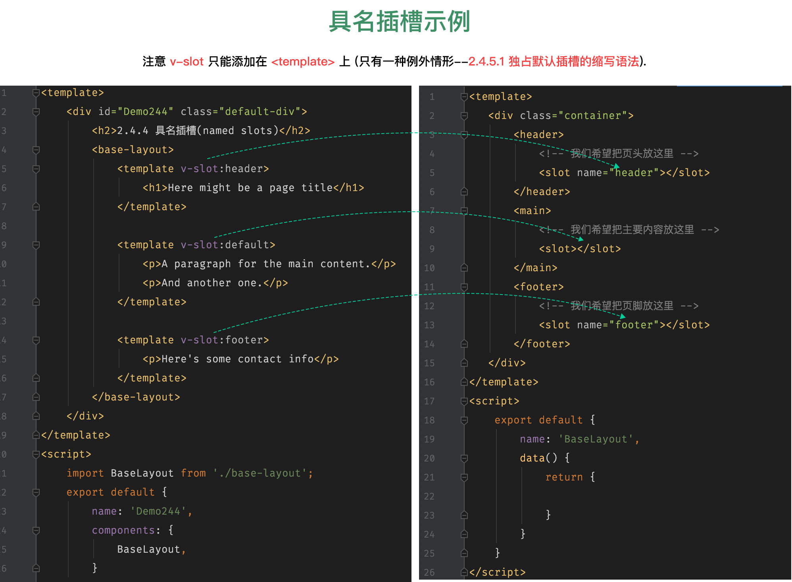
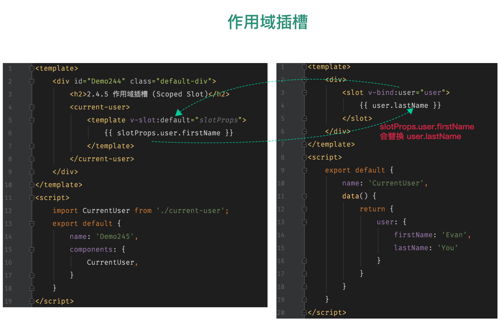
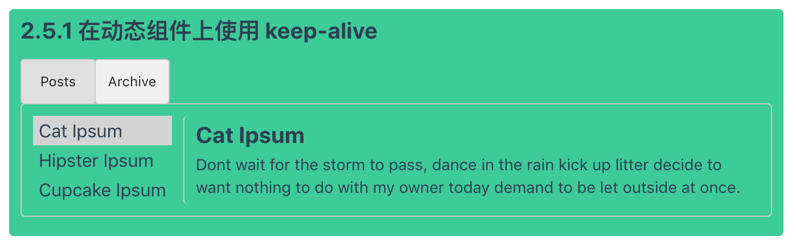

# 02 深入了解组件

## 目录(Catalog)
- 2.1 组件注册
    + 2.1.1 组件名
        - 2.1.1.1 组件名大小写
    + 2.1.2 全局注册
    + 2.1.3 局部注册
    + 2.1.4 模块系统
        - 2.1.4.1 在模块系统中局部注册
        - 2.1.4.2 基础组件的自动化全局注册
- 2.2 `Prop`
    + 2.2.1 `Prop` 的大小写
    + 2.2.2 `Prop` 类型
    + 2.2.3 传递静态或动态 `Prop`
        - 2.2.3.1 传入一个数字
        - 2.2.3.2 传入一个布尔值
        - 2.2.3.3 传入一个数组
        - 2.2.3.4 传入一个对象
        - 2.2.3.5 传入一个对象的所有属性
    + 2.2.4 单向数据流
    + 2.2.5 `Prop` 验证
        - 2.2.5.1 类型检查
    + 2.2.6 非 `Prop` 的 Attribute(特性)
        - 2.2.6.1 替换/合并 已有的 Attribute
        - 2.2.6.2 禁用 Attribute 继承
- 2.3 自定义事件
    + 2.3.1 事件名
    + 2.3.2 自定义组件的 `v-model` 
    + 2.3.3 将原生事件绑定到组件
    + 2.3.4 `.sync` 修饰符
- 2.4 插槽
    + 2.4.1 插槽内容
    + 2.4.2 编译作用域
    + 2.4.3 后备内容
    + 2.4.4 具名插槽
    + 2.4.5 作用域插槽
        - 2.4.5.1 独占默认插槽的缩写语法
        - 2.4.5.2 解构插槽 `Prop`
    + 2.4.6 动态插槽名
    + 2.4.7 具名插槽的缩写
    + 2.4.8 其他示例
    + 2.4.9 废弃了的语法
        - 2.4.9.1 带有 slot attribute 的具名插槽
        - 2.4.9.2 带有 slot-scope attribute 的作用域插槽
- 2.5 动态组件 & 异步组件
    + 2.5.1 在动态组件上使用 `keep-alive`
    + 2.5.2 异步组件
        - 2.5.2.1 处理加载状态
- 2.6 处理边界情况
    + 2.6.1 访问元素 & 组件
        - 2.6.1.1 访问根实例 
        - 2.6.1.2 访问父组件实例
        - 2.6.1.3 访问子组件实例或子元素
        - 2.6.1.4 依赖注入
    + 2.6.2 程序化的事件侦听器
    + 2.6.3 循环引用
        - 2.6.3.1 循环组件
        - 2.6.3.2 组件之间的循环引用
    + 2.6.4 模板定义的替代品
        - 2.6.4.1 内联模板
        - 2.6.4.2 `X-Template`
    + 2.6.5 控制更新
        - 2.6.5.1 强制更新
        - 2.6.5.2 通过 `v-once` 创建低开销的静态组件


## 生词(New Words)
- **tab [tæb] --n.标签; 账单; 制表**
    + The first tab is appended at this time. 第一个标签页是在这个时候加载的.
    + Quick Tab. 快速标签.
- **post [post] --n.邮件; 职位; 柱子; 标杆. --v.邮寄; 公布; 张贴. --vi.快速行进**
    + tab posts. 标签页
    + The post(n) hasn't come yet. 邮件还没来.
    + I had a heavy post(n) yesterday. 我昨天收到很多邮件.
    + the Sunday Post(n). 星期日邮报.
    + I posted(vt) him a Christmas card. 我寄给他一张圣诞卡.
- **store [stɔr] --n.商店; 存储; 储藏. --vt.存储,储备; 供给. --vi.可存储**
    + a candy store. 糖果店
    + buy things at a store. 在商店购物
    + The department store(n) was thronged[θrɔŋ] with people.
      百货商店挤满了人.
    + a great store(n) of wine[waɪn]. 储存大量葡萄酒.
    + store(vt) the mind with knowledge. 以知识充实自己.
    + This food stores(vi) well. 这种食品可存储.


## 内容(Contents)
- Notice: 本节下面的示例代码都是在 `*.html` 页面中引入 Vue 的写法,
  因为语法相对简单, 便没有再创建相应的单文件组件(`.vue`)示例.
### 2.1 组件注册
> 该页面假设你已经阅读过了 `组件基础`(`../01-基础/1.11-组件基础.md`). 如果你还对组件不太了解, 推荐你先阅读它. 
##### 2.1.1 组件名
- 在注册一个组件的时候, 我们始终需要给它一个名字. 比如在全局注册的时候我们已经看到了:
  ```js
    Vue.component('my-component-name', { /* ... */ })
  ```
  该组件名就是 `Vue.component` 的第一个参数. 

  你给予组件的名字可能依赖于你打算拿它来做什么. 当直接在 DOM 中使用一个组件
  (而不是在字符串模板或 `单文件组件`(`../05-工具.md``5.1 单文件组件`) 的时候,
  我们强烈推荐遵循
  [W3C 规范](https://html.spec.whatwg.org/multipage/custom-elements.html#valid-custom-element-name)
  中的自定义组件名(字母全小写且必须包含一个连字符).
  这会帮助你避免和当前以及未来的 HTML 元素相冲突. 

  你可以在
  [风格指南](https://cn.vuejs.org/v2/style-guide/#%E5%9F%BA%E7%A1%80%E7%BB%84%E4%BB%B6%E5%90%8D-%E5%BC%BA%E7%83%88%E6%8E%A8%E8%8D%90)
  中查阅到关于组件名的其它建议. 

- **2.1.1.1 组件名大小写**
    + 定义组件名的方式有 2 种:
        - (1) 使用 `kebab-case`:
          ```js
            Vue.component('my-component-name', {/* ... */})
          ```
          当使用 kebab-case(短横线分隔符命定)定义一个组件时,
          你也必须在引用这个自定义元素时使用 kebab-case, 例如 `<my-component-name>`.
        - (2) 使用 `PascalCase`:
          ```js
            Vue.component('MyComponentName', {/* ... */})
          ```
          当使用 PascalCase(首字母大写命名)定义一个组件时,
          你在引用这个自定义元素时 2 种命名法都可以使用. 也就是说
          `<my-component-name>` 和 `<MyComponentName>` 都是可接受的.
          注意, 尽管如此, 直接在 DOM(即非字符串的模板)中使用时只有 kebab-case
          是有效的.
##### 2.1.2 全局注册
- 到目前为止, 我们只用过 `Vue.component` 来创建组件: 
  ```js
    Vue.component('my-component-name', { // ... 选项 ...})
  ```
  这些组件是**全局注册的**. 也就是说它们在注册之后可以用在任何新创建的 Vue
  根实例 (`new Vue`) 的模板中. 比如: 
  ```js
    Vue.component('component-a', { /* ... */ })
    Vue.component('component-b', { /* ... */ })
    Vue.component('component-c', { /* ... */ })

    new Vue({ el: '#app' })
  ```
  ```html
    <div id="app">
        <component-a></component-a>
        <component-b></component-b>
        <component-c></component-c>
    </div>
  ```
  在所有子组件中也是如此, 也就是说这三个组件*在各自内部*也都可以相互使用. 

##### 2.1.3 局部注册
- 全局注册往往是不够理想的. 比如, 如果你使用一个像 webpack 这样的构建系统,
  全局注册所有的组件意味着即便你已经不再使用一个组件了,
  它仍然会被包含在你最终的构建结果中. 这造成了用户下载的 JavaScript 的无谓的增加.
  
  在这些情况下, 你可以通过一个普通的 JavaScript 对象来定义组件:
  ```js
    var ComponentA = { /* ... */ }
    var ComponentB = { /* ... */ }
    var ComponentC = { /* ... */ }
  ```
  然后在 `components` 选项中定义你想要使用的组件:
  ```js
    new Vue({
        el: '#app',
        components: {
            'component-a': ComponentA,
            'component-b': ComponentB
        }
    })
  ```
  对于 `components` 对象中的每个属性来说, 其属性名就是自定义元素的名字,
  其属性值就是这个组件的选项对象. 

  注意**局部注册的组件在其子组件中*不可用***. 例如, 如果你希望 `ComponentA` 在
  `ComponentB` 中可用, 则你需要这样写:
  ```js
    var ComponentA = { /* ... */ }

    var ComponentB = {
        components: {
            'component-a': ComponentA
        },
        // ...
    }
  ```
  或者如果你通过 Babel 和 webpack 使用 ES2015 模块, 那么代码看起来更像: 
  ```js
    import ComponentA from './ComponentA.vue'
    export default {
        components: {
            ComponentA
        },
        // ...
    }
  ```
  注意在 ES2015+ 中, 在对象中放一个类似 `ComponentA` 的变量名其实是
  `ComponentA: ComponentA` 的缩写, 即这个变量名同时是:
    + (1) 用在模板中的自定义元素的名称
    + (2) 包含了这个组件选项的变量名

##### 2.1.4 模块系统
- 如果你没有通过 `import`/`require` 使用一个模块系统, 也许可以暂且跳过这个章节.
  如果你使用了, 那么我们会为你提供一些特殊的使用说明和注意事项.
- **2.1.4.1 在模块系统中局部注册**
    + 如果你还在阅读, 说明你使用了诸如 Babel 和 webpack 的模块系统. 在这些情况下,
      我们推荐创建一个 components 目录, 并将每个组件放置在其各自的文件中. 
      
      然后你需要在局部注册之前导入每个你想使用的组件. 例如, 在一个假设的
      `ComponentB.js` 或 `ComponentB.vue` 文件中:
      ```js
        import ComponentA from './ComponentA'
        import ComponentC from './ComponentC'

        export default {
            components: {
                ComponentA,
                ComponentC
            },
            // ...
        }
      ```
      现在 `ComponentA` 和 `ComponentC` 都可以在 `ComponentB` 的模板中使用了. 
- **2.1.4.2 基础组件的自动化全局注册**
    + 可能你的许多组件只是包裹了一个输入框或按钮之类的元素, 是相对通用的.
      我们有时候会把它们称为
      [基础组件](https://cn.vuejs.org/v2/style-guide/#%E5%9F%BA%E7%A1%80%E7%BB%84%E4%BB%B6%E5%90%8D-%E5%BC%BA%E7%83%88%E6%8E%A8%E8%8D%90)
      它们会在各个组件中被频繁的用到.
      
      所以会导致好很多组件里都会有一个包含基础组件的长列表. 例如:
      ```js
        import BaseButton from './BaseButton.vue`;
        import BaseIcon from './BaseIcon.vue`;
        import BaseInput from './BaseInput.vue`;

        export default {
            components: {
                BaseButton,
                BaseIcon,
                BaseInput
            }
        }
      ```
      而只是用于模板中的一小部分:
      ```html
        <BaseInput
            v-model="searchText"
            @keydown.enter="search"
        />
        <BaseButton @click="search">
            <BaseIcon name="search"/>
        </BaseButton>
      ```

      幸好如果你使用了 webpack (或在内部使用了 webpack 的
      [Vue CLI 3+](https://github.com/vuejs/vue-cli)), 那么就可以使用
      `require.context` 只全局注册这些非常通用的基础组件.
      这里有一份可以让你在应用入口文件(比如 `src/main.js`)
      中全局导入基础组件的示例代码:
      ```js
        import Vue from 'vue';
        import upperFirst from 'lodash/upperFirst';
        import camelCase from 'lodash/camelCase';

        const requireComponent = require.context(
            // - 其组件目录的相对路径
            './components',
            // - 是否查询其子目录
            false,
            // - 匹配基础组件文件名的正则表达式
            /Base[A-Z]\w+\.(vue|js)$/
        );

        requireComponent.keys().forEach(fileName => {
            // - 获取组件配置
            const componentConfig = requireComponent(fileName);

            // - 获取组件的 PascalCase 命名
            const componentName = upperFirst(
                camelCase(
                    // - 获取和目录深度无关的文件名
                    fileName
                        .split('/')
                        .pop()
                        .replace(/\.\w+$/, '')
                )
            );

            // - 全局注册组件
            Vue.component(
                componentName,
                // - 如果这个组件选项是通过 `export default` 导出的, 那么就会
                //   优先使用 `.default`, 否则回退到使用模块的根.
                componentConfig.default || componentConfig
            )
        })
      ```
      记住**全局注册的行为必须在根 Vue 实例(通过 `new Vue`)创建之前发生.**
      [这里](https://github.com/chrisvfritz/vue-enterprise-boilerplate/blob/master/src/components/_globals.js)
      有一个真实项目情景下的示例.


### 2.2 `Prop`
> 该页面假设你已经阅读过了 `组件基础`(`../01-基础/1.11-组件基础.md`).
  如果你还对组件不太了解, 推荐你先阅读它. 

##### 2.2.1 `Prop` 的大小写(camelCase vs kebab-case)
- HTML 中的 特性(attribute) 名是大小写不敏感的,
  所以浏览器会把所有大写字符解释为小写字符. 这意味着当你使用 DOM 中的模板时,
  camelCase (驼峰命名法) 的 prop 名需要使用其等价的 kebab-case (短横线分隔命名)
  命名:
  ```js
    Vue.component('blog-post', {
        // 在 JavaScript 中是 camelCase 的
        props: ['postTitle'],
        template: '<h3>{{ postTitle }}</h3>'
    })
  ```
  ```html
    <!-- 在 HTML 中是 kebab-case 的 -->
    <blog-post post-title="hello!"></blog-post>
  ```
  重申一次, 如果你使用字符串模板, 那么这个限制就不存在了. 

##### 2.2.2 `Prop` 类型
- 到这里, 我们只看到了以字符串数组形式列出的 prop:
  ```js
    props: ['title', 'likes', 'isPublished', 'commentIds', 'author']
  ```
  但是, 通常你希望每个 prop 都有指定的值类型. 这时, 你可以以对象形式列出 prop,
  这些属性的名称和值分别是 prop 各自的名称和类型:
  ```js
    props:{
        title: String,
        likes: Number,
        isPublished: Boolean,
        commentIds: Array,
        author: Object,
        callback: Function,
        contactsPromise: Promise,   // - or any other constructor
    }
  ```
  这不仅为你的组件提供了文档, 还会在它们遇到错误类型时从浏览器的 JavaScript
  控制台提示用户.

##### 2.2.3 传递静态或动态 `Prop`
- 可以像这样给 prop 传入一个静态的值:
  ```html
    <blog-post title="My journey with Vue"></blog-post>
  ```
  也可以通过 `v-bind` 给 prop 动态赋值. 例如:
  ```html
    <!-- 动态赋予一个变量的值 -->
    <blog-post :title="post.title"></blog-post>
    <!-- 动态赋予一个复杂表达式的值 -->
    <blog-post :title="post.title + ' by ' + post.author.name"></blog-post>
  ```
  在上述 2 个示例中, 我们传入的值都是字符串类型的, 但实际上 *任何类型*
  的值都可以传给一个 prop.
- **2.2.3.1 传入一个数字**
    + ```html
        <!-- 即便 `42` 是静态的, 我们仍然需要 `v-bind` 来告诉 Vue
             这是一个 JavaScript 表达式而不是一个字符串 -->
        <blog-post v-bind:likes="42"></blog-post>

        <!-- 用一个变量进行动态赋值 -->
        <blog-post v-bind:likes="post.likes"></blog-post>
      ```
- **2.2.3.2 传入一个布尔值**
    + ```html
        <!-- 包含该 prop 没有值的情况在内, 都意味着 `true` -->
        <blog-post is-published></blog-post>
        <!-- 即便 `false` 是静态的, 我们仍然需要 `v-bind` 来告诉 Vue
             这是一个 JavaScript 表达式而不是一个字符串 -->
        <blog-post v-bind:is-published="false"></blog-post>

        <!-- 用一个变量进行动态赋值 -->
        <blog-post v-bind:is-published="post.isPublished"></blog-post>
      ```
- **2.2.3.3 传入一个数组**
    + ```html
        <!-- 即便数组是静态的, 我们仍然需要 `v-bind` 来告诉 Vue
             这是一个 JavaScript 表达式而不是一个字符串 -->
        <blog-post v-bind:comment-ids="[234, 266, 273]"></blog-post>
        <!-- 用一个变量进行动态赋值 -->
        <blog-post v-bind:comment-ids="post.commentIds"></blog-post>
      ```
- **2.2.3.4 传入一个对象**
    + ```html
        <!-- 即便对象是静态的, 我们仍然需要 `v-bind` 来告诉 Vue
             这是一个 JavaScript 表达式而不是一个字符串 -->
        <blog-post
            :author="{
                name: 'Veronica',
                company: `Veridian Dynamics`
            }"
        ></blog-post>
        <!-- 用一个变量进行动态赋值 -->
        <blog-post v-bind:comment-ids="post.author"></blog-post>
      ```
- **2.2.3.5 传入一个对象的所有属性**
    + 如果你想将一个对象的所有属性都作为 prop 传入, 你可以使用不带参数的 `v-bind`
      (取代 `v-bind:prop-name`). 例如, 对于一个给定的对象 `post`:
      ```js
        post: {
            id: 1,
            title: `My Journey with Vue'
        }
      ```
      下面的模板:
      ```html
        <blog-post v-bind="post"></blog-post>
      ```
      等价于:
      ```html
        <blog-post
            :id="post.id"
            :title="post.title"
        ></blog-post>
      ```

##### 2.2.4 单向数据流
- 所有的 prop 都使得父子组件之间形成了一个**单向下行绑定:** 父级 prop
  的更新会向下流动到子组件中, 但是反过来则不行.
  这样可以防止子组件意外改变父组件的状态, 从而导致应用的数据流向难以理解.

  额外的, 每次父组件发生更新时, 子组件中所有的 prop 都将会刷新为最新的值.
  这意味着你不应该在一个子组件内部改变 prop. 如果你这样做了, Vue 会在浏览器中发出警告.

  这里有 2 种常见的试图改变一个 prop 的情形:

  (1) **这个 prop 用来传递一个初始值; 这个子组件接下来希望将其作为一个本地的
  prop 数据来使用**. 在这种情况下, 最好定义一个本地的 `data` 属性并将这个 prop
  用作其初始值.
  ```js
    // - .vue 组件中
    props: ['initialCounter'],
    data: function() {
        return {
            counter: this.initialCounter
        }
    }
  ```
  (2) **这个 prop 以一种原始的值传入且需要进行转换.** 在这种情况下, 最好使用这个 prop
  的值来定义一个计算属性:
  ```html
    props: ['size'],
    computed: {
        normalizedSize: function() {
            return this.size.trim().toLowerCase()
        }
    }
  ```
  **Warning**: 注意在 JavaScript 中对象和数组是通过引用传入的,
  所以对于一个数组或对象类型的 prop 来说,
  在子组件中改变这个对象或数组本身将会影响到父组件的状态.

##### 2.2.5 `Prop` 验证
- 我们可以为组件的 prop 指定验证要求, 例如你知道的这些类型. 如果有一个需求没有被满足,
  则 Vue 会在浏览器控制台中警告你. 这在开发一个会被别人用到的组件时尤其有帮助. 

  为了定制 prop 的验证方式, 你可以在组件中为 `props`
  对象属性中的值提供一个带有验证需求的对象, 而不是一个字符串数组. 例如:
  ```js
    Vue.component('my-component', {
        props: {
            // - 基础的类型检查 (`null` 和 `undefined` 会通过任何类型验证)
            propA: Number,
            // - 多个可能的类型
            propB: [String, Number],
            // - 必填的字符串
            propC: {
                type: String,
                required: true
            },
            // - 带有默认值的数字
            propD: {
                type: Number,
                required: 100
            },
            // - 带有默认值的对象
            propE: {
                type: Object,
                // - 对象或数组默认值必须从一个工厂函数获取
                default: function() {
                    return { message: 'hello' }
                }
            },
            // - 自定义验证函数
            propF: {
                validator: function(value) {
                    // - 这个值必须匹配下列字符串中的一个
                    return ['success', 'warning', 'danger'].indexOf(value) !== -1
                }
            }
        }
    })
  ```
  当 prop 验证失败的时候, (开发环境构建版本的) Vue 将会产生一个控制台的警告.

  **Warning:** 注意哪些 prop 会在一个组件实例创建**之前**进行验证, 所以实例的属性
  (如 `data`, `computed` 等) 在上面示例中的 `default` 或 `validator`
  函数中是不可用的.
- **2.2.5.1 类型检查**
    + `type` 可以是下列原生构造函数中的一个:
        - (1) `String` 
        - (2) `Number`  
        - (3) `Boolean`  
        - (4) `Array`  
        - (5) `Object`  
        - (6) `Date`  
        - (7) `Function`  
        - (8) `Symbol`  
        
      额外的, `type` 还可以是一个自定义的构造函数, 并且通过 `instanceof`
      来进行检查确认. 例如, 给定下列现成的构造函数:
      ```js
        function Person(firstName, lastName) {
            this.firstName = firstName;
            this.lastName = lastName
        }
      ```
      你可以使用:
      ```js
        Vue.component('blog-post', {
            props: {
                author: Person
            }
        })
      ```
      来验证 `author` prop 的值是否是通过 `new Person` 创建的.
##### 2.2.6 非 `Prop` 的 Attribute(特性)
- 一个非 prop 的 特性(attribute) 是指传向一个组件, 但是该组件并没有相对应 prop
  定义的 特性(attribute).

  因为显式定义的 prop 适用于向一个子组件传入信息,
  然而组件库的作者并不总能预见组件会被用于怎样的场景. 这也是为什么组件可以接受任意的
  特性(attribute), 而这些 特性(attribute) 会被添加到这个组件的根元素上.

  例如, 想象一下你通过一个 Bootstrap 插件使用了一个第三方的
  `<bootstrap-date-input>` 组件, 这个组件需要在其 `<input>` 上用到一个
  `data-date-picker` 特性. 我们可以将这个特性添加到你的组件实例上:
  ```html
    <bootstrap-date-input data-date-picker="activated"></bootstrap-date-input>
  ```
  然后这个 `data-date-picker="activated"` 特性就会自动添加到
  `<bootstrap-date-input>` 的根元素上.

- **2.2.6.1 替换/合并 已有的 特性(Attribute)**
    + 想象一下 `<bootstrap-date-input>` 的模板是这样的:
      ```html
        <input type="date" class="form-control">
      ```
      为了给我们的日期选择器插件制定一个主题, 我们可能需要像这样添加一个特别的类名:
      ```html
        <bootstrap-date-input
            data-date-picker="activated"
            class="date-picker-theme-dark"
        ></bootstrap-date-input>
      ```
      在这种情况下, 我们定义了 2 个不同的 `class` 的值:
        - (1) `form-control` 这是在组件的模板内设置好的.
        - (2) `date-picker-theme-dark` 这是从组件的父级传入的
      
      对于绝大多数的特性来说, 从外部提供给组件的值会替换掉组件内部设置好的值.
      所以如果传入 `type="text"`, 就会替换掉 `type="date"` 并把它破坏!
      庆幸的是, `class` 和 `style` 特性会稍微智能一些, 即两边的值会被合并起来,
      从而得到最终的值: `form-control date-picker-theme-dark`.

- **2.2.6.2 禁用 特性(Attribute) 继承**
    + 如果你不希望组件的根元素继承特性, 你可以在组件的选项中设置
      `inheritAttrs: false`. 例如:
      ```js
        Vue.component('my-component', {
            inheritAttrs: false,
            // ...
        })
      ```
      这尤其适合配合实例的 `$attrs` 属性使用, 该属性包含了传递给一个组件的
      特性名 和 特性值, 例如:
      ```js
        {
            required: true,
            placeholder: 'Enter your username'
        }
      ```
      有了 `inheritAttrs: false` 和 `$attrs`,
      你就可以手动决定这些特性会被赋予那个元素. 在撰写基础组件的时候是常会用到的:
      ```js
        Vue.component('base-input', {
            inheritAttrs: false,
            props: ['label', 'value'],
            template: `
                <label>
                    {{ label }}
                    <input
                        v-bind="$attrs"
                        :value="value"
                        :input="$emit('input', $event.target.value)"
                    >
                </label>
        })
      ```
      **Warning:** 注意 `inheritAttrs: false` 选项不会影响 `style` 和 `class`
      的绑定.

      这个模式允许你在使用基础组件的时候更像是使用原始的 HTML 元素,
      而不会担心哪个元素是真正的根元素:
      ```html
        <base-input
            v-model="username"
            required
            placeholder="Enter your username"
        ></base-input>
      ```
    + **I added:** 此处给出上面示例的单文件组件(`.vue`) 的写法:
      ```vue
        <!-- 2.2.6.2.vue -->
        <template>
            <div id="Demo2262" class="default-div">
                <h2>2.2.6.2: 禁用特性(attribute)继承</h2>
                <base-input
                    label="姓名"
                    class="username-input"
                    v-model="username"
                    placeholder="Enter your username"
                    data-date-picker="activated"
                ></base-input>
                <p>你在 input 中输入的值为: {{ username }}</p>
            </div>
        </template>
        <script>
            import BaseInput from './base-input';
            export default {
                name: 'Demo2262',
                data() {
                    return {
                        username: '',
                    }
                },
                components: {
                    BaseInput,
                }
            }
        </script>
        <style scoped>
            .username-input {
                background: #9cd5f1;
            }
        </style>
      ```
      ```vue
        <!-- base-input.vue -->
        <template>
            <div>
                <p>我是 2.2.6.2 的子组件 base-input</p>
                <label>
                    <span> {{ label }}: </span>
                    <input
                        v-bind="$attrs"
                        :value="value"
                        @input="$emit('input', $event.target.value)"
                    >
                </label>
            </div>
        </template>
        <script>
            export default {
                name: 'BaseInput',
                // - 此处设置禁用继承特性
                inheritAttrs: false,
                props: ['label', 'value'],
                mounted: function() {
                    console.log(this.$attrs)
                }
            }
        </script>
        <style scoped>
            input {
                min-width: 160px;
                min-height: 30px;
            }
        </style>
      ```
      我们使用上面的文档来解说一下这两个单文件组件; 如果不在 `base-input.vue`
      子组件中使用 `inheritAttrs: false`, 那么在控制台中渲染后的 DOM
      就如下所示: 
      ```html
        <div placeholder="Enter your username"
            data-date-picker="activated" class="username-input">
            <p>我是 2.2.6.2 的子组件 base-input</p>
            <label>
                <span> 姓名: </span>
                <input placeholder="Enter your username"
                    data-date-picker="activated">
            </label>
        </div>
      ```
      可以看到 `base-input.vue` 组件的根元素(`div`)
      继承了调用时传入的 `placeholder` 和 `data-date-picker`,
      但我们本来的意图是只需在 `input` 上继承这两个特性(attribute),
      所以 Vue 给出的解决方法是在子组件内添加 `inheritAttrs` 属性来解决.
      但是 Vue 此处也是做了处理的, 根元素可以正常接收 `class` 和 `style`
      特性, 它们不会受到影响.

      可能你也会对子组件上使用的 `v-bind="$attrs"` 不太了解, 不要着急,
      我们先来看一样官网的
      [vm.$attrs](https://cn.vuejs.org/v2/api/#vm-attrs) 解释:
      
      **`vm.$attrs`**:
        - 类型: `{[key: string]: string}`: 接受参数为一个对象, 对象的键
          `key` 为字符串, 值也为字符串.
        - 只读
        - 详细:
            + 包含了父作用域中不作为 prop 被识别(且获取)的特性绑定(`class` 和
              `style` 除外). 当一个组件没有声明任何 prop 时,
              这里会包含所有父作用域的绑定(`class` 和 `style` 除外),
              并且可以通过 `v-bind=$attrs` 传入内部组件 --
              这在创建高级别的组件时非常有用. <br/>
              (Tip: 大致意思就是子组件可以通过 `v-bind=$attr`
              来获取父组件的标签上除了 `class` 和 `style` 之外的不作为 prop
              被使用的所有特性(attribute))
      
      更多 `inheritAttrs` 的工作原理, 只有在学习源码时才可以看到了.

### 2.3 自定义事件
##### 2.3.1 事件名
- 不同于组件和 prop, 事件名不存在任何自动化的大小写转换.
  而是触发的事件名需要完全匹配监听这个事件所用的名称. 举个例子,
  如果触发一个 camelCase 名字的事件:
  ```js
    this.$emit('myEvent')
  ```
  则监听这个名字的 kebab-case 版本是不会有任何效果的:
  ```html
    <!-- 没有效果 -->
    <my-component @my-event="doSomething"></my-component>
  ```
  不同于组件和 prop, 事件名不会被用作一个 JavaScript 变量名或属性名,
  所以就没有理由使用 camelCase 或 PascalCase 了. 并且 `v-on` 事件监听器在
  DOM 模板中会被自动转换为全小写 (因为 HTML 是大小写不敏感的), 所以
  `v-on:myEvent` 将会变成 `v-on:myevent` —— 导致 `myEvent` 不可能被监听到.

  因此, 我们推荐你**始终使用 kebab-case 的事件名**.

##### 2.3.2 自定义组件的 `v-model` 
- 一个组件上的 `v-model` 默认会利用名为 `value` 的 prop 和名为 `input` 的事件,
  但是像单选框, 复选框类型的输入控件可能会将 `value` 特性用于
  [不同的目的](https://developer.mozilla.org/en-US/docs/Web/HTML/Element/input/checkbox#Value).
  `model` 选项可以用来避免这样的冲突. 我们来看下面这个示例:
  ```vue
    <!-- 2.3.2.vue -->
    <template>
        <div id="Demo232" class="default-div">
            <h2>2.3.2 自定义组件的 `v-model`</h2>
            <base-checkbox
                v-model="lovingVue"
            ></base-checkbox>
        </div>
    </template>
    <script>
        import BaseCheckbox from '../base-components/base-checkbox';
        export default {
            name: 'Demo232',
            data() {
                return {
                    lovingVue: false
                }
            },
            components: {
                BaseCheckbox,
            },
            watch: {
                lovingVue: function(newValue) {
                    console.log('checkbox newValue:', newValue);
                }
            }
        }
    </script>
  ```
  ```vue
    <!-- base-checkbox.vue -->
    <template>
        <div class="base-checkbox">
            <h2>base-checkbox</h2>
            <input
                id="baseCheckbox"
                type="checkbox"
                :checked="checked"
                @change="$emit('change', $event.target.checked)"
            >
            <label for="baseCheckbox">基础复选框组件</label>
        </div>
    </template>
    <script>
        export default {
            name: 'BaseCheckbox',
            model: {
                // - 父作用域 lovingVue 的值会传给 checked 
                prop: 'checked',
                event: 'change'
            },
            props: {
                checked: Boolean
            },
        }
    </script>
    <style lang="stylus" scoped>
        @import './base-components-style.styl';
    </style>
  ```
  这里的 `lovingVue` 的值将会传入名为 `checked` 的 prop. 同时当基础组件
  `<base-checkbox>` 触发一个 `change` 事件并附带一个新的值的时候, 这个
  `lovingVue` 的属性将会被更新(即上面的代码
  `@change="$emit('change', $event.target.checked)"`).

##### 2.3.3 将原生事件绑定到组件
- 你可能有很多次想要在一个组件的根元素上直接监听一个原生事件. 这是, 你可以使用 `v-on`
  的 `.native` 修饰符:
  ```html
    <base-input v-on:focus.native="onFocus"></base-input>
  ````
  在有的时候这是很有用的, 不过在你尝试监听一个类似 `<input>` 的非常特定的元素时,
  这并不是一个好主意. 比如上述 `<base-input>` 组件可能做了如下重构,
  所以根元素实际上是一个 `<label>` 元素; 例如:
  ```vue
    <template>
        <label>
            <span> {{ label }}: </span>
            <input
                v-bind="$attrs"
                :value="value"
                @input="$emit('input', $event.target.value)"
            >
        </label>
    </template>
    <script>
        export default {
            name: 'BaseInput',
            inheritAttrs: false,
            props: ['label', 'value'],
        }
    </script>
    <style lang="stylus" scoped>
        @import "./base-components-style.styl"
    </style>
  ```
  这时, 父级的 `.native` 监听器将静默失败. 他不会产生任何报错, 但是 `onFocus`
  处理函数不会如你预期地被调用.

  为了解决这个问题, Vue 提供了一个 `$listeners` 属性, 它是一个对象,
  里面包含了作用在这个组件上的所有监听器. 例如:
  ```js
    {
        focus: function(event) { // ... },
        input: function(event) { // ... },
    }
  ```
  有了这个 `$listeners` 属性, 你就可以配合 `v-on="$listener"`
  将所有的事件监听器指向这个组件的某个特定的子元素. 对于类似 `<input>`
  的你希望它们也可以配合 `v-model` 工作的组件来说, 为这些监听器创建一个类似下述
  `inputListeners` 的计算属性通常是非常有用的. 例如:
  ```vue
    <!-- 2.3.3.vue -->
    <template>
        <div id="Demo233" class="default-div">
            <h2>2.3.3 将原生事件绑定到组件</h2>
            <base-input
                label="姓名"
                v-model="inputValue"
                v-on="$listeners"
                placeholder="Enter your name"
            ></base-input>
            <span>您的姓名为:  {{ inputValue }}</span>
        </div>
    </template>

    <script>
        import BaseInput from '../base-components/base-input';
        export default {
            name: 'Demo233',
            data() {
                return {
                    inputValue: ''
                }
            },
            components: {
                BaseInput
            }
        }
    </script>
  ```
  ```vue
    <!-- base-input.vue -->
    <template>
        <div>
            <p>基础组件 base-input</p>
            <label>
                <span> {{ label }}: </span>
                <input
                    type="text"
                    v-bind="$attrs"
                    :value="value"
                    v-on="inputListeners"
                >
            </label>
        </div>
    </template>
    <script>
        export default {
            name: 'BaseInput',
            // - 此处设置禁用继承特性
            inheritAttrs: false,
            props: ['label', 'value'],
            mounted: function() {
                // console.log(this.$attrs)
            },
            computed: {
                inputListeners: function() {
                    let vm = this;
                    // - Object.assign 将所有的对象合并为一个新对象
                    return Object.assign({},
                        // - 我们从父级添加所有的监听器
                        this.$listeners,
                        // - 然后我们添加自定义监听器, 或覆写一些监听器的行为
                        {
                            // - 这里确保组件配合 `v-model` 来工作
                            input: function(event) {
                                vm.$emit('input', event.target.value)
                            }
                        }
                    )
                }
            }
        }
    </script>
    <style lang="stylus" scoped>
        @import "./base-components-style.styl"
    </style>
  ```
  现在 `<base-input>` 组件是一个**完全透明的包裹器了**,
  也就是说它可以完全像一个普通的 `<input>` 元素一样使用了:
  所以跟它相同的特性和监听器都可以工作.

##### 2.3.4 `.sync` 修饰符
- > 2.3.0+ 新增
- 在有些情况下, 我们可能需要对一个 prop 进行 "双向绑定". 不幸的是,
  真正的双向绑定会带来维护上的问题, 因为子组件可以修改父组件,
  且在父组件和子组件都没有明显的改动来源.
  
  这也是为什么我们推荐以 `update:myPropName` 的模式触发事件. 举个例子,
  在一个包含 `title` prop 的假设的组件中, 我们可以用以下方法表达对其赋新值的意图,
  即下面示例中的 `this.$emit('update:title', this.newTitle)`:
  ```vue
    <template>
        <div class="text-document">
            <h3>{{ title }}</h3>
            <p>{{ content }}</p>
            <button @click="updateTitle">更新文章标题</button>
        </div>
    </template>
    <script>
        export default {
            name: 'TextDocument',
            data() {
                return {
                    newTitle: '佛说五王经: 人生八苦'
                }
            },
            props: {
                title: String,
                content: String,
            },
            methods: {
                updateTitle: function(event) {
                    this.$emit('update:title', this.newTitle)
                }
            }
        }
    </script>
  ```
  然后父组件可以监听那个事件并根据需要更新一个本地的数据属性(tip: 本示例中即更新
  `article`对象属性的 `title` 的值). 例如:
  ```vue
    <template>
        <div id="Demo234" class="default-div">
            <h2>2.3.4 `.sync` 修饰符</h2>
            <text-document
                :title="article.title"
                :content="article.content"
                @update:title = "article.title = $event"
            ></text-document>
            <!-- :title.sync = "article.title" -->
        </div>
    </template>
    <script>
        import TextDocument from './text-document';
        export default {
            name: 'Demo234',
            data() {
                return {
                    article: {
                        title: "人生八苦",
                        content: "人生八苦是指: 生, 老, 病, 死, 求不得," +
                            " 怨憎会, 爱别离, 五阴盛.",
                    }
                }
            },
            components: {
                TextDocument,
            }
        }
    </script>
  ```
  此示例中的 `@update:title = "article.title = $event"` (tip: `$event`
  即子组件的 `$emit` 方法的第二个参数.)

  为了方便起见, Vue 为这种模式提供了一个缩写, 即 `.sync` 修饰符. 把上面的
  `<base-input>` 组件中的代码更改为:
  
  ```html
    <text-document
        :title="article.title"
        :content="article.content"
        :title.sync = "article.title"
    ></text-document>
    <!-- @update:title = "article.title = $event" -->
  ```
  Tip: 请注意, `v-bind:title.sync="article.title"` 使用的 `v-bind` 指令,
  它是响应式的更新 html 特性; 而 `v-on:update:title="article.title = $event"`
  是使用的 `v-on` 指令, 它用于监听 DOM 事件.

  **Warning:** 注意带有 `.sync` 修饰符的 `v-bind` 不能和表达式一起使用(例如:
  `v-bind:title.sync="doc.title + '!'"` 是无效的.) 取而代之的是,
  你只能提供你想要绑定的属性名, 类似 `v-model`.

  当我们用一个对象同时设置多个 prop 的时候, 也可以将这个 `.sync` 修饰符和 `v-bind`
  配合使用:
  ```html
    <text-document v-bind:sync="doc"></text-document>
  ```
  这样会把 `doc` 对象中的每一个属性(如: `title`) 都作为一个独立的 prop 穿进去,
  然后各自添加用于更新的 `v-on` 监听器.

  **Warning:** 将 `v-bind:sync` 用在一个字面量的对象上, 例如
  `v-bind.sync="{title: doc.title}"` 是无法正常工作的,
  因为在解析一个像这样的复杂表达式的时候, 有很多边缘情况需要考虑.


### 2.4 插槽
> 在 2.6.0 中, 我们为具名插槽(named slots)和作用域插槽(scoped slots)
  引入了一个新的统一的语法(即: `v-slot` 指令). 它取代了 `slot` 和 `slot-scope`
  这两个目前已经被废弃但未移除且仍在文档中的特性(attribute).
  新语法的由来可查看这份
  [RFC](https://github.com/vuejs/rfcs/blob/master/active-rfcs/0001-new-slot-syntax.md)
##### 2.4.1 插槽内容
- Vue 实现了一套内容分发的 API, 这套 API 的设计灵感源自
  [Web Components 规范草案](https://github.com/w3c/webcomponents/blob/gh-pages/proposals/Slots-Proposal.md),
  将 `<slot>` 元素作为承载分发内容的出口.

  它允许你像这样合成组件:
  ```html
    <navigation-link url="/profile">Your Profile</navigation-link>
  ```
  然后你在 `<navigation-link>` 的模板中可能会写到:
  ```html
    <a v-bind:href="url" class="nav-link">
        <slot></slot>
    </a>
  ```
  当组件渲染的时候, `<slot></slot>` 将会被替换为 `Your Profile`.
  插槽内可以包含任何模板代码, 包括 HTML: 
  ```html
    <navigation-link url="/profile">
        <!-- 添加一个 Font Awesome 图标 -->
        <span class="fa fa-user"></span>
        Your Profile
    </navigation-link>
  ```
  甚至其他的组件:
  ```html
    <navigation-link url="/profile">
        <!-- 添加一个图标的组件 -->
        <font-awesome-icon name="user"></font-awesome-icon>
        Your Profile
    </navigation-link>
  ```
  如果 `<navigation-link></navigation-link>` 的模板中没有包含一个 `<slot>`
  元素, 则该组件起始标签和结束标签之间的任何内容都会被抛弃.

##### 2.4.2 编译作用域
- 当你想在一个插槽中使用数据时, 例如:
  ```html
    <navigation-link url="/profile">
        Logged in as {{ user.name }}
    </navigation-link>
  ```
  该插槽跟模板的其他地方一样可以访问相同的实例属性(也就是相同的 "作用域"),
  而**不能**访问 `<navigation-link>` 的作用域. 例如 `url` 是访问不到的
  ```html
    <navigation-link url="/profile">
        Clicking here will send you to : {{ url }}
        <!-- 这里的 `url` 会是 undefined, 因为 "/profile" 是调用模板时,
          要传递给 <navigation-link> 组件的, 而不是在 <navigation-link>
          组件**内部**定义的. -->
    </navigation-link>
  ```
- 作为一条规则, 请记住:
    + > **父级模板里的所有内容都是在父级作用域中编译的;
      子模板里的所有内容都是在子作用域中编译的.**

##### 2.4.3 后备内容
- 有时为一个插槽(slot) 设置具体的后备(也就是默认的)内容是很有用的,
  它只会在没有提供内容的时候被渲染. 例如在一个 `<submit-button>` 组件中:
  ```html
    <button type="submit">
        <slot></slot>
    </button>
  ```
  我们可能希望这个 `<button>` 内绝大部分情况下都渲染文本 "Submit". 为了将
  "Submit" 作为后备内容, 我们可以将它放在 `<slot>` 标签内:
  ```html
    <button type="submit">
        <slot>Submit</slot>
    </button>
  ```
  现在当我们在一个父及组件中使用 `<submit-button>` 并且不提供任何插槽内容时,
  后备内容 "Submit" 将会被渲染:
  ```html
    <button type="submit"> Submit </button>
  ```
  
  但如果我们提供内容:
  ```html
    <submit-button>
        Save
    </submit-button>
  ```
  则这个提供的内容将会被渲染从而取代后备的内容:
  ```html
    <button type="submit">
        Save
    </button>
  ```

##### 2.4.4 具名插槽(named slots)
- > 自 2.6.0 起有所更新. 已废弃的使用 `slot` 特性(attribute) 的语法在
  "这里"(此文档下面的 `2.4.9 废弃的语法`)
- 有时我们需要多个插槽. 例如对于一个带有如下模板的 `<base-layout>` 组件:
  ```html
    <!-- /2.4.4/base-layout.vue -->
    <template>
        <div class="container">
            <header>
                <!-- 我们希望把页头放这里 -->
            </header>
            <main>
                <!-- 我们希望把主要内容放这里 -->
            </main>
            <footer>
                <!-- 我们希望把页脚放这里 -->
            </footer>
        </div>
    </template>
    <script>
        export default {
            name: 'BaseLayout',
            data() {
                return {

                }
            }
        }
    </script>
  ```
  对于这样的情况, `<slot>` 元素有一个特殊的特性 `name`. 这个 特性(attribute)
  可以用来定义额外的插槽. 修改上面的示例为:
  ```html
    <div>
        <header>
           <slot name="header"></slot>
       </header>
       <main>
           <slot></slot>
       </main>
       <footer>
           <slot name="footer"></slot>
       </footer>
   </div>
  ```
  一个不带 `name` 的 `<slot>` 默认会带有隐含的名字 "default" (即:
  `<slot name="default"></slot>`)

  在向具名插槽提供内容的时候, 我们可以在一个 `<template>` 元素上使用 `v-slot` 指令,
  并以 `v-slot` 的参数的形式提供其名称:
  ```html
    <template>
        <div id="Demo244" class="default-div">
            <h2>2.4.4 具名插槽(named slots)</h2>
            <base-layout>
                <!-- :header 为 v-slot 的参数 -->
                <template v-slot:header>
                    <h1>Here might be a page title</h1>
                </template>

                <p>A paragraph for the main content.</p>
                <p>And another one.</p>

                <template v-slot:footer>
                    <p>Here's some contact info</p>
                </template>
            </base-layout>
        </div>
    </template>
    <script>
        import BaseLayout from './base-layout';
        export default {
            name: 'Demo244',
            components: {
                BaseLayout,
            }
        }
    </script>
  ```
  现在 `<template>` 元素中的所有的内容都将会被传入相应的插槽. 任何没有被包裹在带有
  `v-slot` 的 `<template>` 中的内容都会被视为默认插槽的内容.

  然而, 如果你希望更明确一些, 仍然可以在一个 `<template>` 中包裹默认插槽的内容.
  即上面的代码可以改为:
  ```html
    <template v-slot:default>
        <p>A paragraph for the main content.</p>
        <p>And another one.</p>
    </template>
  ```
  任何一种写法都会渲染出:
  ```html
    <div class="container">
        <header>
            <h1>Here might be a page title</h1>
        </header>
        <main>
            <p>A paragraph for the main content.</p>
            <p>And another one.</p>
        </main>
        <footer>
            <p>Here's some contact info</p>
        </footer>
    </div>
  ```
  注意 `v-slot` **只能添加在 `<template>`** 上 (只有
  `一种例外情形`--`2.4.5.1 独占默认插槽的缩写语法`), 这一点和已经废弃的 `slot`
  特性不同.
  
  我们用一张图来说明:
  

##### 2.4.5 作用域插槽
- > 自 2.6.0 起有所更新. 已废弃的使用 `slot-scope` 特性(attribute) 的语法在
  "这里"(此文档下面的 `2.4.9 废弃的语法`)
- 有时候让插槽内容能够访问子组件中才有的数据是很有用的. 例如, 设想一下带有如下模板的
  `<current-user>` 组件:
  ```html
    <span>
        <slot>{{ user.lastName }}</slot>
    </span>
  ```
  我们在父作用域中可能想换掉备用内容, 用名而非姓来显示. 如下:
  ```html
    <current-user>
        {{ user.firstName }}
    </current-user>
  ```
  然而上述代码不会正常工作, 因为只有 `<current-user>` 模板组件才可以访问到 `user`
  而我们提供的内容是在父级渲染的.

  为了让 `user` 在父级的插槽内容中可用, 我们可以将 `user` 作为 `<slot>`
  元素的一个特性绑定上去. 给出单文件组件的写法:
  ```vue
    <!-- current-user.vue -->
    <template>
        <div>
            <!-- 把 `user` 属性动态绑定到 `<slot>` 元素上. -->
            <!-- 绑定在 `slot` 元素上的特性被称为插槽 prop -->
            <slot v-bind:user="user">
                {{ user.lastName }}
            </slot>
        </div>
    </template>
    <script>
        export default {
            name: 'CurrentUser',
            data() {
                return {
                    user: {
                        firstName: 'Evan',
                        lastName: 'You'
                    }
                }
            }
        }
    </script>
  ```
  绑定在 `<slot>` 元素上的 特性(attribute) 被称为 **插槽 prop**.
  现在在父级作用域中, 我们可以使用带值的 `v-slot` 来定义我们提供的插槽 prop 的名字.
  示例代码:
  ```vue
    <template>
        <div id="Demo244" class="default-div">
            <h2>2.4.5 作用域插槽 (Scoped Slot)</h2>
            <current-user>
                <!-- 在父级作用域中, 使用带值的 `v-slot` 指令来定义提供的插槽 prop  -->
                <template v-slot:default="slotProps">
                    {{ slotProps.user.firstName }}
                </template>
            </current-user>
        </div>
    </template>
    <script>
        import CurrentUser from './current-user';
        export default {
            name: 'Demo245',
            components: {
                CurrentUser,
            }
        }
    </script>
  ```
  在这个例子中, 我们选择将包含所有插槽 prop 的对象命名为 `slotProps`,
  但你也可以使用任意你喜欢的名字.

  我们用一张图来说明:
  
  
  Notice: 注意这里的 `<template v-slot:default="slotProps">`
  和上面具名插槽的默认插槽 `<template v-slot:default>` 写法的区别.

- **2.4.5.1 独占默认插槽的缩写语法**
    + 上面的作用域插槽的情况下, 当被提供的内容只有 *默认* 插槽时,
      组件的标签才可以被当作插槽的模板来使用. 这样我们就可以把 `v-slot`
      直接用在组件上, 写法如下:
      ```html
        <!-- 和上面图中的写法一样 -->
        <current-user v-slot:default="slotProps">
            {{ slotProps.user.firstName }}
        </current-user>
      ```
      这种写法还可以更简单. 就像假定未指明的内容对应默认插槽一样, 不带参数的 `v-slot`
      被假定对应默认插槽:
      ```html
        <current-user v-slot="slotProps">
            {{ slotProps.user.firstName }}
        </current-user>
      ```
      注意默认插槽的缩写语法**不能**和具名插槽混用, 因为它会导致作用域不明确:
      ```html
        <current-user v-slot="slotProps">
            {{ slotProps.user.firstName }}
            <template v-slot:other="otherSlotProps">
                slotProps is NOT available here
            </template>
        </current-user>
      ```
      只要出现多个插槽, 请始终为所有的插槽使用完整的基于 `<template>` 的语法:
      ```html
        <current-user>
            <template v-slot:default="slotProps">
                {{ slotProps.user.firstName }}
            </template>

            <template v-slot:other="otherSlotProps">
                ...
            </template>    
        </current-user>
      ```
- **2.4.5.2 解构插槽 `Prop`**
    + 作用域插槽的内部工作原理是将你的插槽内容包括在一个传入单个参数的函数里:
      ```js
        function (slotProps) {
            // 插槽内容
        }
      ```
      这意味着 `v-slot` 的值实际上可以是任何能够作为函数参数的 JS 表达式.
      所以在支持的环境下(`单文件组件`(`../05-工具.md` 5.1 单文件组件)和
      `现代浏览器`(`https://developer.mozilla.org/zh-CN/docs/Web/JavaScript/Reference/Operators/Destructuring_assignment#%E6%B5%8F%E8%A7%88%E5%99%A8%E5%85%BC%E5%AE%B9`))
      ,你也可以使用 `ES2015 解构`(tip: 更多讲解见仓库:
      `JS-book-learning/《深入理解ES6》/chapter05_解构/chapter05-解构.md`)
      来传入具体的插槽 prop. 如下:
      ```html
        <current-user v-slot="{ user }">
            {{ user.firstName }}
        </current-user>
      ```
      这样可以使模板更简洁, 尤其是在该插槽提供了多个 prop 的时候. 它同样开启了 prop
      重命名等其它可能, 例如 `user` 重命名为 `person`:
      ```html
        <current-user v-slot="{ user: person }">
            {{ person.firstName }}
        </current-user>
      ```
      你甚至可以定义后备内容, 用于插槽 prop 是 undefined 的情形:
      ```html
        <current-user v-slot="{ user = { firstName: 'Guest' } }">
            {{ user.firstName }}
        </current-user>
      ```

##### 2.4.6 动态插槽名
- > 2.6.0 新增
- `动态指令参数`(`../01-基础/1.4-模板语法.md` 1.4.2 指令) 也可以用在 `v-slot`
  上, 来定义动态的插槽名:
  ```html
    <base-layout>
        <template v-slot:[dynamicSlotName]>
            ...
        </template>
    </base-layout>
  ```

##### 2.4.7 具名插槽的缩写
- 跟 `v-on` 和 `v-bind` 一样, `v-slot` 也有缩写, 即把参数之前的所有内容
  (`v-slot:`) 替换为字符 `#`. <br/>
  例如: `v-slot:header` 可以重写为 `#header`:
  ```html
    <base-layout>
        <template #header>
            <h1>Here might be a page title</h1>
        </template>

        <template #default>
            <p>A paragraph for the main content.</p>
            <p>And another one.</p>
        </template>

        <template #footer>
            <p>Here's some contact info</p>
        </template>
    </base-layout>
  ```
  由于上面 2.4.5 作用域插槽中的语法只是使用带值的 `v-slot` 来接收子组件的插槽 prop,
  同理作用域插槽的 `v-slot` 也是可以缩写的; 那么把上面 2.4.5 中的示例 +
  2.4.5.2 结构插槽 `prop` + 此时的具名插槽的缩写, 此时的写法为:
  ```html
    <current-user #default="{ user }">
        {{ user.firstName }}
    </current-user>
  ```
  注意, 和其他指令一样, 该缩写只在其有参数的时候才可用. 这意味着下面的语法是无效的:
  ```html
    <current-user #="{ user }">
        {{ user.firstName }}
    </current-user>
  ```
  即, 如果你希望使用缩写的话, 必须始终明确插槽名. (e.g. `#default`).

##### 2.4.8 其他示例
- **插槽 prop**(上面 `2.4.5 作用域插槽`: 绑定在 `<slot>` 元素上的特性被称为
  **插槽 prop**. 在父级作用域中使用带值的 `v-slot`来定义提供的插槽 prop 的名字)
  **允许我们将插槽转换为可复用的模板, 这些模板可以基于输入的 prop 渲染出不同的内容**.
  这在设计封装数据逻辑同时允许父级组件自定义部分布局的可复用组件时是最有用的.

  例如, 我们要实现一个 `<todo-list>` 组件, 它是一个列表且包含布局和过滤逻辑: <br/>
  我们可以将每个 todo 作为父级组件的插槽, 以此通过父级组件对其进行控制, 然后将
  `todo` 作为一个插槽 prop 进行绑定:
  ```vue
    <template>
        <div id="todo-list">
            <ul>
                <li v-for="todo in filteredTodos" v-bind:key="todo.id">
                    <!-- 我们为每个 todo 准备了一个插槽, 将 todo
                         对象作为一个插槽 prop 传入. -->
                    <!-- 绑定在 `slot` 元素上的特性被称为插槽 prop -->
                    <slot name="todo" :todo="todo">
                        <!-- 后备内容 -->
                        {{ todo.text }}
                    </slot>
                </li>
            </ul>
        </div>
    </template>
    <script>
        export default {
            name: 'TodoList',
            props: {
                todos: {
                    type: Array,
                    required: true
                }
            },
            computed: {
                filteredTodos: function() {
                    return this.todos.filter(function(item) {
                        return item.isComplete
                    });
                }
            }

        }
    </script>
  ```
  现在当我们使用 `<todo-list>` 组件的时候, 我们可以选择为 todo 定义一个不一样的
  `<template>` 作为替代方案, 并且可以从子组件获取数据:
  ```vue
    <template>
        <div id="Demo248" class="default-div">
            <h2>2.4.8 其它示例 -- TodoList</h2>
            <!-- v-bind:todos 我当前组件传给todo-list 的 prop -->
            <todo-list :todos="todos">
                <!-- v-slot:todo为接收子组件的插槽 prop -->
                <template v-slot:todo="{ todo }">
                    <span v-if="todo.isComplete">✓</span>
                    {{ todo.text }}
                </template>
            </todo-list>
        </div>
    </template>
    <script>
        import TodoList from "./todo-list";
        export default {
            name: 'Demo248',
            data() {
                return {
                    todos: [
                        {id:1, text: 'Do the dishes', isComplete: true},
                        {id:2, text: 'Take out the trash', isComplete: true},
                        {id:3, text: 'Mow the lawn', isComplete: false},
                    ],
                }
            },
            components: {
                TodoList
            }
        }
    </script>
  ```
  这只是作用域插槽用武之地的冰山一角. 想了解更多现实生活中的作用域插槽的用法,
  我们推荐浏览诸如
  [Vue Virtual Scroller](https://github.com/Akryum/vue-virtual-scroller),
  [Vue Promised](https://github.com/posva/vue-promised)
  和 [Portal Vue](https://github.com/LinusBorg/portal-vue) 等库.
  
##### 2.4.9 废弃了的语法
- **2.4.9.1 带有 slot attribute 的具名插槽**
    + 略
- **2.4.9.2 带有 slot-scope attribute 的作用域插槽**
    + 略


### 2.5 动态组件 & 异步组件
##### 2.5.1 在动态组件上使用 `keep-alive`
- 我们之前曾在一个多标签的界面中使用 `is` 特性来切换不同的组件(即:
  `1.11.8 动态组件`). 现在稍微更该代码来实现下面这个效果:
  ```vue
    <!-- 2.5.1.vue -->
    <template>
        <div id="Demo251" class="default-div">
            <h2>2.5.1 在动态组件上使用 keep-alive</h2>
            <button
                v-for="tab in tabs"
                :key="tab"
                @click="currentTab = tab"
                :class="['tab-button', {active: currentTab === tab}]"
            >
                {{ tab }}
            </button>
            <component :is="currentTabComponent" class="tab"></component>
        </div>
    </template>
    <script>
        import TabPosts from './tab-posts';
        import TabArchive from './tab-archive';
        export default {
            name: 'Demo251',
            data() {
                return {
                    currentTab: 'Posts',
                    tabs: ["Posts", "Archive"]
                }
            },
            components: {
                TabPosts,
                TabArchive,
            },
            computed: {
                currentTabComponent: function() {
                    return 'tab-' + this.currentTab.toLowerCase()
                }
            }
        }
    </script>
    <style scoped>
        #Demo251 {
            min-width: 660px;
            min-height: 200px;
        }
        .tab-button {
            padding: 6px 10px;
            border-top-left-radius: 3px;
            border-top-right-radius: 3px;
            border: 1px solid #ccc;
            cursor: pointer;
            background: #f0f0f0;
            margin-bottom: -1px;
            margin-right: -1px;
        }
        .tab-button:hover {
            background: #e0e0e0;
        }
        .current-tab {
            color: #f54343;
        }
        .tab-button.active {
            background: #e0e0e0;
        }
        .tab {
            border: 1px solid #ccc;
            padding: 10px;
        }
    </style>
  ```
  ```vue
    <!-- tab-posts.vue -->
    <template>
        <div id="tab-posts">
            <ul class="article-title">
                <!-- 如果 post === selectedPost 那么添加 selected 样式 -->
                <li
                    v-for="(post, index) in posts"
                    :key="index"
                    @click="selectedPost = post"
                    :class="{selected: post === selectedPost}"
                >
                    {{ post.title }}
                </li>
            </ul>
            <div class="article-content">
                <div v-if="selectedPost" class="selected-post">
                    <h3>{{ selectedPost.title }}</h3>
                    <div v-html="selectedPost.content"></div>
                </div>
                <strong v-else>
                    Click on a blog title to the left to view it.
                </strong>
            </div>
        </div>
    </template>
    <script>
        export default {
            name:'TabPosts',
            data() {
                return {
                    posts: [
                        {
                            id: 1,
                            title: 'Cat Ipsum',
                            content: '<p>Dont wait for the storm to pass, ' +
                                'dance in the rain kick up litter decide to want nothing to do with' +
                                ' my owner today demand to be let outside at once.</p>'
                        },
                        {
                            id: 2,
                            title: 'Hipster Ipsum',
                            content: '<p>Bushwick blue bottle scenester helvetica ugh.</p>'
                        },
                        {
                            id: 3,
                            title: 'Cupcake Ipsum',
                            content: '<p>Icing dessert soufflé lollipop chocolate bar' +
                                'sweet tart cake chupa chups.</p>'
                        }
                    ],
                    selectedPost: null,
                }
            }
        }
    </script>
    <style scoped>
        #tab-posts {
            padding: 10px;
            display: flex;
            justify-content: flex-start;
            align-items: stretch;
        }
        .article-title {
            padding-right: 10px;
        }
        .article-title li {
            line-height: 26px;
            cursor: pointer;
            white-space: nowrap;
            padding: 0 5px 0 5px;
        }
        .article-title li.hover {
            background: #eee;
        }
        .article-title li.selected {
            background: lightgray;
        }

        .article-content {
            padding-left: 10px;
            border-left: 1px solid #ccc;
        }
    </style>
  ```
  ```vue
    <!-- tab-archive.vue -->
    <template>
        <div id="tab-archive">
            Archive component
        </div>
    </template>
    <script>
        export default {
            name:'TabArchive',
        }
    </script>
  ```
  运行效果可以启动 `../../Vue-Examples/vue-document-example/` 项目后自行查看,
  截图如下:
  

  **I added:** 此处说明一下 `tab-posts.vue` (标签页)组件, 这个单文件组件中是用
  Vue 实现选项卡切换, 简单梳理一下实现步骤:
    + (1) 使用 `v-for` 循环出 `li` 列表
    + (2) 绑定 `click` 事件, 事件触发时把 `posts` 数组中的当前点击项(即: `post`)
      赋值给 `selectedPost`.
    + (3) 经过第 2 步, `selectedPost` 的值发生改变, 因为 `data`
      中的数据都是双向绑定的, 所以 Vue 在后台会自动触发其他 DOM 元素中对
      `selectedPost` 的依赖, 这样 `v-if` 会自动执行, 此时 `selectedPost`
      已经有值了, 所以 `v-if` 对应的 DOM 便会展示, `v-show` 执行对应的 DOM
      会在再次编译时移除. 这样就实现了选项卡的切换. 
  
  你会注意到, 如果你选择了一篇文章, 切换到 `Archive` 标签, 然后再切换回 Posts,
  是不会继续展示你之前选择的文章的. 这是因为你每次切换新标签的时候, Vue
  都创建了一个新的 `currentTabComponent` 实例.

  重新创建动态组件的行为通常是非常有用的, 但是在这个案例中,
  我们更希望那些标签的组件实例能够被在它们第一次被创建的时候缓存下来. 为了解决这个问题,
  我们可以用一个 `<keep-alive>` 元素将其动态组件包裹起来. 如下:
  ```html
    <!-- 失活的组件将会被缓存! -->
    <keep-alive>
        <component v-bind:is="currentTabComponent"></component>
    </keep-alive>
  ```

##### 2.5.2 异步组件
- **Added: 前置知识**
  [参考文章](https://juejin.im/post/5d52c1bce51d4562043f56de)
    + 异步组件是什么?
        - 异步是相对于同步而言的. 我们在使用 Vue 时, 使用到的组件大多为同步组件.
          在 Vue 实例第一次执行渲染的过程中, 已经生成了组件构造器.
          而异步组件则是在用到该组件时, 异步通过请求拉取对应组件的 JavaScript
          (这里需要和 Webpack 的 `import` 相结合). 当对应的 JS 加载完毕后,
          获取到异步组件的配置项, 从而创建组件构造器. 在通过 `foreRender`,
          强制依赖它的 vm 实例重新触发渲染函数.
    + 为什么需要异步组件?
        - 比如, 我们有一个后台管理系统, 通常左侧有一系列的操作 tab. 而每个 tab
          对应一个组件. 当用户进入时, 如果把所有的组件都进行加载, 会导致用户体验下降,
          等待时间过程. 所以就需要使用异步组件.
    + 异步组件如何使用?
        - 注册异步组件与注册普通组件差不多. 既可以全局注册, 也可以局部注册.
          不过不同的是异步组件需要通过 webpack 的 import 函数来引入. 例如:
          ```js
            // - 局部注册
            new Vue({
                // ...,
                components: {
                    a: () => import('./components/a.vue')
                }
            })

            // - 全局注册
            Vue.component('async-comp', (resolve, reject) => ({
                component: () => import('./component/a.vue'),
                loading: loadingComp,
                error: errorComp,
                delay: 200,
                timeout: 3000
            }))
          ```
          其中, 异步组件还有高级异步组件. 所谓高级异步组件, 就是提供了 loading
          组件(用于组件异步加载时展示), error组件(用于组件加载出错时展示),
          delay(用于延迟加载异步组件), timeout(用于设置异步组件加载的最大时长,
          如果超过了规定的时间还没有加载完毕, 则展示 error 组件).

          其中, error 和 loading 组件都是同步的. 因为当异步组件加载中或者加载出错时,
          需要立即展示对应的状态组件.

          对于异步组件, 通过使用 Webpack 提供的 import 函数, 可以让 Webpack
          在打包时将 import 中传入的组件文件单独打包. 这样当使用到该组件时,
          通过发送请求异步加载组件的 js, 当资源加载完毕后交给 Vue 来处理加载.
- 在大型应用中, 我们可能需要将应用分隔成小一些的代码块,
  并且只在需要的时候才从服务器加载一个模块. 为了简化, Vue
  允许你以一个工厂函数的方式定义你的组件, 这个工厂函数会异步解析你的组件定义.
  Vue 只有在这个组件需要被渲染的时候才会触发该工厂函数, 且会把结果缓存起来供未来重渲染.
  例如:
  ```js
    Vue.component('async-example', function(resolve, reject) {
        setTimeout(function() {
            // - 向 `resolve` 回调传递组件定义
            resolve({
                template: `<div>I am async!</div>`
            })
        }, 1000)
    })
  ```
  如你所见, 这个工厂函数会收到一个 `resolve` 回调,
  这个回调函数会在你从服务器得到组件定义的时候被调用. 你也可以调用 `reject(reason)`
  来表示加载失败. 这里的 `setTimeout` 是为了演示用的, 如何获取组件取决于你自己.
  一个推荐的做法是将一部组件和
  [Webpack 的 code-spliting 功能](https://webpack.js.org/guides/code-splitting/)
  一起配合使用:
  ```js
    Vue.component('async-webpack-examle', function(resolve){
        // 这一个特殊的 `require` 语法将会告诉 webpack
        // 自动将你的构建代码切割成多包, 这些包会通过 Ajax 请求加载
        require(['./my-async-component'], resolve)
    })
  ```
  你也可以在工厂函数中返回一个 `Promise`, 所以把 webpack 2 和 ES2015 语法加在一起,
  我们可以写成这样:
  ```js
    Vue.component(
        'async-webpack-example', 
        // - 这个 `import` 函数会返回一个 `Promise` 对象
        () => import('./my-async-component')
    )
  ```
  当使用`局部注册`(`2.1.3 局部注册`)的时候, 你也可以直接提供一个返回 `Promise` 的函数:
  ```js
    new Vue({
        // ...
        components: {
            'my-component': () => require('./my-async-component')
        }
    })
  ```
  **Warning:** 如果你是一个 Browserify 用户同时喜欢使用异步组件,
  很不幸这个工具的作者
  [明确表示](https://github.com/browserify/browserify/issues/58#issuecomment-21978224)
  异步加载“并不会被 Browserify 支持”, 至少官方不会.Browserify 社区已经找到了
  [一些变通方案](https://github.com/vuejs/vuejs.org/issues/620),
  这些方案可能会对已存在的复杂应用有帮助. 对于其它的场景,
  我们推荐直接使用 webpack, 以拥有内置的头等异步支持. 
- **2.5.2.1 处理加载状态**
    + > 2.3.0+ 新增
    + 这里的异步组件工厂函数也可以返回一个如下格式的对象:
      ```js
        const AsyncComponent = () => ({
            // - 需要加载的组件 (应该是一个 `Promise` 对象)
            component: import('/MyComponent.vue`),
            // - 异步组件加载时使用的组件
            loading: LoadingComponent,
            // - 加载失败时使用的组件
            error: ErrorComponent,
            // - 展示加载组时组件的延时时间. 默认值是 200(毫秒)
            delay: 200,
            // - 如果提供了超时时间且组件加载也超时了, 则使用加载失败时使用的组件.
            //   默认值是 `Infinity`
            timeout: 3000
        })
      ```
    + **注意如果你希望在 [Vue Router](https://github.com/vuejs/vue-router)
      的路由组件中使用上述语法的话, 你必须使用 Vue Router 2.4.0+ 版本.**


### 2.6 处理边界情况
- **Warning:** 这里记录的都是和处理边界情况有关的功能, 即一些需要对 Vue
  的规则做一些小调整的特殊情况. 不过注意这些功能都是有劣势或危险的场景的.
  我们会在每个案例中注明, 所以当你使用每个功能的时候请稍加留意. 
##### 2.6.1 访问元素 & 组件
- 在绝大多数情况下, 我们最好不要触达另一个组件实例内部或手动操作 DOM 元素.
  不过也确实在一些情况下做这些事情是合适的. 
- **2.6.1.1 访问根实例**
    + 在每个 `new Vue` 实例的子组件中, 其根实例可以通过 `$root` 属性进行访问.
      例如, 在这个根实例中:
      ```js
        // - Vue 根实例
        new Vue({
            data: {
                foo: 1
            },
            computed: {
                bar: function () { /* ... */ }
            },
            methods: {
                baz: function () { /* ... */ }
            }
        })
      ```
      所有的子组件都可以将这个实例作为一个全局 store 来访问或使用. 例如:
      ```js
        // - 获取根组件的数据
        this.$root.foo;
        
        // - 写入根组件的数据
        this.$root.foo = 2;

        // - 访问根组件的计算属性
        this.$root.bar

        // - 调用根组件的方法
        this.$root.baz()
      ```
      **Warning:** 对于 demo 或非常小型的有少量组件的应用来说这是很方便的.
      不过这个模式扩展到中大型应用来说就不然了.因此在绝大多数情况下,
      我们强烈推荐使用 [Vuex](https://github.com/vuejs/vuex) 来管理应用的状态.

- **2.6.1.2 访问父组件实例**
    + 和 `$root` 类似, `$parent` 属性可以用来从一个子组件访问父组件的实例.
      它提供了一种机会, 可以在后期随时触达父级组件, 以替代将数据以 prop
      的方式传入子组件.
    + **Warning:** 在绝大多数情况下, 触达父级组件会使得你的应用更难调试和理解,
      尤其是当你变更了父级组件的数据的时候. 当我们稍后回看那个组件的时候,
      很难找出那个变更是从哪里发起的.
    + 然而在有些情况下, 特别是共享组件库,这可能是合适的. 举个例子, 在和
      JavaScript API 进行交互而不渲染 HTML 的抽象组件内, 例如这里假设性的
      Google 地图组件: 
      ```html
        <google-map>
            <google-map-markers :places="iceCreamShops"></google-map-markers>
        </google-map>
      ```
      这个 `<google-map>` 组件可以定义一个 `map` 属性, 所有的子组件都需要访问它.
      在这种情况下 `<google-map-markers>` 可能想要通过类似 `this.$parent.getMap`
      的方式访问那个地图, 以便为其添加一组标记. 你可以在
      [这里](https://jsfiddle.net/chrisvfritz/ttzutdxh/) 看到实现代码.
      (tip: 此示例会调用 google map 接口, 暂略.)

      请留意, 尽管如此, 通过这种模式构建出来的那个组件的内部仍然是容易出问题的. 比如,
      设想一下我们添加一个新的 `<google-map-region>` 组件, 当 `<google-map-markers>`
      在其内部出现的时候, 只会渲染那个区域内的标记:
      ```html
        <google-map>
            <google-map-region :shape="cityBoundaries">
                <google-map-markes :places="iceCreamShops"></google-map-markes>
            </google-map-region>
        </google-map>
      ```
      那么在 `<google-map-markes>` 内部你可能发现自己需要一些类似这样的 hack:
      ```js
        var map = this.$parent.map || this.$parent.$parent.map
      ```
      很快它就会失控. 这也是我们针对需要向任意更深层级的组件提供上下文信息时推荐
      `依赖注入`(下面 2.6.1.4) 的原因. 
- **2.6.1.3 访问子组件实例或子元素**
    + 尽管存在 prop 和事件, 有的时候你仍可能需要在 JavaScript
      里直接访问一个子组件. 为了达到这个目的, 你可以通过 `ref`
      这个特性为子组件赋予一个 ID 引用. 例如:
      ```html
        <base-input ref="usernameInput"></base-input>
      ```
      现在在你已经定义了这个 `ref` 的组件里, 你可以这样使用:
      ```js
        this.$refs.usernameInput
      ```
      来访问这个 `<base-input>` 实例, 以便不时之需.
      比如程序化地从一个父组件聚焦这个输入框. 在刚才那个例子中, 该 `<base-input>`
      组件也可以使用一个类似的 `ref` 提供对内部这个指定元素的访问, 例如:
      ```html
        <input ref="input">
      ```
      甚至可以通过其父级组件定义方法:
      ```js
        methods: {
            // - 用来从父组件聚焦输入框
            focus: fucntion() {
                this.$refs.input.focus()
            }
        }
      ```
      这样就允许父级组件通过下面的代码聚焦 `<base-input>` 里的输入框:
      ```js
        this.$refs.usernameInput.focus()
      ```
      当 `ref` 和 `v-for` 一起使用时,
      你得到的引用将会是一个包含了对应数据源的这些子组件的数据.

      **Warning:** `$refs` 只会在组件渲染完成之后生效, 并且他们不是响应式的.
      这仅作为一个用于直接操作子组件的 "逃生舱" --
      你应该避免在模板或计算属性中访问 `$refs`.

      这里使用单文件组件的方式给出此小节的示例:
      ```vue
        <!-- 2.6.1.3.vue -->
        <template>
            <div class="default-div">
                <h2>2.6.1.3 访问子组件实例或子元素</h2>
                {{ initInputValue }}
                <base-common-input
                    v-model="initInputValue"
                    placeholder="Enter your name"
                    ref="usernameInput"
                ></base-common-input>
            </div>
        </template>

        <script>
            import BaseCommonInput from '../base-components/base-common-input';
            export default {
                name: 'Demo2613',
                data() {
                    return {
                        initInputValue: ''
                    }
                },
                mounted: function() {
                    this.$refs.usernameInput.$el.querySelector('input').focus();
                },
                components: {
                    BaseCommonInput
                }
            }
        </script>
      ```
      ```vue
        <!-- /base-components/base-common-input.vue -->
        <template>
            <div class="base-common-input">
                <h3>base-common-input</h3>
                <input
                    type="text"
                    :value="value"
                    @input="$emit('input', $event.target.value)"
                    :placeholder="placeholder"
                >
            </div>
        </template>
        <script>
            export default {
                name: 'BaseCommonInput',
                props: ['value', 'placeholder']
            }
        </script>

        <style scoped>
            .base-common-input {
                padding: 10px 0;
            }
        </style>
      ```
      Notice: 如你所见, 单文件组件中的写法和上面文档中的讲解是不一样的, 上面文档中说,
      `this.$refs.usernameInput` 可以访问到 `<base-input>` 实例(对应示例中的
      `<base-common-input>`), 但是给 input 添加 focus() 的方法却需要稍作修改;
      另外一点, 上面文档中 methods 下的 focus 方法可能是需要绑定到一个 button
      或者别的元素上, 点击后实现 input 获得焦点.
      
      `2.6.1.3.vue` 中的 `this.$refs.usernameInput.$el` 的 `vm.$el`
      见 Vue API [vm.$el](https://cn.vuejs.org/v2/api/#vm-el).
      详细: Vue 实例使用的根 DOM 元素. (tip: 因为每个单文件组件都会创建一个 Vue
      实例, 所以当前 `base-common-input.vue` 的 `$el` 就是当前组件的根元素.)
    
- **2.6.1.4 依赖注入 (Dependency injection)**
    + 在上面 `2.6.1.2 访问父组件实例` 章节中, 我们展示过一个类似这样的例子:
      ```html
        <google-map>
            <google-map-region :shape="cityBoundaries">
                <google-map-markes :places="iceCreamShops"></google-map-markes>
            </google-map-region>
        </google-map>
      ```
      在这个组件里, 所有 `<google-map>` 的后代都需要访问一个 `getMap` 方法, 
      以便知道要跟哪个地图进行交互. 不幸的是, 使用 `$parent` 
      属性无法很好的扩展到更深层级的嵌套组件上. 这也是依赖注入的用武之地, 
      它用到了两个新的实例选项: `provide` 和 `inject`. 

      `provide` 选项允许我们指定我们想要提供给后代组件的数据/方法. 在这个例子中,
      就是 `<google-map>` 内部的 `getMap` 方法:
      ```js
        provide: function() {
            return {
                getMap: this.getMap
            }
        }
      ```
      然后在任何后代组件里, 我们都可以使用 `inject`
      选项来接收指定的我们想要添加在这个实例上的属性:
      ```js
        inject: ['getMap']
      ```
      你可以在 [这里](https://jsfiddle.net/chrisvfritz/tdv8dt3s/)
      看到完整的示例. 相比 `$parent` 来说, 这个用法可以让我们在 *任意*
      后代组件中访问 `getMap`, 而不需要暴露整个 `<google-map>` 实例.
      这允许我们更好的持续研发该组件, 而不需要担心我们可能会 改变/移除
      一些子组件依赖的东西. 同时这些组件之间的接口是始终明确定义的,
      就和 `props` 一样.

      实际上, 你可以把依赖注入看成一种 "大范围有效的 prop", 除了:
        + 祖先组件不需要知道哪些后代组件使用它提供的属性;
        + 后代组件不需要知道被注入的属性来自哪里.

      **Warning:** 然而, 依赖注入还是有负面影响的.
      它将你应用程序中的组件与它们当前的组织方式耦合起来, 使重构变得更加困难.
      同时所提供的属性是非响应式的. 这是出于设计的考虑,
      因为使用它们来创建一个中心化规模化的数据跟使用 `$root` 做这件事都是不够好的.
      如果你想要共享的这个属性是你的应用特有的, 而不是通用化的,
      或者如果你想在祖先组件中更新所提供的数据, 那么这意味着你可能需要换用一个像
      [Vuex](https://github.com/vuejs/vuex) 这样真正的状态管理方案了. 

      你可以在 [API 参考文档]() 学习更多关于依赖注入的知识.

##### 2.6.2 程序化的事件侦听器
- 现在, 你已经知道了 `$emit` 的用法, 它可以被 `v-on` 侦听, 但是 Vue
  实例同时在其事件接口中提供了其它的方法. 我们可以:
    + 通过 `$on(eventName, eventHandler)` 侦听一个事件
    + 通过 `$once(eventName, eventHandler)` 一次性侦听一个事件
    + 通过 `$off(eventName, eventHandler)` 停止侦听一个事件
  
  你通常不会用到这些, 但是当你需要在一个组件实例上手动侦听事件时, 它们是派得上用场的.
  它们也可以用于代码组织工具. 例如, 你可能经常看到这种集成一个第三方库的模式:
  ```js
    // - 一次性将这个日期选择器附加到一个输入框上, 它会被挂载到 DOM 上.
    mounted: function() {
        // - Pikaday 是一个第三方日期选择器的库
        this.picker = new Pikaday({
            field: this.$refs.input,
            format: 'YYYY-MM-DD'
        })
    },
    // - 在组件被销毁之前, 也销毁这个日期选择器
    beforeDestroy: function() {
        this.picker.destroy()
    }
  ```
  这里有 2 个潜在的问题:
    + 它需要在这个组件实例中保存这个 `picker`,
      如果可以的话最好只有生命周期钩子可以访问到它. 这并不算严重的问题,
      但是它可以被视为杂物.
    + 我们的设置代码与清理代码保持分开,
      这使得以程序化的方式清理我们设置的内容变得更加困难.

  你应该通过一个程序化的侦听器解决这两个问题:
  ```js
    mounted: function() {
        var picker = new Pikaday({
            field: this.$refs.input,
            format: 'YYYY-MM-DD'
        });

        this.$once('hook:beforeDestroy', function() {
            picker.destroy()
        })
    }
  ```
  使用了这个策略, 我们甚至可以让多个输入框元素同时使用不同的 Pikaday,
  每个新的实例都程序化地在后期清理它们自己:
  ```js
    mounted: function() {
        this.attachDatepicker('startDateInput');
        this.attachDatepicker('endDateInput')
    },
    methods: {
        attachDatepicker: function(refName) {
            var picker = new Pikaday({
                field: this.$refs[refName],
                format: 'YYYY-MM-DD'
            });
            
            this.$once('hook:beforeDestory', function() {
                picker.destroy()
            })
        }
    }
  ```
  查阅 [这个 fiddle](https://jsfiddle.net/09jvu65m/)
  可以了解到完整的代码. 注意, 即便如此,
  如果你发现自己不得不在单个组件里做很多建立和清理工作,
  最好的方式通常还是创建更多的模块化组件. 在这个例子送, 我们推荐创建一个可复用的
  `<input-datepicker>` 组件.

  想了解更多程序化侦听器的内容, 请查阅
  [实例方法 / 事件](https://cn.vuejs.org/v2/api/#%E5%AE%9E%E4%BE%8B%E6%96%B9%E6%B3%95-%E4%BA%8B%E4%BB%B6)
  相关的 API.

  **Warning:** 注意 Vue 的事件系统不同于浏览器的
  [EventTarget API](https://developer.mozilla.org/zh-CN/docs/Web/API/EventTarget)
  (Tip: 原生 JS 的事件学习更推荐去看《JavaScript高级程序设计》).
  尽管它们工作起来是相似的, 但是 `$emit`, `$on`, `$off` 并不是 `dispatchEvent`
  , `addEventListener` 和 `removeEventListener` 的别名.

##### 2.6.3 循环引用
- **2.6.3.1 循环组件**
    + 组件是可以在它们自己的模板中调用自身的. 不过它们只能通过 `name`
      选项来做这件事:
      ```js
        name: 'unique-name-of-my-component'
      ```
      当你使用 `Vue.component` 全局注册一个组件时, 这个全局的 ID
      会自动设置为该组件的 `name` 选项. 
      ```js
        Vue.component('unique-name-of-my-component', {// ...})
      ```
      稍有不慎, 递归组件就可能导致无限循环:
      ```js
        name: 'stack-overflow',
        template: '<div><stack-overflow></stack-overflow></div>'
      ```
      类似上述的组件将会导致 "max stack size exceeded" 错误,
      所以请确保递归调用是条件性的 (例如使用一个最终会得到 `false` 的 `v-if`). 
- **2.6.3.2 组件之间的循环引用**
    + 假设你需要构建一个文件目录树, 像访达或资源管理器那样的. 你可能有一个
      `<tree-folder>` 组件, 模板是这样的: 
      ```html
        <p>
            <span>{{ folder.name }}</span>
            <tree-folder-contents :children="folder.children"/>
        </p>
      ```
      还有一个 `<tree-folder-contents>` 组件, 模板是这样的:
      ```html
        <ul>
            <li v-for="child in children">
                <tree-folder v-if="child.children" :folder="child"/>
                <span v-else>{{ child.name }}</span>
            </li>
        </ul>
      ```
      当你仔细观察的时候, 你会发现这些组件在渲染树中互为对方的后代和祖先——一个悖论!
      当通过 `Vue.component` 全局注册组件的时候, 这个悖论会被自动解开.
      如果你是这样做的, 那么你可以跳过这里. 
      
      然而, 如果你使用一个模块系统依赖/导入组件, 例如通过 webpack 或 Browserify,
      你会遇到一个错误: 
      ```base
        Failed to mount component: template or render function not defined.
      ```
      为了解释这里发生了什么, 我们先把两个组件称为 `A` 和 `B`.
      模块系统发现它需要 `A`, 但是首先 `A` 依赖 `B`, 但是 `B` 又依赖 `A`,
      但是 `A` 又依赖 `B`, 如此往复. 这变成了一个循环,
      不知道如何不经过其中一个组件而完全解析出另一个组件. 为了解决这个问题,
      我们需要给模块系统一个点(tip: 对应此处的说明是点 `A`), 在那里 "`A`
      反正是需要 `B` 的, 但是我们不需要先解析 `B`."
      
      在我们的例子中, 把 `<tree-folder>` 组件设为了那个点.
      我们知道那个产生悖论的子组件是 `<tree-folder-contents>` 组件,
      所以我们会等到生命周期钩子 `beforeCreate` 时去注册它: 
      ```js
        beforeCreate: function () {
            this.$options.components.TreeFolderContents = require('./tree-folder-contents.vue').default
        }
      ```
      或者, 在本地注册组件的时候, 你可以使用 webpack 的**异步 `import`**: 
      ```js
        components: {
            TreeFolderContents: () => import('./tree-folder-contents.vue')
        }
      ```
      这样问题就解决了！

##### 2.6.4 模板定义的替代品
- **2.6.4.1 内联模板**
    + 当 `inline-template` 这个特殊的特性(attribute)出现在一个子组件上时,
      这个组件将会使用其里面的内容作为模板, 而不是将其作为被分发的内容.
      这使得模板的撰写工作更加灵活. 
      ```html
        <my-component inline-template>
            <div>
                <p>These are compiled as the component's own template.</p>
                <p>Not parent's transclusion content.</p>
            </div>
        </my-component>
      ```
      内联模板需要定义在 Vue 所属的 DOM 元素内. 

      **Warning:** 不过, `inline-template` 会让模板的作用域变得更加难以理解.
      所以作为最佳实践, 请在组件内优先选择 `template` 选项或 `.vue`
      文件里的一个 `<template>` 元素来定义模板. 
- **2.6.4.2 `X-Template`**
    + 另一个定义模板的方式是在一个 `<script>` 元素中, 并为其带上
      `text/x-template` 的类型, 然后通过一个 `id` 将模板引用过去. 例如:
      ```html
        <script type="text/x-template" id="hello-world-template">
            <p>Hello hello hello</p>
        </script>
      ```
      ```js
        Vue.component('hello-world', {
            template: '#hello-world-template'
        })
      ```
      `x-template` 需要定义在 Vue 所属的 DOM 元素外.

      **Warning:** 这些可以用于模板特别大的 demo 或极小型的应用,
      但是其它情况下请避免使用, 因为这会将模板和该组件的其它定义分离开. 


##### 2.6.5 控制更新
- 感谢 Vue 的响应式系统, 它始终知道何时进行更新 (如果你用对了的话). 
  不过还是有一些边界情况, 你想要强制更新, 尽管表面上看响应式的数据没有发生改变. 
  也有一些情况是你想阻止不必要的更新. 
- **2.6.5.1 强制更新**
    + **Warning:** 如果你发现你自己需要在 Vue 中做一次强制更新, 
      99.9% 的情况, 是你在某个地方做错了事. 
    + 你可能还没有留意到
      [数组](https://cn.vuejs.org/v2/guide/list.html#%E6%B3%A8%E6%84%8F%E4%BA%8B%E9%A1%B9)
      或 
      [对象](https://cn.vuejs.org/v2/guide/list.html#%E5%AF%B9%E8%B1%A1%E5%8F%98%E6%9B%B4%E6%A3%80%E6%B5%8B%E6%B3%A8%E6%84%8F%E4%BA%8B%E9%A1%B9)
      的变更检测注意事项, 或者你可能依赖了一个未被 Vue 的响应式系统追踪的状态. 
      
      然而, 如果你已经做到了上述的事项仍然发现在极少数的情况下需要手动强制更新, 
      那么你可以通过 `$forceUpdate` 来做这件事. 
- **2.6.5.2 通过 `v-once` 创建低开销的静态组件**
    + 渲染普通的 HTML 元素在 Vue 中是非常快速的, 但有的时候你可能有一个组件, 
      这个组件包含了大量静态内容. 在这种情况下, 你可以在根元素上添加 `v-once`
      特性 以确保这些内容只计算一次然后缓存起来, 就像这样:
      ```vue
        <template>
            <div v-once>
                <h1> Terms of Service </h1>
                ... a lot of static content ...
            </div>
        </template>
      ```
      **Warning:** 再说一次, 试着不要过度使用这个模式. 当你需要渲染大量静态内容时, 
      极少数的情况下它会给你带来便利, 除非你非常留意渲染变慢了, 
      不然它完全是没有必要的——再加上它在后期会带来很多困惑. 例如, 
      设想另一个开发者并不熟悉 `v-once` 或漏看了它在模板中, 
      他们可能会花很多个小时去找出模板为什么无法正确更新. 


