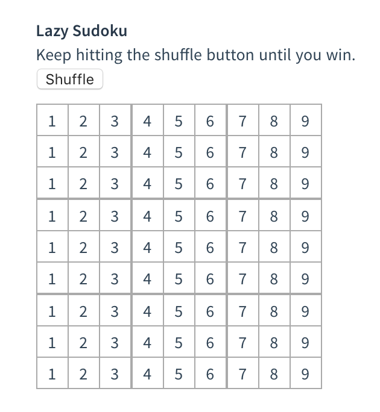
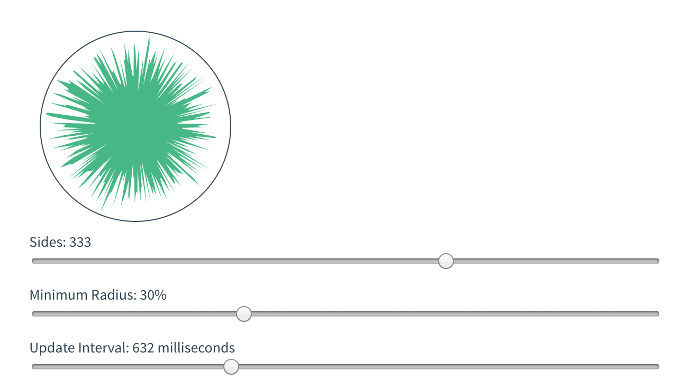
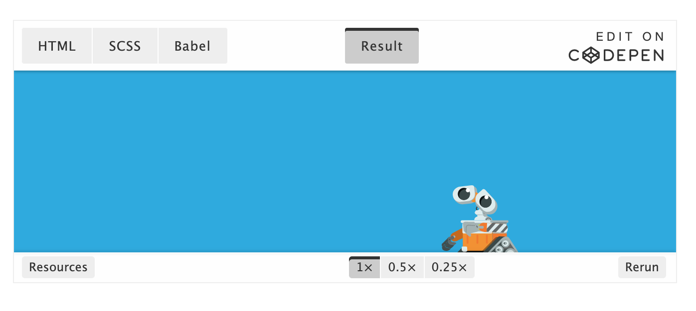

# 03 过渡 & 动画


## 目录(Catalog)
* 3.1 进入/离开 & 列表过渡
    - 3.1.1 概述
    - 3.1.2 单元素/组件的过渡
        + 3.1.2.1 过渡的类名 
        + 3.1.2.2 CSS 过渡
        + 3.1.2.3 CSS 动画
        + 3.1.2.4 自定义过渡的类名
        + 3.1.2.5 同时使用过渡与动画
        + 3.1.2.6 显性的过渡持续时间
        + 3.1.2.7 JavaScript 钩子 
    - 3.1.3 初始渲染的过渡
    - 3.1.4 多个元素的过渡
        + 3.1.4.1 过渡模式
    - 3.1.5 多个组件的过渡
    - 3.1.6 列表过渡
        + 3.1.7.1 列表的进入/离开过渡 
        + 3.1.7.2 列表的排序过渡
        + 3.1.7.3 列表的交错过渡
    - 3.1.7 可复用的过渡
    - 3.1.8 动态过渡
- 3.2 状态过渡
    - 3.2.1 状态动画与侦听器
    - 3.2.2 动态状态过渡
    - 3.2.3 把过渡放到组件里
    - 3.2.4 赋予设计以生命


## 生词(New Words)
- **interpret [ɪn'tɝprɪt] --vt.解释,说明; 解析. --vi.口译**
    + Can you interpret(vt) the passage? 你能解释这一段吗?
    + How do you interpret(vt) this sentence? 你如何解释这一句?
    + He interpreted(vt) those symbols for me. 他为我解说那些符号.
    + The student kindly interpreted(vi) for me. 那个学生亲切地为我口译.
- **interpretation [ɪntɜːprɪ'teɪʃ(ə)n] --n.解释, 翻译**
    + semantic interpretation rule. 语义解释规则. 
    + They put a false interpretation on events. 它们对事件进行了错误的解释. 
    + Everything is your mind, or interpretation of your mind.
        所有事都是你的心, 或者是你心的解释. 
- **transition [træn'zɪʃən] --n.过渡; 转换; 变迁**
    + transition animation. 过渡动画
    + transition duration. 过渡时间
    + a period of transition. 过渡时期
    + Adolescence is the period of transition between childhood and
      adulthood. 青春期是童年与成年之间的过渡时期.
- **reverse [rɪ'vɜːs] --adj.相反的. --v.逆转, 颠倒. --n.相反, 背面**
    + Reverse Proxy 反向代理, 逆向代理
    + We should see the reverse as well as the obverse of things.
      我们应该看到事物的反面和正面. 
- **alternate ['ɔːltəneɪt] --adj.轮流的; 交替的; 间隔的. vt&vi.轮流; 交替**
    + That was a week of alternate(adj) rain and sunshine.
      那是晴雨天交替的一周.
    + Alternate(adj) hop and fear. 时喜时忧.
- **flip [flɪp] --vt.弹, 轻打; 扔,掷. --vi.翻动; 跳动; 抽打.**
  **--n.一弹. --adj.冒失的; 轻浮的**
    + flip(vt) a coin. 将硬币抛上去.
    + She flipped(vt) the insect from her face. 她将昆虫从脸上弹掉.
    + He flipped(vt) a lighter onto the desk. 他把打火机往桌上一扔.
    + flip list demo. 反转列表演示.
    + She flipped(vi) at the fly with a swatter.
      她用苍蝇拍打那只苍蝇.
    + flip(vi) through a book. 快速翻阅一本书.
    + give a person a flip(n) on the cheek. 轻弹某人的面颊.
- **collection [kə'lekʃ(ə)n] --n.采集; 收集; 集合; 收藏品.**
    + The collection to shuffle. 要洗牌的集合.
    + a large collection of stamps. 大量的邮票收藏. 
    + a motley collection of books. 杂七杂八的书
- **guarantee [gær(ə)n'tiː] --n.保证; 保证书; 担保人. --vt.保证; 担保; 确保.**
    + a guarantee(n) on a camera. 照相机的保证书.
    + a guarantee(n) to provide a job. 给与工作的保证.
    + I give my guarantee(n) that I'll pay your money tomorrow.
      我保证明天付给你钱.
    + There is no guaranteed(n) that we will succeed.
      不能保证我们会成功.
    + This watch is guaranteed(vt) for five years.
      这只手表保用 5 年.
    + Who can guarantee(vt) that his story is true?
      谁能保证他的话是真的呢?
- **reverse [rɪ'vɜːs] --adj.相反的. --v.逆转, 颠倒. --n.相反, 背面**
    + Reverse Proxy 反向代理, 逆向代理
    + We should see the reverse as well as the obverse of things.
      我们应该看到事物的反面和正面. 
 - **crucial ['kruːʃ(ə)l] --adj.关键, 紧要**
    + The `cc|c` is the crucial part here; it says that there are there
      centered columns with a vertical bar between the second and third.
- **stagger ['stægɚ] --vt.错开; 交错; 蹒跚. --vi.蹒跚; 犹豫. --n.踉跄.**
    + She staggered(vi) and fell. 她踉跄了几步, 跌倒在地.
    + The drunk man staggered(vi) across the room.
      那个醉汉摇摇晃晃地穿过房间.
    + He staggered, but he did not fall. 他踉跄了几步, 但没有倒下.


## 内容(Content)

### 0.0 前置知识
- (1) CSS3 过渡(transition), 转换(transform)和动画(animation) 的知识见仓库文件: <br>
  [CSS-grocery/CSS3-过渡-转换-动画/transition-transform-animation.md](File:///Users/WANG/Github-clone/CSS-grocery/CSS3-过渡-转换-动画/transition-transform-animation.md)
- (2) ==**Important**==: 使用原生 JS 来简单实现 Vue 过渡效果的示例: <br>
  [JS-book-learning/《JavaScript高级程序设计》/Chapter11-DOM扩展/JS添加和删除class方法总结.md](File:///Users/WANG/Github-clone/JS-book-learning/《JavaScript高级程序设计》/Chapter11-DOM扩展/JS添加和删除class方法总结.md)
  内的 `1.5 使用 JS 控制 transition(过渡)效果`

  如果你不熟悉原生 JS 如何操作 CSS3 的 transition 过渡样式, 请一定先看一下这个示例.

### 3.1 进入/离开 & 列表过渡
#### 3.1.1 概述
- 当我们在 DOM 中插入, 更新或移除选项(items)时, Vue 提供了多种方式去应用
  transition(过渡)效果. 这包括用于: 
    + (1) 自动应用 class 在过渡(transition)和动画(animation) 中
    + (2) 可以配合使用第三方 CSS 动画库, 如 Animate.css
    + (3) 在过渡钩子函数中使用 JavaScript 直接操作 DOM
    + (4) 可以配合使用第三方 JavaScript 动画库, 如 Velocity.js
  
  在这里, 我们只会讲到进入、离开和列表的过渡, 你也可以看下一节的
  `管理过渡状态`(`3.2 状态过渡`).
#### 3.1.2 单元素/组件的过渡
- Vue 提供了 `transition(过渡)` 的封装组件, 在下列情形中,
  可以给任何元素和组件添加进入/离开过渡.
    + (1) 条件渲染 (使用 `v-if`) 
    + (2) 条件展示 (使用 `v-show`)
    + (3) 动态组件
    + (4) 组件根节点
  
  这是一个典型的例子:
  ```vue
    <template>
        <div class="default-div">
            <h2>3.1.2 单元素/组件的过渡</h2>
            <div id="demo">
                <button @click="show = !show">Toggle</button>
                <transition name="fade">
                    <p v-if="show">Hello</p>
                </transition>
            </div>
        </div>
    </template>
    <script>
        export default {
            name: 'Demo312',
            data() {
                return {
                    show: true
                }
            }
        }
    </script>
    <style scoped>
        /* - transition 会自动监听元素从起始状态到终止状态的过渡, 我们不用管中间状态.
         *   对应此示例, 起始状态到终止状态的过渡有 2 种情形: 细节讲解参考:
         *   0.0 前置知识 - (2) 使用原生 JS 来简单实现 Vue 过渡效果的示例:
         */
        .fade-enter-active, .fade-leave-active {
            transition: opacity .5s;
        }
        .fade-enter, .fade-leave-to {
            opacity: 0;
        }
    </style>
  ```
  当插入或删除包含在 `transition` 组件中的元素时, Vue 将会做以下处理:
    + (1) 自动嗅探目标元素是否应用了 CSS 过渡或动画, 如果是, 在恰当的时机添加删除
      CSS 类名.
    + (2) 如果过渡组件提供了 `JavaScript 钩子函数`(下面
      `3.1.2.7 JavaScript 钩子`), 这些钩子函数将在恰当的时机被调用.
    + (3) 如果没有找到 JavaScript 钩子并且也没有检测到 CSS 过渡/动画, DOM 操作
      (插入/删除) 在下一帧中立即执行. (注意: 此指浏览器逐帧动画机制, 和 Vue 的
      `nextTick` 概念不同.)
##### 3.1.2.1 过渡的类名
- 在元素 进入(enter)/离开(leave) 的过渡(transition)中, 有 6 个 class 被应用:
    + (1) `v-enter`: 定义进入过渡的开始状态. 在元素被插入到 DOM 之前添加,
      在元素被插入之后的下一帧移除.
    + (2) `v-enter-active`: 元素进入过渡(transition)时被激活,
      应用在整个进入状态. 在元素插入 DOM 的那一刻即被添加,
      过渡(transition) / 动画(animation) 完成之后被移除.
      这个类可以也可以用来定义进入过渡的过渡持续时间(transition-duration),
      过渡时间的曲线函数(transition-timing-function)
      以及延迟过渡(transition-delay). (tip: 这里的知识, 在上面的 **前置知识**
      中有详细的讲解).
    + (3) `v-enter-to`: **2.1.8 版本及以上** 定义进入过渡的结束状态.
      在元素被插入之后下一帧生效(与此同时 `v-enter` 被移除), 在 transition(过渡)
      / 动画(animation) 完成之后移除.
    + (4) `v-leave`: 定义离开过渡(leave transition) 的开始状态.
      在离开过渡被触发时立刻生效, 下一帧被移除.
    + (5) `v-leave-active`: 定义离开过渡生效时的状态. 在整个离开过渡的阶段中应用,
      在离开过渡被触发时立即生效, 在过渡/动画完成之后移除.
      这个类同样可以也可以用来定义进入过渡的过渡持续时间(transition-duration),
      过渡时间的曲线函数(transition-timing-function)
      以及延迟过渡(transition-delay).
    + (6) `v-leave-to`: **2.1.8 版及以上** 定义离开过渡的结束状态.
      在离开过渡被触发之后下一帧生效(与此同时 `v-leave` 被删除),
      在过渡/动画完成之后移除.

  
  
  对于这些在过渡中切换的类名来说, 如果你使用一个没有名字的 `<transition>`, 则 `v-`
  是这些类名的默认前缀. 如果你使用了 `<transition name="my-transition">`,
  那么 `v-enter` 会替换为 `my-transition-enter`.

  `v-enter-active` 和 `v-leave-active` 可以控制 进入/离开 过渡的不同的缓和曲线,
  在下面章节会有个示例说明.
  
##### 3.1.2.2 CSS 过渡
- 常用的过渡都是使用 CSS 过渡. 下面是一个简单例子.
  ```vue
    <template>
        <div class="default-div">
            <h2>3.1.2.2 CSS 过渡</h2>
            <div id="demo">
                <button @click="show = !show">Toggle render</button>
                <transition name="slide-fade">
                    <p v-if="show">CSS transition(过渡)</p>
                </transition>
            </div>
        </div>
    </template>

    <script>
        export default {
            name: 'Demo3122',
            data() {
                return {
                    show: true
                }
            }
        }
    </script>

    <style scoped>
        /* - 可以设置不同的进入和离开动画 */
        /* - 设置持续时间和动画函数 */
        .slide-fade-enter-active {
            transition: all .6s linear;
        }
        .slide-fade-leave-active {
            transition: all .6s cubic-bezier(1.0, 0.5, 0.8, 1.0);
        }
        .slide-fade-enter, .slide-fade-leave-to {
            transform: translateX(10px);
            opacity: 0;
        }
    </style>
  ```
##### 3.1.2.3 CSS 动画
- CSS 动画用法同 CSS 过渡, 区别是在动画中 `v-enter` 类名在节点插入 DOM
  后不会立即删除, 而是在 `animationend` 事件触发时删除.

  示例: (省略了兼容性前缀)
  ```vue
    <template>
        <div class="default-div">
            <h2>3.1.2.3 CSS 动画</h2>
            <div id="demo">
                <button @click="show = !show">Toggle show</button>
                <transition name="bounce">
                    <p v-if="show" class="text-center">
                        CSS animation(动画): <br>
                        Lorem ipsum dolor sit amet, consectetur adipiscing elt.
                    </p>
                </transition>
            </div>
        </div>
    </template>
    <script>
        export default {
            name: 'Demo3123',
            data() {
                return {
                    show: true
                }
            }
        }
    </script>
    <style scoped>
        .text-center {
            text-align: center;
        }
        .bounce-enter-active {
            animation: bounce-in .5s;
        }
        .bounce-leave-active {
            /* - animation-direction 让动画按照指定顺序来播放 `@keyframes` 定义的关键帧.
            *   其值有:
            * - (1) `normal` 默认值.
            * - (2) `reverse` 表示动画反向播放.
            * - (3) `alternate` 表示正向和反向交叉进行.
            * - (4) `alternate-reverse` 表示反向和正向交叉进行. */
            animation: bounce-in .5s reverse;
        }
        @keyframes bounce-in {
            0% { transform: scale(0); }
            50% { transform: scale(1.5); }
            100% { transform: scale(1); }
        }
    </style>
  ```
##### 3.1.2.4 自定义过渡的类名
- 我们可以通过以下 特性(attribute) 来自定义过渡类名:
    + (1) `enter-class`
    + (2) `enter-active-class`
    + (3) `enter-to-class` (2.1.8+)
    + (4) `leave-class`
    + (5) `leave-active-class`
    + (6) `leave-to-class` (2.1.8+)
    
  这些将覆盖常规的(conventional)的类名, 当你想把 Vue 的过渡系统与已经存在的
  CSS 动画(animation) 库相连接时这特别有用, 例如
  [Animate.css](https://daneden.github.io/animate.css/)
      
  示例:
  ```vue
    <!-- Tip: 使用命令行在项目中安装 animate.css
            `npm install --save animate.css` 或者 `yarn add animate.css`
    -->
    <template>
        <div class="default-div">
            <h2>3.1.2.4 自定义过渡的类名</h2>
            <div id="Demo3124">
                <button @click="show = !show">Toggle show</button>
                <transition
                    name="custom-classes-transition"
                    enter-active-class="animated tada"
                    leave-active-class="animated bounceOutRight"
                    >
                    <p v-if="show">
                        自定义过渡类名
                    </p>
                </transition>
            </div>
        </div>
    </template>
    <script>
        // - 引入 animate.css
        import animate from 'animate.css'
        export default {
            name: 'Demo3124',
            data() {
                return {
                    show: true
                }
            }
        }
    </script>
  ```
##### 3.1.2.5 同时使用过渡与动画
- Vue 为了知道过渡的完成, 必须设置相应的事件监听器, 它可以是 `transitionend`
  或 `animationend`, 这取决于给元素应用的 CSS 规则. 如果你使用其中任何一种,
  Vue 能自动识别类型并设置监听.

  但是, 在一些场景中, 你需要给同一个元素同时设置 2 种过渡动效, 比如 `animation`
  很快的被触发并完成了, 而 `transition` 效果还没结束. 在这种情况下, 你需要使用
  `type` 特性(attribute) 并设置 `animation` 或 `transition`
  来明确声明你需要 Vue 监听的类型.

##### 3.1.2.6 显性的过渡持续时间
- <p style="color: green">2.2.0 新增</p>
- 在很多情况下, Vue 可以自动得出过渡效果的完成时机. 默认情况下,
  Vue 会等待根过渡(transition)元素上的第一个 `transitionend` 或
  `animationend` 事件. 然而也可以不这样设定 -- 比如,
  我们可以拥有一个精心编排的一系列过渡效果,
  其中一些嵌套的内部元素相比于过渡效果的根元素有延迟的或更长的过渡效果.

  在这种情况下你可以用 `<transition>` 组件上的 `duration`
  属性定制一个显性的过渡持续时间(以毫秒计): 
  ```html
    <transition v-bind:duration="1000">...</transition>
    ```
    你也可以定制进入和移出的持续时间:
    ```html
    <transition :duration="{enter: 500, leave: 800}">...</transition>
  ```

##### 3.1.2.7 JavaScript 钩子
- 可以在属性中声明 JavaScript 钩子
  ```html
    <!-- enter cancelled 进入取消  -->
    <transition
        v-on:before-enter="beforeEnter"
        @enter="enter"
        @after-enter="afterEnter"
        @enter-cancelled="enterCancelled"

        @before-leave="beforeLeave"
        @leave="leave"
        @after-leave="afterLeave"
        @leave-cancelled="leaveCancelled"
    >
    <!-- ... -->
    </transition>
  ```
  ```js
    methods: {
        /* - 进入中 */
        beforeEnter: function(el) {
            // ...
        },
        // - 当与 CSS 结合使用时, 回调函数 done 是可选的
        enter: function(el, done) {
            // ...
            done()
        },
        afterEnter: function(el) {
            // ...
        },
        enterCancelled: function(el) {
            // ...
        },

        /* - 离开时 */
        beforeLeave: function(el) {
            // ...
        },
        // - 当与 CSS 结合使用时, 回调函数 done 是可选的
        leave: function(el, done) {
            // ...
            done()
        },
        afterLeave: function(el) {
            // ...
        },
        // - leaveCancelled 只用于 v-show 中
        leaveCancelled: function(el) {
            // ...
        }
    }
  ```
  这些钩子函数可以结合 CSS `transition`/`animation` 使用, 也可以单独使用.

  **Warning**: 当使用 JavaScript 过渡的时候, 在 `enter` 和 `leave`
  中必须使用 `done` 进行回调. 否则, 它们将被同步回调, 过渡会立即完成.

  **Warning**: 推荐对于仅使用 JavaScript 过渡的元素添加
  `v-bind:css="false"`, Vue 会跳过 CSS 的检测.
  这也可以避免过渡过程中 CSS 的影响.

  一个使用 `Velocity.js` 的简单例子:
  ```vue
    <!-- NPM 安装: `npm install velocity-animate@beta -->
    <!-- Velocity 和 jQuery.animate 的工作方式类似, 也是用来实现
            JavaScript 动画的一个很棒的选择 -->
    <template>
        <div class="default-div">
            <h2>3.1.2.7 JavaScript 钩子</h2>
            <div id="Demo3127">
                <button @click="show = !show">Toggle use Velocity.js</button>
                <transition
                    v-on:before-enter="beforeEnter"
                    v-on:enter="enter"
                    v-on:leave="leave"
                    v-bind:css="false"
                >
                    <p v-if="show">
                    animation effects.
                    </p>
                </transition>
            </div>
        </div>
    </template>
    <script>
        import Velocity from 'velocity-animate'
        export default {
            name: 'Demo3127',
            data() {
                return {
                    show: false
                }
            },
            methods: {
                beforeEnter: function(el) {
                    el.style.opacity = 0;
                    el.style.transformOrigin = 'left';
                },
                enter: function(el, done) {
                    Velocity(el, {opacity: 1, fontSize: '1.4em'}, {duration: 300});
                    Velocity(el, {fontSize: '1em'}, {complete: done});
                },
                /* - Notice: 离开的效果在当前组件中死活改不对, 方了!!! */
                leave: function(el, done) {
                    Velocity(el, {translateX: '15px', rotateZ: '50deg'}, {duration: 600});
                    Velocity(el, {rotateZ: '100deg'}, {loop: 2});
                    Velocity(el, {
                        rotateZ: '45deg',
                        translateY: '30px',
                        translateX: '30px',
                        opacity: 0
                    }, {complete: done})
                }
            }
        }
    </script>
    <style scoped>
        #Demo3127 {
            height: 160px;
            width: 76%;
            margin: 0 auto;
            background: lightgray;
            border-radius: 4px;
            text-align: center;
            overflow: auto;
            position: relative;
        }
    </style>
  ```

#### 3.1.3 初始渲染的过渡
- 可以通过 `appear` 特性(attribute) 设置节点在初始渲染的过渡
  ```html
    <transition appear>
        <!-- ... -->
    </transition>
  ```
  这里默认和进入/离开过渡一样, 同样也可以自定义 CSS 类名.
  ```html
    <transition
        appear
        appear-class="custom-appear-class"
        appear-to-class="custom-appear-to-class"
        appear-active-class="custom-appear-active-class"
    >
        <!-- ... -->
    </transition>
  ```
  自定义 JavaScript 钩子:
  ```html
    <transition
        appear
        @before-appear="customBeforeAppearHook"
        @appear="customAppearHook"
        @after-appear="customAfterAppearHook"
        @appear-cancelled="customAppearCancelledHook"
    >
        <!-- ... -->
    </transition>
  ```
  在上面的例子中, 无论是 `appear` 特性(attribute) 还是 `v-on:appear`
  钩子都会生成初始渲染过渡.
#### 3.1.4 多个元素的过渡
- 我们之后讨论 多个组件的过渡(下一节), 对于原生标签可以使用 `v-if`/`v-else`.
  最常见的多标签过渡是一个列表和描述这个列表为空消息的元素:
  ```html
    <transition>
        <table v-if="items.length > 0">
            <!-- ... -->
        </table>
        <p v-else>Sorry, no items found.</p>
    </transition>
  ```
  可以这么使用, 但是有一点要注意:

  **Warning:** 当有**相同标签名**的元素切换时, 需要通过 `key` 特性(attribute)
  设置唯一的值来标记以让 Vue 区分它们, 否则 Vue 为了效率只会替换相同标签内部的内容.
  即使在技术上没有必要, **给在 `<transition>` 组件中的多个元素设置 key
  是一个更好的实践**.

  示例:
  ```html
    <transition>
        <button v-if="isEditing" key="save">Save</button>
        <button v-else key="edit">Edit</button>
    </transition>
  ```
  在一些场景中, 也可以通过给同一个元素的 `key` 特性(attribute) 设置不同的状态来代替
  `v-if` 和 `v-else`, 上面的例子可以重写为:
  ```html
    <transition>
        <button v-if="isEditing">
            {{ isEditing ? 'Save' : 'Edit' }}
        </button>
    </transition>
  ```
  这里添加一个单文件组件的示例:
  ```vue
    <template>
        <div class="default-div">
            <h2>3.1.4 多个元素的过渡</h2>
            <div class="fade-btn-wrapper" @click="show = !show">
                <transition name="fade">
                    <button :key="show">
                        {{ show ? 'Save' : 'Edit' }}
                    </button>
                </transition>
            </div>
        </div>
    </template>

    <script>
        export default {
            name: 'Demo314',
            data() {
                return {
                    show: true,
                }
            },
        }
    </script>

    <style scoped>
        /* - 可以设置不同的进入和离开动画 */
        /* - 设置持续时间和动画函数 */
        .fade-enter-active, .fade-leave-active {
            transition: all .6s linear;
        }
        .fade-enter, .fade-leave-to {
            transform: translateX(10px);
            opacity: 0;
        }
        .fade-btn-wrapper {
            margin-left: 50px;
        }
        .fade-btn-wrapper button {
            margin-right: 2px;
        }
    </style>
  ```
  使用多个 `v-if` 的多个元素的过渡可以重写为绑定了动态属性的单个元素过渡. 例如:
  ```html
    <transition>
        <button v-if="docState === 'saved'" kye="saved">Edit</button>
        <button v-if="docState === 'edited'" kye="edited">Save</button>
        <button v-if="docState === 'editing'" kye="editing">Cancel</button>
    </transition>
  ```
  可以重写为: 
  ```html
    <transition>
        <button v-bind:key="docState">{{ buttonMessage }}</button>
    </transition>
  ```
  ```js
    export default {
        // ...
        computed: {
            buttonMsg: function() {
                switch (this.docState) {
                    case 'saved':
                        return 'Edit';
                    case 'edited': 
                        return 'Save';
                    case 'editing':
                        return 'Cancel';
                }
            }
        }
    }
  ```
- 3.1.4.1 过渡模式
  
  这里还有一个问题, 请试着点击下面的按钮: 即上面的 `3.1.4 多个元素的过渡` 示例,
  在 `Edit` 按钮和 `Save` 按钮的过渡中, 两个按钮都被重绘了,
  一个离开过渡的时候另一个开始进入过渡. 这是 `<transition>` 的默认行为 -
  进入和离开同时发生.

  如果一个元素绝对定位在另一个之上时可以实现我们经常在网页中使用的两个按钮切换的效果.
  如果再加上 `translate` 可以让他们的运动像滑动过渡, 我们把上面的
  `3.1.4 多个元素的过渡`稍微更该一下, 看看如何试下这个效果:
  ```vue
    <!-- 其他和上面的相同, 省略 -->

    <!-- Tip: 这个地方的样式我真的改了好久, 好久.... -->
    <style scoped>
        /* - 可以设置不同的进入和离开动画 */
        /* - 设置持续时间和动画函数 */
        .fade-enter-active, .fade-leave-active {
            transition: all .6s linear;
        }
        .fade-enter-active {
            transition-delay: .3s;
        }
        .fade-leave-to {
            transform: translateX(-26px);
            opacity: 0;
        }
        .fade-enter {
            transform: translateX(26px);
            opacity: 0;
        }
        .fade-enter-to {
            transform: translateX(0);
            opacity: 1;
        }
        .fade-btn-wrapper {
            margin-left: 50px;
            position: relative;
            height: 26px; width: auto;
            /*background: lightblue;*/
        }
        .fade-btn-wrapper button {
            min-width: 0;
            font-size: 12px;
            border: 1px solid #eee;
            margin-top: 1px;
            margin-right: 2px;
            position: absolute;
        }
    </style>
  ```
  同时生效的进入和离开的过渡不能满足所有需求, 所以 Vue 提供了**过渡模式**:
    + `out-in`: 当前元素先过渡离开, 完成之后新元素过渡进入.
    + `in-out`: 新元素先过渡进入, 完成之后当前元素过渡离开.
  
  用 `out-in` 重写之前的开关按钮过渡:
  ```html
    <transition name="fade" mode="out-in">
        <!-- ... the buttons ... -->
    </transition>
  ```
  单文件示例代码:
  ```vue
    <template>
        <div class="default-div">
            <h2>3.1.4 多个元素的过渡</h2>
            <div class="fade-btn-wrapper" @click="show = !show">
                <transition name="fade" mode="out-in">
                    <button :key="show">
                        {{ show ? 'Save' : 'Edit' }}
                    </button>
                </transition>
            </div>
        </div>
    </template>
    <script>
        export default {
            // - Omitted(省略)...
        }
    </script>
    <style scoped>
        .fade-enter-active, .fade-leave-active {
            transition: all .5s linear;
        }
        .fade-enter, .fade-leave-to {
            /*transform: translateX(16px);*/
            opacity: 0;
        }
        .fade-btn-wrapper {
            margin-left: 50px;
            position: relative;
            height: 26px; width: auto;
        }
        .fade-btn-wrapper button {
            min-width: 0;
            font-size: 12px;
            border: 1px solid #eee;
            margin-top: 1px;
            margin-right: 2px;
            position: absolute;
        }
    </style>
  ```
  只用添加一个简单的特性(attribute), 就解决了之前的过渡问题而无需任何额外的代码.

  `in-out` 模式也不是经常用到, 但对于一些稍微不同的过渡效果还是有用的.
  将之前滑动淡出的例子结合: 
  ```vue
    <!-- Hint: 很诚实的说, 我真没看出为什么 in-out 比较少用, 用 transition
        添加样式后, 效果和 out-in 也差不多, out-in 是当前显示的元素先过渡离开,
        然后要显示的新元素才过渡进入; in-out 就是新元素先过渡进入,
        完成之后当前过渡离开. 好绕... -->
    <template>
        <div class="default-div">
            <h2>3.1.4 多个元素的过渡</h2>
            <div class="fade-btn-wrapper" @click="show = !show">
                <!-- in-out: 新元素先出现过渡, 完成后当前元素过渡离开. -->
                <transition name="fade" mode="in-out">
                    <button :key="show">
                        {{ show ? 'Save' : 'Edit' }}
                    </button>
                </transition>
            </div>
        </div>
    </template>

    <script>
        export default {
            name: 'Demo314',
            data() {
                return {
                    show: true,
                }
            },
        }
    </script>

    <style scoped>
        .fade-enter-active, .fade-leave-active {
            transition: all .5s linear;
        }
        .fade-leave-to {
            transform: translateX(-20px);
            opacity: 0;
        }
        .fade-enter {
            transform: translateX(20px);
            opacity: 0;
        }
        /* - 这个 fade-enter-to 样式可以不写, 因为设置了 fade-enter 样式后,
         *   Vue 会自动推测 fade-enter-to 即要过渡到达后的样式效果,
         *   因为这些样式一般情况下都是两个值之间切换, 比如 opacity = 0 / 1,
         *   translateX(16px) 切换到 fade-enter-to 后一般是 translateX(0);
         */
        .fade-enter-to {
            transform: translateX(0);
            opacity: 1;
        }
        .fade-btn-wrapper {
            margin-left: 50px;
            position: relative;
            height: 26px; width: auto;
            /*background: lightblue;*/
        }
        .fade-btn-wrapper button {
            min-width: 0;
            font-size: 12px;
            border: 1px solid #eee;
            margin-top: 1px;
            margin-right: 2px;
            position: absolute;
        }
    </style>
  ```

#### 3.1.5 多个组件的过渡
- 多个组件的过渡简单很多 - 我们不需要使用 `key` 特性(attribute). 相反,
  我们只需要使用 `动态组件`:
  ```vue
    <template>
        <div class="default-div">
            <h2>3.1.6 多个组件的过渡</h2>
            <p>
                <span>
                    <!--
                        - v-model 在内部为不同的输入元素使用不同的属性并抛出不同的事件:
                            + (1) text 和 textarea 元素使用 value 属性和 input 事件;
                            + (2) checkbox 和 radio 使用 checked 属性和 change 事件;
                            + (3) select 字段将 value 作为 prop 并将 change 作为事件.
                    -->
                    <input type="radio" id="one" value="VA" v-model="view">
                    <label for="one">A</label>
                </span>
                <span>
                    <input type="radio" id="two" value="VB" v-model="view">
                    <label for="two">B</label>
                </span>
            </p>
            <div class="fade-btn-wrapper">
                <transition name="component-fade" mode="out-in">
                    <component v-bind:is="view"></component>
                </transition>
            </div>
        </div>
    </template>
    <script>
        import VA from './v-a';
        import VB from './v-b';
        export default {
            name: 'Demo316',
            data() {
                return {
                    view: 'VA',
                }
            },
            components: {
                VA,
                VB,
            }
        }
    </script>
    <style scoped>
        .component-fade-enter-active, .component-fade-leave-active {
            transition: opacity .3s linear;
        }
        .component-fade-enter, .component-fade-leave-to {
            opacity: 0;
        }
        .default-div p span{
            margin-right: 10px;
        }
        label {
            margin-left: 5px;
        }
    </style>
  ```
#### 3.1.6 列表过渡
- 目前为止, 关于过渡我们已经讲到:
    + 单个节点.
    + 同一时间渲染多个节点中的一个.

  那么怎么同时渲染整个列表, 比如使用 `v-for`? 在这种场景中, 使用
  `<transition-group>` 组件. 在我们深入例子之前, 先了解关于这个组件的几个特点:
    + (1) 不同于 `<transition>`, `<transition-group>`
      内的元素会以一个真实的标签元素呈现: 默认为一个 `<span>`.
      你也可以通过 `tag` 特性(attribute) 更换为其他元素. 
    + (2) `过渡模式`(上面 `3.1.4.1 过渡模式`) 不可用, 因为我们不再相互切换特有的元素.
    + (3) 内部元素总是需要提供唯一的 `key` 属性值.
    + (4) CSS 过渡的类将会应用在内部的元素中, 而不是这个组/容器本身.
- 3.1.7.1 列表的进入/离开过渡

  现在让我们由一个简单的例子深入, 进入和离开的过渡使用之前一样的 CSS 类名.
  
  单文件示例如下:
  ```vue
    <template>
        <div class="default-div">
            <h2>3.1.7.1 列表的进入/离开过渡</h2>
            <div id="list-demo" class="demo">
                <button @click="add">Add</button>
                <button @click="remove">Remove</button>
                <transition-group name="list" tag="p">
                    <span v-for="item in items" :key="item" class="list-item">
                        {{ item }}
                    </span>
                </transition-group>
            </div>
        </div>
    </template>

    <script>
        export default {
            name: 'Demo3171',
            data() {
                return {
                    items: [1, 2, 3, 4, 5, 6, 7, 8, 9],
                    nextNum: 10
                }
            },
            methods: {
                randomIndex: function() {
                    return Math.floor(Math.random() * this.items.length)
                },
                add: function() {
                    this.items.splice(this.randomIndex(), 0, this.nextNum++)
                },
                remove: function() {
                    this.items.splice(this.randomIndex(), 1)
                }
            },
        }
    </script>

    <style scoped>
        .list-item {
            display: inline-block;
            margin-right: 10px;
        }
        .list-enter-active, .list-leave-active {
            transition: all 1s;
        }
        .list-enter, .list-leave-to {
            opacity: 0;
            transform: translateY(30px);
        }
    </style>
  ```
  这个例子有个问题, 当添加和移除元素的时候, 周围的元素会瞬间移动到它们的新布局的位置,
  而不是平滑的过渡, 我们下面会解决这个问题.
- 3.1.7.2 列表的排序过渡

  `<transition-group>` 组件还有一个特殊之处. 不仅可以进入和离开动画,
  还可以改变定位. 要使用这个新功能只需要了解新增的 `v-move` 特性(attribute),
  它会在元素的改变定位的过程中应用. 像之前的类名一样, 可以通过 `name`
  属性来自定义前缀, 也可以通过 `move-class` 属性手动设置.

  `v-move` 对于设置过渡的切换时机和过渡曲线非常有用, 你会看到如下的例子:
  ```vue
    <template>
        <div class="default-div">
            <h2>3.1.7.2 列表的排序过渡</h2>
            <!-- flip list demo 翻转列表示例-->
            <div id="flip-list-demo" class="demo typo">
                <button @click="shuffle">shuffle</button>
                <transition-group name="flip-list" tag="ul">
                    <li v-for="item in items" :key="item" class="list-item">
                        {{ item }}
                    </li>
                </transition-group>
            </div>
        </div>
    </template>
    <script>
        import _ from 'lodash';
        export default {
            name: 'Demo3171',
            data() {
                return {
                    items: [1, 2, 3, 4, 5, 6, 7, 8, 9],
                    nextNum: 10
                }
            },
            methods: {
                shuffle: function() {
                    this.items = _.shuffle(this.items);
                }
            },
        }
    </script>
    <style scoped>
        .default-div {
            height: auto;
            min-height: 200px;
            overflow: auto;
        }
        .flip-list-move {
            transition: transform 1s;
        }
    </style>
  ```
  这个看起来很神奇, 内部的实现, Vue 使用了一个叫
  [FLIP](https://aerotwist.com/blog/flip-your-animations/) 简单的动画队列.
    + Added: `FLIP`: 代表 `First(第一)`, `Last(最后)`, `Invert(反转)`,
      `Play(播放)`. Let's break it down(让我们来分析一下): 
        - `First`: 过渡中涉及的元素的初始状态.
        - `Last`: 元素的最终状态(finial state).
        - `Invert`: 这很有趣.
          你可以计算出从第一个元素到最后一个元素它们是如何改变的, 即 `width`,
          `height` `opacity`. 接下来应用 `transform` 和 `opacity`
          变更为反向, 或反转它们. 如果元素在 "第一" 和 "最后" 之间向下移动了 90px,
          你可以应用 `transform: translateY(-90px)`.
          这使得元素看起来好像它们仍然在第一的位置, 但关键是, 它们不是.
        - `Play`: 为你更改的任何属性打开过渡, 然后删除上一步的 `invert`(反转)
          更改. 由于一个或多个元素处于其最终位置, 因此删除变换(transform))和
          (opacity)透明度会使他们从其仿制的 "第一" 位置移动到 "最后"位置.

  我们将之前实现的例子和这个技术结合, 使我们列表的一切变动都会有动画过渡.
  ```vue
    <template>
        <div class="default-div">
            <h2>3.1.7.2 列表的排序过渡</h2>
            <div id="flip-list-demo" class="demo typo">
                <button @click="shuffle">shuffle</button>
                <button @click="add">Add</button>
                <button @click="remove">Remove</button>
                <transition-group name="list-complete" tag="p">
                    <span v-for="item in items" :key="item" class="list-complete-item">
                        {{ item }}
                    </span>
                </transition-group>
            </div>
        </div>
    </template>
    <script>
        import _ from 'lodash';
        export default {
            name: 'Demo3171',
            data() {
                return {
                    items: [1, 2, 3, 4, 5, 6, 7, 8, 9],
                    nextNum: 10
                }
            },
            methods: {
                randomIndex: function () {
                    return Math.floor(Math.random * this.items.length);
                },
                add: function () {
                    this.items.splice(this.randomIndex(), 0, this.nextNum++,)
                },
                remove: function() {
                    this.items.splice(this.randomIndex(), 1)
                },
                shuffle: function() {
                    this.items = _.shuffle(this.items)
                }
            },
        }
    </script>
    <style scoped>
        .default-div {
            height: auto;
            min-height: 200px;
            overflow: auto;
        }
        .list-complete-item {
            transition: all 1s;
            display: inline-block;
            margin-right: 10px;
        }
        .list-complete-enter, .list-complete-leave-to {
            opacity: 0;
            transform: translateY(30px);
        }
        .list-complete-leave-active {
            position: absolute;
        }
    </style>
  ```
  **Warning:** 需要注意的是使用 FLIP 过渡的元素不能设置为 `display: inline`.
  作为替代方案, 可以设置为 `display:inline-block` 或者放置于 flex 中.

  FLIP 动画不仅可以实现单列过渡, 多维网格也同样可以过渡, 效果如下图:

  
  
  单文件组件的代码如下:
  ```vue
    <template>
        <div class="default-div">
            <h2>3.1.7.2 List Move Transitions Sudoku Example</h2>
            <div id="sudoku-demo" class="demo">
                <h1>Lazy Sudoku</h1>
                <p>Keep hitting the shuffle button util you win.</p>

                <button @click="shuffle">Shuffle</button>
                <transition-group name="cell" tag="div" class="container">
                    <div class="cell" v-for="cell in cells" :key="cell.id">
                        {{ cell.number }}
                    </div>
                </transition-group>
            </div>
        </div>
    </template>
    <script>
        import _ from 'lodash';
        export default {
            name: 'Demo3171',
            data() {
                return {
                cells: Array.apply(null, {length: 81}).map(function(_, index) {
                    return {
                        id: index,
                        number: (index % 9) + 1
                    }
                }),
                }
            },
            methods: {
                shuffle: function() {
                    this.cells = _.shuffle(this.cells);
                }
            },
        }
    </script>
    <style scoped>
        .default-div {
            height: auto;
            min-height: 460px;
            overflow: auto;
        }
        .container {
            display: flex;
            flex-wrap: wrap;
            width: 238px;
            margin-top: 10px;
        }
        .cell {
            display: flex;
            justify-content: space-around;
            align-items: center;
            width: 25px;
            height: 25px;
            border: 1px solid #aaa;
            margin-right: -1px;
            margin-bottom: -1px;
        }
        .cell:nth-child(1) {
            background: #6be855;
        }
        .cell:nth-child(2) {
            background: #c6a933;
        }
        .cell:nth-child(3n) {
            margin-right: 0;
            background: lightcoral;
        }
        .cell:nth-child(4) {
            background: #b185ec;
        }
        .cell:nth-child(27n) {
            margin-bottom: 0;
            background: lightblue;
        }
        .cell-move {
            transition: transform 1s;
        }
    </style>
  ```

  **Suggestion:** 请一定给几个格子添加一下颜色, 看下这些 cell 是如何运行的,
  哈哈哈... 真是意想不到 LOL. 
    
- 3.1.7.3 列表的交错过渡
  
  通过 `data` 特性(attribute) 与 JS 通信, 就可以实现列表的交错过渡. 示例代码如下:
  ```vue
    <template>
        <div class="default-div typo">
            <h2>3.1.7.3 列表的交错过渡</h2>
            <input v-model="query">
            <transition-group
                name="staggered-fade"
                tag="ul"
                :css="false"
                :before-enter="beforeEnter"
                @enter="enter"
                @leave="leave">
                <li
                    v-for="(item, index) in computedList"
                    :key="item.msg"
                    :data-index="index"
                >{{ item.msg }}</li>
            </transition-group>
        </div>
    </template>
    <script>
        import Velocity from 'velocity-animate';
        export default {
            name: 'Demo3173',
            data() {
                return {
                    query: '',
                    list: [
                        {msg: 'Bruce Lee'},
                        {msg: 'Jackie Chan'},
                        {msg: 'Chunk Norris'},
                        {msg: 'Jet Li'},
                        {msg: 'Kung Fury'},
                    ]
                }
            },
            computed: {
                computedList: function() {
                    var vm = this;
                    return this.list.filter(function(item) {
                        return item.msg.toLowerCase().indexOf(vm.query.toLowerCase()) !== -1
                    })
                }
            },
            methods: {
                beforeEnter: function(el) {
                    el.style.opacity = 0;
                    el.style.height = 0;
                },
                enter: function(el, done) {
                    // - HTML5 规定可以为元素添加以 `data-` 为前缀的非标准属性,
                    //   可以通过元素的 `dataset` 属性来访问自定义属性的值. 
                    //   --《JavaScript 高级程序设计》 11.3.5 自定义数据属性
                    var delay = el.dataset.index * 150;
                    setTimeout(function() {
                        Velocity(
                            el,
                            {opacity: 1, height: '1.6em'},
                            {complete: done}
                        )
                    }, delay)
                },
                leave: function(el, done) {
                    var delay = el.dataset.index * 150;
                    setTimeout(function() {
                        Velocity(
                            el,
                            {opacity: 0, height: 0},
                            {complete: done}
                        )
                    }, delay)
                }
            },
        }
    </script>
    <style scoped>
        .default-div {
            height: auto;
            min-height: 260px;
            overflow: auto;
        }
    </style>
  ```

#### 3.1.7 可复用的过渡
- 过渡可以通过 Vue 的组件系统实现复用. 要创建一个可复用过渡组件, 你需要做的就是将
  `<transition>` 或者 `<transition-group>` 作为根组件,
  然后将任何子组件放置在其中就可以了.

  使用 template 的简单例子: *略*

  **Hint:** 组件复用, 就是把组件单独拿出来放在一个 *.vue 组件中即可, 不再创建示例.
  
#### 3.1.8 动态过渡
- 在 Vue 中即使是过渡也是数据驱动的! 动态过渡最基本的例子是通过 `name`
  特性(attribute) 来绑定动态值.
  ```html
    <transition v-bind:name="transitionName">
        <!-- ... -->
    </transition>
  ```
  当你想用 Vue 的过渡系统来定义的 CSS 过渡/动画 在不同过渡间切换回非常有用.

  所有过渡 特性(attribute) 都可以动态绑定, 但我们不仅仅只有 attribute 可用,
  还可以通过事件钩子获取上下文中的所有数据, 因为事件钩子都是方法. 这意味着,
  根据组件的状态不同, 你的 JS 过渡会有不同的表现. 如下示例:
  ```vue
    <template>
        <div class="default-div">
            <h2>3.1.9 动态过渡</h2>
            Fade In:
            <input type="range" v-model="fadeInDuration" min="0"
                :max="maxFadeDuration">
            <br>
            Fade Out:
            <input type="range" v-model="fadeOutDuration" min="0" 
                :max="maxFadeDuration">
            <transition
                :css="false"
                @before-enter="beforeEnter"
                @enter="enter"
                @leave="leave"
            >
                <p v-if="show">Hello</p>
            </transition>
            <button
                v-if="stop"
                @click="stop = false; show = false"
            >Start animating</button>
            <button
                v-else
                @click="stop = true"
            >Sop it!</button>
        </div>
    </template>

    <script>
        import Velocity from 'velocity-animate';
        export default {
            name: 'Demo319',
            data() {
                return {
                    show: true,
                    fadeInDuration: 1000,
                    fadeOutDuration: 1000,
                    maxFadeDuration: 1500,
                    stop: true
                }
            },
            mounted: function() {
                this.show = false;
            },
            methods: {
                beforeEnter: function(el) {
                    el.style.opacity = 0;
                },
                enter: function(el, done) {
                    const vm = this;
                    Velocity(el,
                        {opacity: 1},
                        {
                            duration: this.fadeInDuration,
                            complete: function() {
                                done();
                                if (!vm.stop) {
                                    return vm.show = false
                                }
                            }
                        }
                    )
                },
                leave: function(el, done) {
                const vm = this;
                Velocity(el,
                    {opacity: 0},
                    {
                        duration: this.fadeOutDuration,
                        complete: function() {
                            done();
                            vm.show = true
                        }
                    }
                )
                }
            },
        }
    </script>
    <style scoped>
        .default-div {
            height: auto;
            min-height: 260px;
            overflow: auto;
        }
    </style>
  ```
  最后, 创建动态过渡的最终方案是组件通过接受 `props` 来动态修改之前的过渡.
  一句话, 唯一的限制是你的想象力.

### 3.2 状态过渡
- Vue 的过渡系统提供了非常多简单的方法设置进入、离开和列表的动效.
  那么对于数据元素本身的动效呢, 比如:
    + 数字和运算
    + 颜色的显示
    + SVG 节点的位置
    + 元素的大小和其他的 property
  
  这些数据要么本身就以数值形式存储, 要么可以转换为数值. 有了这些数值后,
  我们就可以结合 Vue 的响应式和组件系统, 使用第三方库来实现切换元素的过渡状态.
#### 3.2.1 状态动画与侦听器
- 通过侦听器我们能监听到任何数值属性(property)的值变化. 可能听起来很抽象,
  所以让我们来看看使用 [GreenSock](https://greensock.com/) 的一个例子:
    + 示例省略, 请去查看
      [Vue 文档](https://cn.vuejs.org/v2/guide/transitioning-state.html)
    + 连续的第二个示例也省略.
#### 3.2.2 动态状态过渡
- 就像 Vue 的过渡组件一样, 数据背后状态过渡会实时更新, 这对于原型设计十分有用.
  当你修改一些变量, 即使是一个简单的 SVG 多边形也可实现很多难以想象的效果.

  

  上述 demo 背后的代码可以通过
  [这个示例](https://codesandbox.io/s/github/vuejs/vuejs.org/tree/master/src/v2/examples/vue-20-dynamic-state-transitions)
  进行详阅.
#### 3.2.3 把过渡放到组件里
- 管理太多的状态过渡会很快的增加 Vue 实例或者组件的复杂性,
  幸好很多的动画可以提取到专用的子组件. 我们来将之前的实例改写一下:
  ```vue
    <template>
        <div class="default-div">
            <h2>3.2.3 把过渡放到组件里</h2>
            <div>
                <input type="number" v-model.number="firstNumber" step="20"> +
                <input type="number" v-model.number="secondNumber" step="20"> =
                {{ result }}
            </div>

            <p>
                <!-- 把 animated-integer 组件复用 3 次, 每一个组件都利用 props
                    传值 -->
                <animated-integer v-bind:value="firstNumber"></animated-integer> +
                <animated-integer v-bind:value="secondNumber"></animated-integer> =
                <animated-integer v-bind:value="result"></animated-integer>
            </p>
        </div>
    </template>

    <script>
        import AnimatedInteger from '../base-components/base-animated-integer';
        export default {
            name: 'Demo323',
            data() {
                return {
                    firstNumber: 20,
                    secondNumber: 40
                }
            },
            computed: {
                result: function() {
                    return this.firstNumber + this.secondNumber;
                }
            },

            components: {
                AnimatedInteger,
            }
        }
    </script>

    <style scoped>
        input {
            width: 90px;
            height: auto;
            display: inline;
        }
    </style>
  ```

  ```vue
    <template>
        <span>{{ tweeningValue }}</span>
    </template>

    <script>
        import TWEEN from '@tweenjs/tween.js';

        // - 这种复杂的补间动画逻辑可以被复用, 任何整数都可以执行动画,
        //   组件化使我们的界面十分清晰, 可以支持更多更复杂的动态过渡策略.
        export default {
            name: 'BaseAnimatedInteger',
            props: {
                value: {
                    type: Number,
                    required: true
                }
            },
            data() {
                return {
                    tweeningValue: 0
                }
            },
            watch: {
                // - 监听 props 对象内的 value 属性值的变化, 当前值为 oldValue,
                //   如果有新值传入, 则命名为 newValue
                value: function(newValue, oldValue) {
                    // - 调用当前 methods 对象下的 tween 方法, 传入 oldValue 和
                    //   newValue,
                    this.tween(oldValue, newValue);
                }
            },
            // - 模板编译之后
            mounted: function() {
                // console.log("this.value: ", this.value);
                this.tween(0, this.value);
            },
            methods: {
                tween: function(startValue, endValue) {
                    var vm = this;
                    function animate() {
                        if (TWEEN.update()) {
                            requestAnimationFrame(animate);
                        }
                    }

                    // - 注意: tween.js 从 16 版本开始, 对 onUpdate 方法
                    //   接收的匿名函数做了调整, 原来匿名函数不接收参数,
                    //   现在必须传入一个 objec 的参数, 此 object
                    //   应该代表当前对象本身.
                    new TWEEN.Tween({tweeningValue: startValue})
                        .to({tweeningValue: endValue}, 500)
                        .onUpdate(function(object) {
                            vm.tweeningValue = object.tweeningValue.toFixed(0);
                        })
                        .start();

                    animate()
                }
            }
        }
    </script>
    <style scoped></style>
  ```
  我们能在组件中结合使用这一节讲到各种过渡策略和 Vue `内建的过渡系统`(即:
  `02-深入了解组件.md`). 总之, 对于完成各种过渡动效几乎没有阻碍.
#### 3.2.4 赋予设计以生命
- 只要一个动画, 就可以带来生命. 不幸的是, 当设计师创建图标、logo 和吉祥物的时候,
  他们交付的通常都是图片或静态的 SVG. 所以, 虽然 GitHub 的章鱼猫、Twitter
  的小鸟以及其它许多 logo 类似于生灵, 它们看上去实际上并不是活着的. 
  
  Vue 可以帮到你. 因为 SVG 的本质是数据, 我们只需要这些动物兴奋、思考或警戒的样例.
  然后 Vue 就可以辅助完成这几种状态之间的过渡动画, 来制作你的欢迎页面、加载指示、
  以及更加带有情感的提示. 

  Sarah Drasner 展示了下面这个 demo, 这个 demo 结合了时间和交互相关的状态改变:

  
  
  Tip: 源代码见 Vue 文档.