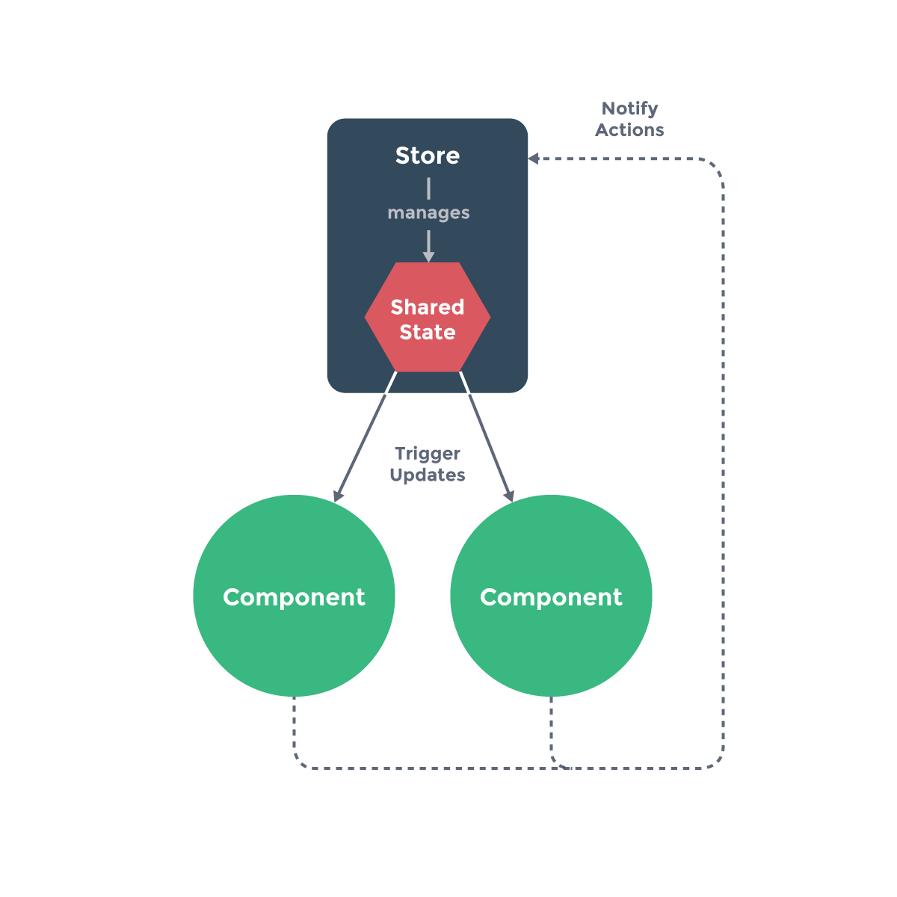

# 06 - 规模化


## Catalog
- 6.1 路由
    + 6.1.1 官方路由 
    + 6.1.2 从零开始简单的路由
    + 6.1.3 整合第三方路由
- 6.2 状态管理
    + 6.2.1 类 Flux 状态管理的官方实现
        - 6.2.1.1 React 的开发者请参考以下信息
    + 6.2.2 简单状态管理起步使用
- 6.3 服务端渲染
    + 6.3.1 SSR 完全指南
    + 6.3.1 Nuxt.js
    + 6.3.1 Quasar Framework SSR + PWA
- 6.4 安全
    + 6.4.1 报告安全漏洞  
    + 6.4.2 第一原则: 永远不要使用不可信任的模板
    + 6.4.3 Vue 的安全措施
        - 6.4.3.1 HTML 内容 
        - 6.4.3.2 Attribute 绑定
    + 6.4.4 潜在危险
        - 6.4.4.1 注入 HTML 
        - 6.4.4.2 注入 URL
        - 6.4.4.3 注入样式
        - 6.4.4.4 注入 JavaScript
    + 6.5 最佳实践
    + 6.6 后端协作
    + 6.7 服务端渲染


## New Words
- **sanitize [ˈsænɪˌtaɪz] --vt.消毒; 清洁; 使...无害.**
    + We're producing about 300 (1135 liters) gallons of sanitizer right
      now. 我们现在生产大约 3000 加仑(1135升)的消毒液.


## Content
### 6.1 路由
- 对于大多数单页面应用, 都推荐使用官方支持的
  [vue-router](https://github.com/vuejs/vue-router) 库.
  更多细节可以移步 [vue-router](https://router.vuejs.org/zh/) 文档.
#### 6.1.1 官方路由 
- 更多内容在见 `vue-router` 文档
#### 6.1.2 从零开始简单的路由
- 更多内容在见 `vue-router` 文档
#### 6.1.3 整合第三方路由


### 6.2 状态管理
#### 6.2.1 类 Flux 状态管理的官方实现
- 由于状态零散地分布在许多组件和组件之间的交互中，大型应用复杂度也经常逐渐增长。
  为了解决这个问题，Vue 提供 [vuex](https://github.com/vuejs/vuex):
  我们有受到 Elm 启发的状态管理库。vuex 甚至集成到
  [vue-devtools](https://github.com/vuejs/vue-devtools)，
  [无需配置即可进行时光旅行调试 (time travel debugging)](https://raw.githubusercontent.com/vuejs/vue-devtools/master/media/demo.gif)。
##### 6.2.1.1 React 的开发者请参考以下信息
- 如果你是来自 React 的开发者，你可能会对 Vuex 和
  [Redux](https://github.com/reduxjs/redux) 间的差异表示关注，Redux 是
  React 生态环境中最流行的 Flux 实现。Redux 事实上无法感知视图层，所以它能够轻松的通过一些
  [简单绑定](https://classic.yarnpkg.com/en/packages?q=redux%20vue&p=1)
  和 Vue 一起使用。Vuex 区别在于它是一个专门为 Vue 应用所设计.
  这使得它能够更好地和 Vue 进行整合，同时提供简洁的 API 和改善过的开发体验。
#### 6.2.2 简单状态管理起步使用
- 经常被忽略的是，Vue 应用中原始 `data` 对象的实际来源 -- 当访问数据对象时，
  一个 Vue 实例只是简单的代理访问。所以，如果你有一处需要被多个实例间共享的状态，
  可以简单地通过维护一份数据来实现共享:
  ```js
    var sourceOfTruth = {};
    var vmA = new Vue({
        data: sourceOfTruth
    });
    var vmB = new Vue({
        data: sourceOfTruth
    })
  ```
  现在当 sourceOfTruth 发生变更，vmA 和 vmB 都将自动地更新它们的视图。
  子组件们的每个实例也会通过 `this.$root.$data` 去访问。
  现在我们有了唯一的数据来源，但是，调试将会变为噩梦。任何时间，我们应用中的任何部分，
  在任何数据改变后，都不会留下变更过的记录。

  为了解决这个问题, 我们采用一个简单的 **store 模式**:
  ```js
    var store = {
        debug: true,
        state: {
            message: 'Hello!'
        },
        setMessageAction(newValue) {
            if(this.debug) {
                console.log('setMessageAction triggered with', newValue)
            }
            this.state.message = newValue
        },
        clearMessageAction() {
            if (this.debug) {
                console.log('clearMessageAction triggered')
            }
            this.state.message = ''
        }
    }
  ```
  需要注意, 所有 store 中 state 的变更, 都放置在 store 自身的 action 中去管理.
  这种集中式状态管理能够被更容易地理解哪种类型的变更将会发生, 以及它们是如何被触发.
  当错误出现时, 我们现在也会有一个 log 记录 bug 之前发生了什么.

  此外, 每个实例/组件仍然可以拥有和管理自己的私有状态:
  ```js
    var vmA = new Vue({
        data: {
            privateState: {},
            sharedState: store.state
        }
    });
    var vmB = new Vue({
        data: {
            privateState: {},
            sharedState: store.state
        }
    })
  ```
  
  
  **WARNING:** 重要的是, 注意你不应该在 action 中 替换原始的状态对象 - 组件和
  store 需要引用同一个共享对象, 变更才能够被观察到.

  接着我们继续延伸约定, **组件不允许直接变更属于 store 实例的 state, 而应该执行
  action 来分发(dispatch) 事件通知 store 去改变**, 我们最终达成了
  Flux[https://facebook.github.io/flux/] 架构. 这样约定的好处是,
  我们能够记录所有 store 中发生的 state 变更, 同时实现能做到记录变更, 保存状态快照,
  历史回滚/时光旅行的先进的的调试工具.

  说了一圈其实又回到了 Vuex, 如果你已经读到这儿, 获取可以去尝试一下!


### 6.3 服务端渲染
#### 6.3.1 SSR 完全指南
- 在 2.3 发布后我们发布了一份完整的构建 Vue 服务端渲染应用的指南。这份指南非常深入，
  适合已经熟悉 Vue、webpack 和 Node.js 开发的开发者阅读。请移步
  [ssr.vuejs.org](https://ssr.vuejs.org/zh/guide/caching.html).

#### 6.3.1 Nuxt.js
- 从头搭建一个服务端渲染的应用是相当复杂的。幸运的是，我们有一个优秀的社区项目
  [Nuxt.js](https://nuxtjs.org/) 让这一切变得非常简单。Nuxt 是一个基于
  Vue 生态的更高层的框架，为开发服务端渲染的 Vue 应用提供了极其便利的开发体验。
  更酷的是，你甚至可以用它来做为静态站生成器。推荐尝试。

#### 6.3.1 Quasar Framework SSR + PWA
- [Quasar Framework](https://quasar.dev/) 可以通过其一流的构建系统、
  合理的配置和开发者扩展性生成 (可选地和 PWA 互通的) SSR 应用，
  让你的想法的设计和构建变得轻而易举。你可以在服务端挑选执行超过上百款遵循
  "Material Design 2.0" 的组件，并在浏览器端可用。你甚至可以管理网站的 
  `<meta>` 标签。Quasar 是一个基于 Node.js 和 webpack 的开发环境，
  它可以通过一套代码完成 SPA、PWA、SSR、Electron 和 Cordova 应用的快速开发。


### 6.4 安全
#### 6.4.1 报告安全漏洞
- 当我们收到一个安全漏洞报告, 将给予其最高优先级, 并由全职贡献者停下手中的工作处理此事.
  如发现任何安全漏洞, 请邮件给
  <a href="mailto:security@vuejs.org" target="_blank" rel="noopener">security@vuejs.org</a>

  虽然发现新安全漏洞是比较罕见的事，我们仍推荐始终使用最新版本的 Vue 及其官方的周边库,
  以确保应用尽可能安全.
#### 6.4.2 第一原则: 永远不要使用不可信任的模板
- 在使用 Vue 的时候最基本的安全规则是永远不要将不可信任的内容作为模板内容使用。
  这样做等价于允许在应用程序中执行任意的 JavaScript --
  甚至更糟的是如果在服务端渲染的话可能导致服务器被攻破。举个例子:
  ```js
    new Vue({
        el: '#app',
        template: `<div>` + userProvidedString + `</div>` // 永远不要这样做
    })
  ```
  Vue 的模板是被编译为 JavaScript 的，而其中的表达式会作为渲染流程的一部分执行。
  尽管该表达式是在一个特定的渲染上下文中进行运算的。考虑到潜在的全局运行环境的复杂性,
  作为类似 Vue 的框架，想要完全让代码远离潜在的恶意代码执行而不导致性能问题,
  是不切实际的。最直接的回避这类问题的方式就是确保 Vue 
  模板的内容始终是可信的且完全由你掌控。
#### 6.4.3 Vue 的安全措施
##### 6.4.3.1 HTML 内容 
- 不论使用模板还是渲染函数，内容都会被自动转义。也就是说对于这份模板:
  ```html
    <h1>{{ userProvidedString }}</h1>
  ```
  如果 `userProvidedString` 包含了:
  ```js
    '<script>alert("hi")</script>'
  ```
  则它会被转义成为如下 HTML:
  ```html
    &lt;script&gt;alert(&quot;hi&quot;)&lt;/script&gt;
  ```
  因此避免了脚本注入。该转义通过诸如 `textContent` 的浏览器原生的 API 完成,
  所以除非浏览器本身存在安全漏洞，否则不会存在安全漏洞。
##### 6.4.3.2 Attribute 绑定
- 同样地，动态 attribute 绑定也会自动被转义。也就是说对于这份模板:
  ```html
    <h1 v-bind:title="userProvidedString">
        hello
    </h1>
  ```
  如果 `userProvidedString` 包含了:
  ```js
    '" onclick=" alert(\'hi\')'
  ```
  则它会被转义成为如下 HTML:
  ```html
    &quot; onclick=&quot;alert('hi')
  ```
  因此避免了通过闭合 `title` attribute 而注入新的任意 HTML。该转义通过诸如
  `setAttribute` 的浏览器原生的 API 完成，所以除非浏览器本身存在安全漏洞，
  否则不会存在安全漏洞。
#### 6.4.4 潜在危险
- 在任何 web 应用中，允许未过滤的用户提供的内容成为 HTML、CSS 或 JavaScript
  都有潜在的危险，因此应当尽可能避免。尽管如此，有些情况下的风险是可接受的。

  例如，类似 CodePen 和 JSFiddle 这样的服务允许用户提供的内容直接被执行，
  但这是预期行为，且在 iframe 中以某种程度被隔离在沙箱中。
  当一些重要功能不可避免地依赖引入一些安全漏洞，
  您的团队需要自行在该功能的重要性和漏洞带来的最坏场景间进行权衡。
##### 6.4.4.1 注入 HTML
如你之前学到的，Vue 会自动转义 HTML 内容，以避免向应用意外注入可执行的 HTML。
然而，某些情况下你清楚这些 HTML 是安全的，这时你可以显式地渲染 HTML 内容:
- 使用模板:
  ```html
    <div v-html="userProvidedHtml"></div>
  ```
- 使用渲染函数:
  ```js
    h('div', {
        domProps: {
            innerHTML: this.userProvidedHtml
        }
    })
  ```
- 使用基于 JSX 的渲染函数:
  ```
    <div domPropsInnerHTML={this.userProvidedHtml}></div>
  ```
- **Warning:** 注意永远不要认为用户提供的 HTML 是 100% 安全的，
  除非它是在一个 iframe 沙盒里或者应用中只有编写这些 HTML 的用户可以接触到它。
  除此之外，允许用户撰写其自己的 Vue 模板会带来类似的危险。 
##### 6.4.4.2 注入 URL
- 在类似这样的 URL 中:
  ```html
    <a :href="userProvidedUrl">
        click me
    </a>
  ```
  如果没有对该 URL 进行 "过滤" 以防止通过 `javascript:` 来执行 JavaScript, 
  则会有潜在的安全问题。有一些库如
  [sanitize-url](https://www.npmjs.com/package/@braintree/sanitize-url)
  可以帮助你做这件事，但请注意:
- **Warning:** 只要你是在前端进行 URL 过滤，那么就已经有安全问题了。
  用户提供的 URL 永远需要通过后端在入库之前进行过滤。
  然后这个问题就会在每个客户端连接该 API 时被阻止，包括原生移动应用。还要注意，
  甚至对于被过滤过的 URL，Vue 仍无法帮助你保证它们会跳转到安全的目的地。
##### 6.4.4.3 注入样式
- 来看这个示例:
  ```html
    <a
        :href="sanitizedUrl"
        :style="userProvidedStyles"
    >
        click me
    </a>
  ```
  让我们假设 `sanitizedUrl` 已经被过滤过了，所以这已经是一个完全真实的 URL
  且没有 JavaScript。但通过 userProvidedStyles，恶意用户仍可以提供 CSS 
  来进行 "点击诈骗"，例如将链接的样式设置为一个透明的方框覆盖在 "登录" 按钮之上。
  然后再把 `https://user-controlled-website.com/` 做成你的应用的登录页的样子，
  它们就可能获取一个用户真实的登录信息。

  你可以想象到，允许用户为一个 `<style>` 元素提供内容，将产生甚至更严重的安全漏洞，
  以使得用户完全控制整个页面的样式。这就是为什么 Vue 要在模板内避免渲染 style 标签,
  例如:
  ```js
    <style>{{ userProvidedStyles }}</style>
  ```
  为了确保用户完全远离点击诈骗，我们推荐只允许在一个 iframe 沙盒内进行 CSS 
  的完全控制。或让用户通过一个样式绑定来控制，我们推荐使用其
  `对象语法`(见: `./01-基础.md`-- `1.6.1.1 对象语法`) 
  且只允许用户提供特定的可以安全控制的 property 的值。例如:
   ```html
    <a
        v-bind:href="sanitizedUrl"
        v-bind:style="{
            color: userProvidedColor,
            background: userProvidedBackground
        }"
    >
        click me
    </a>

##### 6.4.4.4 注入 JavaScript
- 我们强烈不鼓励使用 Vue 渲染 `<script>` 元素,
  因为模板和渲染函数永远不应该产生副作用。然而,
  这并不是唯一包含可能在运行时会被视为 JavaScript 的字符串。

  每个 HTML 元素都有接受 JavaScript 字符串作为其值的 attribute，如
  `onclick`、`onfocus` 和 `onmouseenter`。将用户提供的 JavaScript 
  绑定到它们任意当中都是一个潜在的安全风险，因此应该避免。

  请注意，永远不要认为用户提供的 JavaScript 是 100% 安全的，除非它是在一个
  iframe 沙盒里或者应用中只有编写该 JavaScript 的用户可以接触到它。

  有的时候我们会收到在 Vue 模板中可以产生
  **跨站脚本攻击 (XSS:Cross Site Scripting)** 的安全漏洞报告。一般情况下，
  我们不会将这样的案例视为真正的安全漏洞，因为从以下两个可能允许 XSS 的场景看，
  不存在可行的办法来保护开发者:
    1. 开发者显式地要求 Vue 将用户提供的、未经过滤的内容作为 Vue 模板进行渲染。
       这是无法避免的不安全，Vue 没有办法知道其源头。
    2. 开发者向 Vue 挂载包含服务端渲染或用户提供的内容的 HTML 的整个页面。
       这实质上和问题 #1 是相同的，但是有的时候开发者可能没有意识到。
       这会使得攻击者提供作为普通 HTML 安全但对于 Vue 模板不安全的 HTML
       以导致安全漏洞。最佳实践是永远不要向 Vue
       挂载可能包含服务端渲染或用户提供的内容。

#### 6.5 最佳实践
- 通用的规则是只要允许执行未过滤的用户提供的内容 (不论作为 HTML、
  JavaScript 甚至 CSS)，你就可能令自己处于被攻击的境地。这些建议实际上不论使用
  Vue 还是别的框架甚至不使用框架，都是成立的。
  
  除了上述关于潜在危险的建议，我们也推荐自行熟悉以下资料:
    + [HTML5 Security Cheat Sheet](https://html5sec.org/)
    + [OWASP’s Cross Site Scripting (XSS) Prevention Cheat Sheet](https://cheatsheetseries.owasp.org/cheatsheets/Cross_Site_Scripting_Prevention_Cheat_Sheet.html)
  
  然后利用学到的知识，对那些包含了第三方组件或通过其它方式影响渲染到 DOM
  的内容的依赖的源代码进行重新审查，以发现潜在的危险模式。

#### 6.6 后端协作
- HTTP 安全漏洞，诸如伪造跨站请求 (CSRF/XSRF) 和跨站脚本注入 (XSSI)，
  都是后端重点关注的方向，因此并不是 Vue 所担心的。尽管如此，
  和后端团队交流学习如何和他们的 API 最好地进行交互，例如在表单提交时提交
  CSRF token，永远是件好事。

#### 6.7 服务端渲染
- 使用 SSR 时存在额外的安全考量，因此请确认遵循
  [我们的 SSR 文档](https://ssr.vuejs.org/zh/)中概括出的最佳实践以避免安全漏洞。
