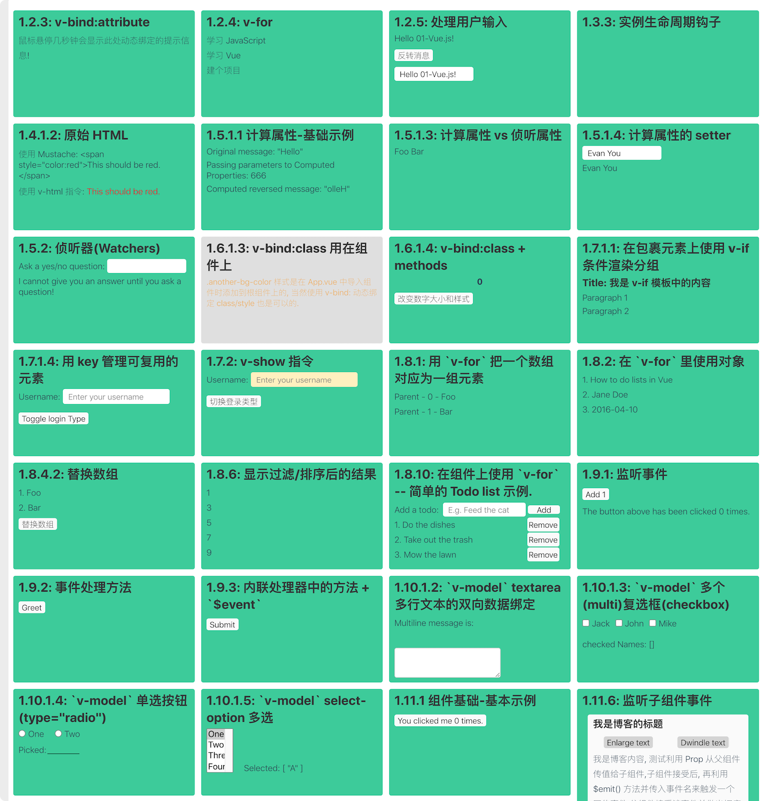

# Vue.js 官网文档学习

- [Vue.js 官网文档](https://cn.vuejs.org/v2/guide/installation.html)

- 以一种更详细的方式来重新整理官网文档. 我们都知道 Vue 官网文档是使用 `<script>`
  来加载 `Vue` 的方式讲解的, 对于初学者使用 `Vue CLI` 创建项目后, 
  却不会在单文件(`*.vue`) 中运行示例,
  所以下面文档中的示例代码都是使用单文件组件的形式来书写的, 完整的代码在当前仓库:
  `../../Vue-Examples/vue-document-example` 文件夹中. 这里是部分示例的截图

  

## 目录(Catalog)
1. 基础
2. 深入了解组件
3. 过渡 & 动画
4. 可复用性 & 组合
5. 工具
6. 规模化
7. 内在(深入响应式原理)

## New Words

## 内容(Content)
### 1. 基础
- 讲解见: `./01-基础.md`

### 2. 深入了解组件
- 讲解见: `./02-深入了解组件.md`

### 3. 过渡 & 动画
- 讲解见: `./03-过渡与动画.md`

### 4. 可复用性 & 组合
- 讲解见: `./04-可复用性与组合.md`

### 5. 工具
- 讲解见: `./05-工具.md`

### 6. 规模化
- 讲解见: `./06-规模化.md`

### 7. 内在(深入响应式原理)
- 讲解见: `./07-内在(深入响应式原理).md`

