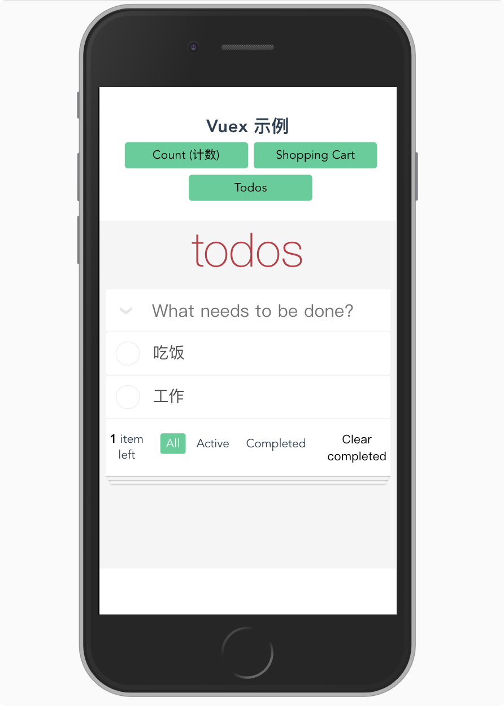

# Todo list 示例详解


## Catalog
1. 根据设计图分析项目需求, 完成 Todo list 的静态排版
2. 完善 Todo list 的各功能.


## New Words


## Content
### 1. 根据设计图分析项目需求, 完成 Todo list 的静态排版
#### 1.1 分析设计图, 然后完成静态排版
- 首先上设计图, 如下:
  
  

- (1) 我们主要实现几个绿色按钮下的部分, todos 一整块可以看作一个 vue 组件,
  页面的排版如下:
  ```vue
    <!-- todos.vue -->
    <template>
        <section class="todo-app">
            <h2>todos</h2>
            <div class="middle-box">
                <!-- header -->
                <header class="header">
                    <!-- 全部选中/反选 toggle-all -->
                    <p class="toggle-all-wrap">
                        <input type="checkbox" class="toggle-all" id="toggle-all">
                        <label for="toggle-all"></label>
                    </p>

                    <input type="text"
                        class="new-todo"
                        autofocus
                        autocomplete="off"
                        placeholder="What needs to be done?">
                </header>

                <!-- main section -->
                <section class="main">
                    <ul class="todo-list">
                        <li class="todo"
                            v-for="(todo, index) in todos"
                            :key="index">
                            <p class="view">
                                <input type="checkbox" class="toggle">
                                <label>{{ todo.text }}</label>
                                <button class="destroy"></button>
                            </p>
                            <input type="text"
                                class="edit" style="display: none;">
                        </li>
                    </ul>
                </section>

                <!-- footer -->
                <footer class="footer" v-show="todos.length">
                    <span class="todo-count">
                        <strong>1</strong> item left
                    </span>
                    <ul class="filters">
                        <li><a href="#/all" class="selected">All</a></li>
                        <li><a href="#/active">Active</a></li>
                        <li><a href="#/completed">Completed</a></li>
                    </ul>
                    <button class="clear-completed">Clear completed</button>
                </footer>

            </div>
        </section>
    </template>

    <script>
        export default {
            name: 'Todos',
            components: {},
            data() {
                return {}
            },
            computed: {
                todos() {
                    // - 这个 bug 又改了很久, 原因是我把当前 store 数据放在
                    //   store/todos.js 模块中了, 引用 todos 数据的方式是: todos.todos
                    // console.log(this.$store.state.todos.todos);
                    return this.$store.state.todos.todos;
                },

            },
            methods: {},
            filters: {}
        };
    </script>

    <style lang="stylus" scoped>
        @import '~assets/todos'
    </style>
  ```

  ```css
    /* - todos.styl */
    @charset "UTF-8"

    .todo-app {
        min-height 66vh
        width 100vw
        background-color #f5f5f5
        letter-spacing 0

        h2 {
            font-size 60px
            line-height 1.2
            font-weight 200
            text-align center
            color #b63f45
            font-family "Helvetica Neue", Helvetica, Arial, sans-serif
        }

        .middle-box {
            width 96%
            margin 1em auto
            min-height 40vh
            overflow hidden

            .header {
                display flex
                justify-content flex-start
                align-item center
                padding 3px 0
                background-color #fff
                box-shadow inset 0 -2px 1px rgba(0,0,0,0.03)

                p.toggle-all-wrap {
                    flex: 0 0 50px
                    height: inherit
                    position relative
                    overflow: hidden

                    // 把 input.toggle-all 设置为隐藏状态
                    input.toggle-all {
                        width 1px
                        height 1px
                        border none
                        position: absolute
                        opacity: 0;
                        right 100%
                        bottom 100%
                    }
                    // - 让 label 填充 p 标签,
                    .toggle-all + label {
                        width 100%
                        height 100%
                        position absolute
                        left -5px
                        top 0
                        transform rotate(90deg)
                    }
                    .toggle-all + label:before {
                        content '❯'
                        font-size 22px
                        color #e6e6e6
                    }
                    .toggle-all:checked + label:before {
                        color #6c9
                    }
                }

                input.new-todo {
                    flex: 1 1 auto
                    padding 9px
                    font-size 22px
                    line-height 1.4
                    border none
                }
            }

            .main {
                .todo-list li {
                    font-size 20px
                    min-height 40px
                    border-bottom 1px solid rgba(0, 0, 0, 0.06)
                    position relative
                    border-radius: 4px
                    background-color #fff
                    overflow: hidden

                    li:last-child {
                        border-bottom none
                    }

                    li.editing {
                        border-bottom none
                        padding 0
                    }
                    li.editing .edit {
                        display block
                        width calc(100% - 43px)
                        padding 12px 16px
                        margin 0 0 0 43px
                    }
                    li.editing .view {
                        display none
                    }

                    input.toggle {
                        text-align center
                        width 40px
                        height auto
                        position absolute
                        top 0
                        left 0
                        bottom 0
                        border none
                        appearance none
                    }
                    input.toggle {
                        opacity 0
                    }

                    label {
                        padding: 15px 15px 15px 60px
                        display: block
                        line-height: 1.2
                        transition: color 0.4s
                        font-weight: 400
                        color: #4d4d4d
                        text-align left
                        background-color: inherit
                    }
                    input.toggle + label {
                        background-image url('data:image/svg+xml;utf8,%3Csvg%20xmlns%3D%22http%3A//www.w3.org/2000/svg%22%20width%3D%2240%22%20height%3D%2240%22%20viewBox%3D%22-10%20-18%20100%20135%22%3E%3Ccircle%20cx%3D%2250%22%20cy%3D%2250%22%20r%3D%2250%22%20fill%3D%22none%22%20stroke%3D%22%23ededed%22%20stroke-width%3D%223%22/%3E%3C/svg%3E')
                        background-repeat no-repeat
                        background-position center left 5px
                    }
                    input:checked + label {
                        background-image url('data:image/svg+xml;utf8,%3Csvg%20xmlns%3D%22http%3A//www.w3.org/2000/svg%22%20width%3D%2240%22%20height%3D%2240%22%20viewBox%3D%22-10%20-18%20100%20135%22%3E%3Ccircle%20cx%3D%2250%22%20cy%3D%2250%22%20r%3D%2250%22%20fill%3D%22none%22%20stroke%3D%22%23bddad5%22%20stroke-width%3D%223%22/%3E%3Cpath%20fill%3D%22%235dc2af%22%20d%3D%22M72%2025L42%2071%2027%2056l-4%204%2020%2020%2034-52z%22/%3E%3C/svg%3E')
                    }
                    .destroy {
                        position absolute
                        top 0
                        right 10px
                        bottom 0
                        width 40px
                        margin auto 0
                        font-size 30px
                        color #cc9a9a
                        border none
                        transition color 0.2s ease-out
                    }
                    .destroy:hover {
                    color #af5b5e
                    }
                    &:hover .destroy {
                        display block
                    }
                    &:hover .destroy::after {
                        content: '×';
                    }
                }
            }

            .footer {
                background-color #fff
                padding: 1em .3em
                display flex
                justify-content space-between
                align-items flex-start
                box-shadow 0 1px 1px rgba(0, 0, 0, 0.2),
                    0 8px 0 -3px #f6f6f6,
                    0 9px 1px -3px rgba(0, 0, 0, 0.2),
                    0 16px 0 -6px #f6f6f6,
                    0 17px 2px -6px rgba(0, 0, 0, 0.2)

                span.todo-count ul.filters{
                    flex 1 1 auto
                }

                span.todo-count {
                    width: calc(0.5em + 10vw)
                    line-height: initial
                }

                ul.filters {
                    display flex
                    justify-content flex-start
                    align-item center
                    margin: 0 5px

                    li {
                        margin 3px

                        a {
                            color: inherit
                            text-align center
                            padding: .2em .5em
                            border-radius: 3px
                        }
                        a.selected {
                            background-color: #6c9
                            color: #fff
                        }
                        a:active, a:hover {
                            text-decoration: none
                        }
                        a:hover {
                            background-color: white;
                        }
                    }
                }

                button.clear-completed {
                    border: 0
                    padding: 0
                    line-height: initial
                    flex: 0 0 60px
                    text-align: center
                }
            }
        }
    }
  ```
  如果你觉得对这个排版不熟悉, 请一定自己排一下, 这个排版我觉得不简单.
  
  注意, 此时页面中 "吃饭", "工作", 这些数据是模拟出来的, 数据的格式是这样的:
  ```js
    // - src/store/modules/todosapp/todos.js

    export default {
        state() {
            return {
                todos: [
                    {text: '吃饭', done: false},
                    {text: '工作', done: true}
                ]
            }
        },
        getters: { },
        mutations: {

        },
        actions: {
        }
    }
  ```
  即上面代码中的 `todos` 数组, 因为此示例是 Vuex 文档中的示例, 所以此处 todos
  保存在 store 中自己划分的 todo.js 模块中, todos 数组的每一项都为一个对象,
  对象中的 `text` 属性为通过页面中 `input.new-todo` 表单添加的待做项, 
  默认 `done` 属性为 `false`, 即未完成, `done: true` 表示已完成当前 todo.
 
  上面的静态排版, 在下面添加各项功能时会发生很大的更改, 但是不管怎么说,
  页面的静态排版是添加各项 JS 功能的第一步.
  

### 2. 完善 Todo list 的各功能.
