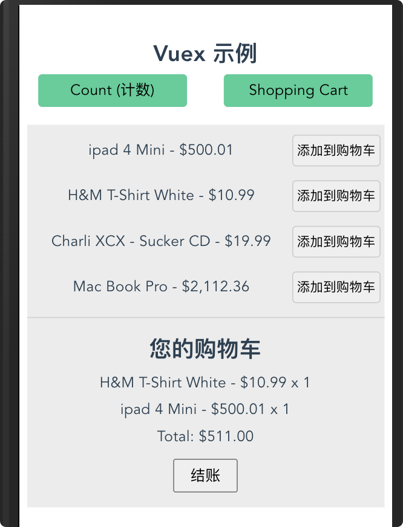

# Vuex 购物车示例详解


## Catalog
1. 购物车示例目录
2. 购物车完整流程和各文件讲解


## New Words


## Content
### 1. 购物车示例目录
- 下面是购物车示例目录:
  ```
    |-- src
    |   |-- api
    |   |   |-- shop.js              ......... (4)
    |   |-- components 
    |   |   |-- product-list.vue     ......... (6)
    |   |-- router 
    |   |   |-- index.js             ......... (3) 
    |   |-- store 
    |   |   |-- modules
    |   |   |   |-- cart.js          ......... (8)
    |   |   |   |-- products.js      ......... (7)
    |   |   |-- index.js     ......... (5)
    |   |-- views 
    |   |   |-- shopping-cart.vue  ......... (3)
    |   |-- App.vue      ......... (2)
    |   |-- main.js      ......... (1)
  ```

### 2. 购物车完整流程和各文件讲解
- (1) 我们先在 App.vue 中给 `shopping-cart.vue` 添加路由跳转.
  ```html
     <router-link to="/shopping-cart">Shopping Cart</router-link>
  ```
- (2) 然后在 `/router/index.js` 中添加当前路由的配置信息
  ```js
    {
        path: '/shopping-cart',
        name: 'ShoppingCart',
        // - router level code-splitting(路由及代码拆分)
        // - this generates a separate chunk (about.[hash].js) for this
        //   route which is lazy-loaded when the route is visited.
        //   (这会为此路由生成一个单独的块(about.[hash].js),
        //   当访问该路由时会被延迟加载.)
        // - 将 `/shopping-cart` 路由下的所有组件都打包在 ShoppingCart 异步块中.
        component: () => import(/* webpackChunkName: 'ShoppingCart' */ '../views/shopping-cart')
    }
  ```
- (3) 接着在 `src/views` 目录下新建 `shopping-cart.vue` 购物车组件,
  并在 `src/components/` 下新建 `product-list.vue` 组件(即产品列表组件),
  接着我们在 `shopping-cart.vue` 中引入 `product-list.vue` 组件, 到目前为止,
  购物车示例需要的页面部分就创建完毕.
  
    + views 是页面级组件, components 是小组件, 小组件可被引用在 views 中,
      一般 views 组件不被复用.
  ```js
    /* - src/components/shopping-cart.vue */
  
    <template>
        <div class="shopping-cart">
            <ProductList/>
            <hr>
            <h2>您的购物车</h2>
            <p v-show="!products.length"><i>请添加一些产品到购物车.</i></p>
        </div>
    </template>
  
    <script>
        import ProductList from '../components/product-list';
        export default {
            name: 'ShoppingCart',
            components: {
                ProductList
            },
        }
    </script>
  
    <style lang="stylus" scoped>
        .shopping-cart {
            width: 96% 
            margin: 10px auto
            background: #ececec
            min-height: 50vh
            overflow: hidden
        }
    </style>
  ```
  ```js
  /* - src/components/product-list.vue */
  
    <template>
        <div class="product-list">
        </div>
    </template>
    
    <script>
        import { mapState, mapActions } from 'vuex'
        export default {}
    </script>
  ```
  
- (4) 页面创建完毕了, 就需要产品数据来渲染产品, 由于没有后台服务器, 所以我们 mock
  一个数据, 在 `src/api/` 下, 新建 `shop.js` 文件来模拟一个数据, 数据格式如下:
  
  ```js
    /*
    * Mocking client-server processing (模拟客户端-服务器处理)
    */ 
    const _products = [
        {"id": 1, "title": "ipad 4 Mini", "price": 500.01, "inventory": 2},
        {"id": 2, "title": "H&M T-Shirt White", "price": 10.99, "inventory": 10},
        {"id": 3, "title": "Charli XCX - Sucker CD", "price": 19.99, "inventory": 5},
        {"id": 4, "title": "Mac Book Pro", "price": 2112.36, "inventory": 45}
    ];
  ```
- (5) 由于购物车组件的数据在别的页面可能也会用到, 比如手机端用户下订单后, 库存减少,
  那么另外一个购买者看到的库存数据就应该是实时更新的, 所以我们把产品数据放在 Vuex 中,
  使用单一状态管理模式来管理.

  还有另外一种情况需要考虑, 我们在当前页面添加产品到"购物车",
  接着跳转到别一个页面, 在此页面再次添加一个产品到购物车,
  那么此时购物车应正确的显示我已经添加的所有产品总数,
  所以也需要把购物车中的产品放入到 Vuex 中. 
  
  下面在创建 Vuex  文件 `src/store/index.js`,
  代码如下:
  
  ```js
    /* - src/store/index.js` */
  
    import Vue from 'vue'
    import Vuex from 'vuex'
    
    // - 购物车 store
    import cart from './modules/cart'
    import products from './modules/products'
    
    Vue.use(Vuex)
  
    const debug = process.env.NODE_ENV !== 'production'

    export default new Vuex.Store({
        modules: {
            // - 购物车组件
            products,   // {1-1}
            cart        // {1-2}
        },
    })
  ```
  上面 (3) 中, 我们把创建产品的功能单独放在 `product-list.vue` 组件里,
  因为创建产品这个功能, 可能在项目中的多个页面中使用到, 为了更好的组织代码,
  现在把 `Vuex.Store()` 中的 store 对象分割为 `products(产品)` 和
  `cart(购物车)` 两个模块(module), 即上面的 `行{1-1}` 和 `行{1-2}`. 
  
  我们先来看 `products` 模块中的代码要怎么写, 产品列表首先要获取到产品数据,
  然后开始渲染, 下面是代码:
  ```js
    /* - str/store/modules/products.js */
    import shop from '../../api/shop`
    export default {
        namespaced: true,                               // {2-1}
        state() {
            return {
                all: []                                 // {2-2}
            }
        },
        getters: {},
        mutations: {
            // - 设置产品
            setProducts(state, products) {              // {2-3}
                state.all = products,
            },
        },
        actions: {
            // - Hint: 此方法在 ProductList.vue 组件加载时,
            //   在 `created()` 声明周期中被调用
            getAllProducts({ commit }) {                // {2-4}
                shop.getProducts(products => {          // {2-5}
                    commit('setProducts', products)     // {2-6}
                })
            }
        }
    }
  ```
  来看一下上面的代码, `行{2-1}` 首先使用 `namespaced: true` 属性把当前
  `products` 设置成带命名空间的模块, 然后 `行{2-2}` 在 `state`(状态)
  中设置 `all` 数组属性, 用来保存 `shop.js` 中的产品列表数据,  `mutations`
  中的 `setProducts()` 方法, 即 `行{2-3}` 也很简单, 就是把 `shop.js`
  中的数据赋值给 `state.all` 属性, 由于我们都知道 Vuex 中的 `mutations`
  规定是只能使用同步方法, 但是我们在页面加载时, 不能确定从服务器请求的 "产品列表"
  数据什么时候能返回, 所以我们在 `actions` 中定义一个 `getAllProducts()`
  方法用来异步读取数据(即 `行{2-4}`).
  
  到这一步, 我们的 `products.js` 模块中需要获取产品列表的方法已经定义完毕了, 
  那么什么时候被调用呢? 答案就是在 `product-list.vue` 页面加载时, 在 `created()`
  声明周期中被调用,  我们在第 (3) 步中, 只是定义了 `product-list.vue`
  并没有添加渲染数据的代码, 现在我们更新一下代码: 
  ```js
  /* - src/components/product-list.vue */
  
    <template>
        <div class="product-list">
            <ul>
                <li
                    v-for="product in products"
                    :key="product.id">
                    <span>
                        {{ product.title }} -
                        {{ product.price | currency }}
                    </span>
                    <button
                        :disable="!product.inventory"
                        @click="addProductToCart(product)">
                        添加到购物车
                    </button>
                </li>
            </ul>
        </div>
    </template>
  
    <script>
    import { mapState, mapActions } from 'vuex'
  
    export default {
        created() {
            this.$store.dispatch('products/getAllProducts');    // {3-1}
        },
        computed: mapState({
            products: function(state) {                         // {3-2}
                console.log('state.products.all:', state.products.all);
                return state.products.all                       // {3-3}
            }
        }),
        // - 'cart' 为 namespaced 名称
        methods: mapActions('cart', [                           // {3-4}  
            'addProductToCart'
        ]);     
    }
    </script>
  
    <style lang="stylus">
        /* 
         * - 略 
         */
    </style>
  ```
  我们来看上面的代码, `<template>` 中的 `button` 按钮暂时先不分析; 先看
  Vue 生命周期的 `created()` 钩子中利用 `dispatch` 调用  Vuex 中 
  `products` 模块内的 `getAllProducts` 方法, 即 `行{3-1}`,  `行{3-1}`
  执行, 上面 `行{2-4}` 的 `getAllProducts` 方法被调用, 
  
  ```js
    /* - str/store/modules/products.js */
    getAllProducts({ commit }) {                // {2-4}
        shop.getProducts(products => {          // {2-5}
            commit('setProducts', products)     // {2-6}
        })
    }
  ```
  然后接着 `行{2-5}` 调用 `shop.js` 中定义的 `getProducts` 方法,
  那么我们进入到 `shop.js` 方法, 看看这个方法写的是什么, 由于上面我们还没有在
  `shop.js` 中添加方法, 所以根据示例, 把代码添加进来, 更新第 (4) 步中的 `shop.js` 文件:
  ```js
    /*
    * Mocking client-server processing (模拟客户端-服务器处理)
    */ 
    const _products = [
        {"id": 1, "title": "ipad 4 Mini", "price": 500.01, "inventory": 2},
        {"id": 2, "title": "H&M T-Shirt White", "price": 10.99, "inventory": 10},
        {"id": 3, "title": "Charli XCX - Sucker CD", "price": 19.99, "inventory": 5},
        {"id": 4, "title": "Mac Book Pro", "price": 2112.36, "inventory": 45}
    ];
    export default {
        // - 取得产品   
        getProducts(cb) {       // {4-1}
            setTimeout(
                () => cb(_products)
            , 100)
      },
  
        // - 购买产品成功与否
        buyProducts(products, cb, errorCb) {
            setTimeout(() => {
                // - simulate random checkout failure.(模拟随机结账失败)
                (Math.random() > 0.5 || navigator.webdriver)
                    ? cb()
                    : errorCb()
            }, 100)
        }
    }
  ```
  可以看到 `行{2-5}` 调用的即是 `行{4-1}` 的 `getProducts()` 方法,
  `行{2-5}` `shop.getProducts()` 传递一个函数参数 `cb` 到 `行{4-1}`; 
  此处更改一下 `行{4-1}` 的 `getProducts()`方法以便更直观的看出这里的调用关系,
  ```js
    // - `行{2-5}` 传递的 函数参数 `cb`
    let cb = function(products) {
        return commit('setProducts', products);
    }
    getProducts(cb) {
        setTimeout(
            function() {
                return function(products) {
                    return commit('setProducts', products);
                }
            }
            , 100
        )
    }
  ```
  这里的调用很巧妙. 接着是代码 `行{2-6}`, 这里利用 ES6 的对象解构, 取到
  `context` 对象下的 `commit` (函数)属性, 接着我们利用
  `context.commit('setProducts', products)` 调用 mutation 下的
  `setProducts`(设置商品)方法, 并传递一个参数 `products`, 即 `行{2-3}`
  执行, 期内的 `state.all = products` 被调用, 此时 `state`状态下的 `all`
  属性便得到了 products 数据, 由于 Vuex 中的 `state` 数据是响应式的, `all`
  属性的值改变, 便会触发 `product-list.vue` 中计算属性内的 `products()`
  方法(即 `行{3-2}`) 执行, 注意 `行{3-3}` 因为我们使用了模块的命名空间,
此时返回数据的方式是 `state.命名空间.属性`, 请一定注意.
  
- (6) 上面第 (5) 步我们已经把商品列表, 循环输出到页面上了,
  下面一个功能就是点击 "添加到购物车"按钮, 可以把产品添加到下半部分的购物车, 即如下图:

  
  
  既然要 "添加到购物车" 我们就要获取到当前点击 "添加到购物车" 按钮对应的商品,
  放入到下半部分的购物车, 我们先找到模板中 "添加到购物车" 按钮的点击事件, 它在
  `src/components/product-list.vue` 的模板中 `addProductToCart(product)`,
  那么这个 `addProductToCart()` 方法定义在哪里呢? 答案是在
  `src/modules/cart.js` 中, 因为既然是和购物车(cart) 相关的事件,
  所以较合理的方式就是放在 store 的购物车(cart) 模块中, 现在知道要把
  `addProductToCart()` 方法放在 `cart.js` 模块中, 那么该定义为 actions
  内的属性方法还是 mutations 内的属性方法呢? 答, 应该是 actions 的属性方法,
  比如当用户疯狂点击 "添加购物车" 按钮添加商品到购物车时,
  商品应该是异步按顺序加入到购物车的, 下面先给出 `src/modules/cart.js`
  中所有的代码, 然后慢慢分析每行代码:
  ```js
    /* - src/modules/cart.js */

    // - cart 手推车/购物车
    import shop from "../../api/shop"

    export default {
        namespaced: true,
        state() {
            return {
                items: [],
                checkoutStatus: null
            }
        },
        getters: {
            // - 购物车产品
            cartProducts: (state, getters, rootState) => {
                return state.items.map(({ id, quantity }) => {
                    // - `[].find()` 返回数组中满足方法内部函数的第一个元素的值.
                    //   否则返回 `undefined`.
                    // - rootState.products.all: 意思为, 先找到根节点的 state,
                    //   然后到子模块 products 的 all 状态(state), 因为 all
                    //   状态保存的为一个数组, 所以可以调用数组的 find() 方法.
                    const product = rootState.products.all.find(product => product.id === id);
                    return {
                        title: product.title,
                        price: product.price,
                        quantity
                    }
                })
            },
            // - 购物车总价格
            cartTotalPrice: (state, getters) => {
                return getters.cartProducts.reduce((total, product) => {
                    return total + product.price * product.quantity
                }, 0)
            }
        },
        mutations: {
            // - 把产品放入购物车
            pushProductToCart(state, { id }) {
                state.items.push({
                    id,
                    quantity: 1
                })
            },
            // - 增加商品数量
            // - tip: { id } 为解构的下面 actions 中传入的 items 数组的子项,
            //   每一个子项都是一个对象, 这里使用解构赋值, 只取 id 属性的值.
            incrementItemQuantity(state, { id }) {
                console.log('id: ', id);
                const cartItem = state.items.find(item => item.id === id);
                cartItem.quantity++;
            },

            // - 设置购物车项目
            setCartItems(state, { items }) {
                state.items = items;
            },

            // - 设置结账状态
            setCheckoutStatus(state, status) {
                state.checkoutStatus = status
            }
        },
        actions: {
            // - 结账
            checkout({ commit, state }, products) {
                const savedCartItems = [...state.items];
                commit('setCheckoutStatus', null);
                // - empty cart 清空购物车
                commit('setCartItems', { items: [] });
                shop.buyProducts(
                    products,
                    () => commit('setCheckoutStatus', 'successful'),
                    () => {
                        commit('setCheckoutStatus', 'failed'),
                        // rollback to the cart saved before sending the request
                        // 回滚到发送请求之前保存的购物车
                        commit('setCartItems', { items: savedCartItems })
                    }
                )
            },
            // - 添加商品到购物车
            addProductToCart({ state, commit }, product) {
                // - 首先设置结账状态 
                commit('setCheckoutStatus', null);
                // - 如果当前产品的库存(inventory) 大于 0 
                if (product.inventory > 0) {
                    // - 找到当前点击要添加的项
                    const cartItem = state.items.find(function(item) {
                        return item.id === product.id
                    });
                    // - 如果当前购物车没有此商品, 就把此商品推入到购物车中
                    if (!cartItem) {
                        commit('pushProductToCart', { id: product.id })
                    } else {
                        // - 如果当前商品已经存在了, 那就增加商品数量
                        commit('incrementItemQuantity', cartItem)
                    }
                    // - remove 1 item from stock. 从库存中删除一项
                    commit('products/decrementProductInventory',
                        { id: product.id}, {root: true})
                }
            }
        }
    }
  ```
  下面的代码在各个文件中添加的注释已经够多, 所以不再单独细说, 主要是太多了,
  请看各自的文件即可:
  ```vue
    <!-- shopping-cart.vue -->
    <template>
        <div class="shopping-cart">
            <ProductList/>
            <hr>
            <h2>您的购物车</h2>
            <p v-show="!products.length"><i>请添加一些产品到购物车.</i></p>
            <ul>
                <li
                    v-for="product in products"
                    :key="product.id">
                    {{ product.title }} - {{ product.price | currency }}
                        x {{ product.quantity }}    
                </li>
            </ul>
            <p>Total: {{ total | currency }} </p>
            <p>
                <button
                    :disabled="!products.length"
                    @click="checkout(products)">
                    结账
                </button>
            </p>
            <p v-show="checkoutStatus">结账状态 {{ checkoutStatus }}</p>
        </div>
    </template>

    <script>
        import ProductList from '../components/product-list';

        import { mapGetters, mapState } from 'vuex';

        export default {
            name: 'ShoppingCart',
            components: {
                ProductList
            },
            computed: {
                ...mapState({
                    // - 从 cart.js 获取结账状态
                    checkoutStatus: state => state.cart.checkoutStatus
                }),
                // - 从 cart.js 获取 "购物车产品" 和 "购物车总价"
                ...mapGetters('cart', {
                    products: 'cartProducts',
                    total: 'cartTotalPrice'
                })
            },
            methods: {
                checkout(products) {
                    this.$store.dispatch('cart/checkout', products)
                }
            }
        }
    </script>
    <style lang="stylus" scoped>
        .shopping-cart {
            width: 96% 
            margin: 10px auto
            background: #ececec
            min-height: 50vh
            overflow: hidden
        }
    </style>
  ```
- `src/main.js` 中需要使用的过滤器方法 `currency`, 这个过滤器方法方法写的很巧妙,
  请认真看实现过程:
  ```js
    import Vue from 'vue'
    import App from './App.vue'
    import router from './router'
    import store from './store'

    import "./assets/typo.css";

    Vue.config.productionTip = false

    // - `(\d{3})`: 一个捕获型分组, 分组中匹配 3 个数字.
    // - `(?=\d)`: 一个正向前瞻型分组, 它断言自身出现位置的后面要匹配的模式,
    //   这里是匹配为一个数字
    const digitsRE = /(\d{3})(?=\d)/g;

    // - 自定义全局过滤器 currency
    Vue.filter('currency', function(value, currency, decimals){
        // - `parseFloat()`: 把非数值转换为数值
        value = parseFloat(value);

        // - - **finite ['faɪnaɪt] --adj.有限的, 限定的.  --n.有限之物**
        // - `isFinite()`: 确定一个数是不是有穷.
        if (!isFinite(value) || (!value && value !== 0)) return '';
        currency = currency != null ? current : '$';
        // - - **decimal ['desɪm(ə)l] --adj.十进制的, 小数的. --n.小数**
        decimals = decimals != null ? decimals: 2;

        // - stringified 字符串化: 把当前 value 数值利用 Math.abs()转成正数,
        //   然后利用数组的 toFixed() 方法截取小数点后两位数, 并转换成字符串.
        // - Math.abs() 返回数值的绝对值
        // - 数组的 `toFixed()` 方法会按照指定的小数位返回数值的字符串表示.
        var stringified = Math.abs(value).toFixed(decimals);

        // - 截取 stringified 的整数部分.
        var _int = decimals ? stringified.slice(0, -1 - decimals) : stringified;
        // - (1) _int: 500; (2) _int: 10; (3) _int: 19; (4) _int: 2112
        // console.log('_int:', _int)

        var i = _int.length % 3;
        // console.log('i: ', i);  // - (1) i: 0; (2) i: 2; (3) i: 2; (4) i: 1
        var head = i > 0
            ? (_int.slice(0, i) + (_int.length > 3 ? ',' : ''))
            : '';
        // - (1) head: ; (2) head: 10; (3) head: 19; (4) head: 2,
        // console.log('head: ', head);

        var _float = decimals ? stringified.slice(-1 - decimals) : '';
        // - _float 为取得价格的小数部分.
        // - (1) _float: .01; (2) _float: .99; (3) _float: .99; (4) _float: .36,
        // console.log('_float: ', _float);

        var sign = value < 0 ? '-' : '';
        return sign + currency + head +
            _int.slice(i).replace(digitsRE, '$1,') + _float;
    });

    new Vue({
        router,
        store,
        render: h => h(App)
    }).$mount('#app')
  ```


