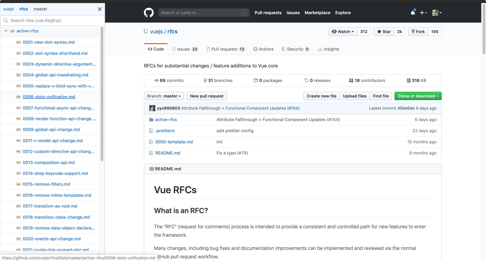
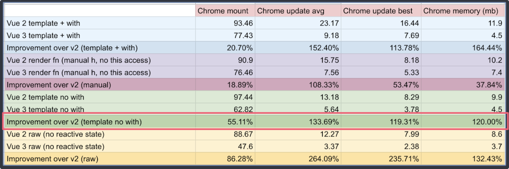

# 1. 尤雨溪(Evan You) 谈 Vue 3.0 Beta

## New Words

1. **usable ['jʊzəbl] (= useable)--adj.可用的; 使用的; 方便的.**
    + useable partition. 有效分类.
    + useable income. 可用收入.
1. **alongside [ə'lɔŋ'saɪd] --prep.在...旁边; 与...一起. --adv.在旁边.**
    + Usable alongside(prep) existing Options API.
      可与现有的 Options API 一起使用.
    + If you stay alongside(prep) of me you won't get hurt.
      你若在我身边, 就不会受伤害. (alongside of... 与...并肩; 在旁边)
1. **flexible ['flɛksəbl] --adj.灵活的; 柔韧的; 易弯曲的.**
    + We should stick to the principles and be flexible as well.
      既要有原则性, 也要有灵活性.
    + flexible packaging. 软包装.
1. **reactivity [ˌriæk'tivəti] --n.反应性; 反应.**
    + vascular reactivity. 血管反应性.
    + Reactivity module can be used as a standalone library.
      响应式(Vue.js)模块可以作为独立库.
1. **implement ['ɪmplɪm(ə)nt] --vt.实现, 执行, 落实. --n.工具, 设备**
    + How do we implement this? 那我们怎么来执行呢？
    + How do you implement this practice? 您如何执行这个实践?
    + Otherwise, you would have to implement this feature yourself. 
      否则, 您就需要自己想办法实现这个特性. 
1. **planned [plænd] --adj.计划了的; 根据计划的.**
    + a planned economy. 计划经济.
    + a planned crime. 有计划的犯罪.
1. **integration [ɪntɪ'greɪʃ(ə)n] --n.集成, 综合**
1. **implementation [ˌimplimen'teiʃən] --n.实现, 履行**
    + CPython is an implementation of Python.  CPython是Python的一个实现
    + implementation of program. 计划的执行    
1. **efficient [ɪ'fɪʃ(ə)nt] --adj.有效率的, 能胜任的**
    + an efficient machine. 高效率的机器
    + an efficient teacher. 能干的教师
    + He is efficient at his work. 他在工作方面是有实力的.
1. **simulate ['sɪmjulet] --vt.模拟; 仿真; 模仿; 假装.**
1. **typical [ˈtɪpɪkəl] --adj.典型的; 特有的; 象征性的**
    + His typical way of speaking. 他独特的说话方式.
    + But -- This is so typical. 可是 -- 你总是这样. 
1. **scenario [sə'nærɪo] --n.情节; 剧本; 方案**

## Content
- RFCs: https://live.bilibili.com/22155512
- Vue 3.0 Template Explorer:
  https://vue-next-template-explorer.netlify.app
- Vue Composition API: https://composition-api.vuejs.org/api.html#setup
- cache Handlers (缓存处理程序)
#### Vue 3 core status: beta ready (Vue 3 核心状况: Beta 版本就绪) [PPT]
- (1) What this means:
    + (1.1) All planned RFCs merged & implemented
      (合并并实施所有已计划好的 RFCs)

      RFCs(Request For Comments 请求注解/请求评论).

      Vue 3 的 RFC 仓库: [vuejs/rfcs](https://github.com/vuejs/rfcs)

      每一个 RFC, 仓库中都做了排序, 截图如下:

       

    + (1.2) Focus is now on stability and library integrations.
      ((Beta 阶段的)现在的重点是稳定性和库集成.)
- (2) Highlights: (突出显示/高亮)
    + (2.1) Performance (性能比 Vue 2.0 强.)  
      (tip: Vue 3.0 从头重写的. --尤大所说)
        + (1) Rewritten virtual Dom implementation.  
          (重写虚拟 DOM 的实现)
        + (2) Compiler-informed fast paths.  
          (编译模板的优化.)
        + (3) More efficient component initialization.  
          (更高效的组件初始化.)
        + (4) 1.3 ~ 2x better update performance^*  
          (update 性能提升 1.3 ~ 2 倍)
        + (5) 2 ~ 3x faster SSR^* (SSR 提高了 2 ~ 3 倍)
          
          下图为各项性能对比

          
        + `*`based on benchmarks that simulates typical scenarios,
          may vary based on actual application.
    + (2.2) Tree-Shaking support  
      (摇树?支持: 可以将无用模块'剪辑', 仅打包需要的.)
        + (1) Most optional features (e.g. `v-model`, `<transition>`)
          are now tree-shakable.
        + (2) Bare-bone HelloWord size: 13.5kb
            - 11.75 with only Composition API support
        + (3) All runtime features included: 22.5kb
            - More features but still lighter than Vue 2
    + (2.3) Composition API (组合 API)
        + (1) Usable alongside existing Options API  
          (可与现存的 Options API 一起使用)
        + (2) Flexible logic composition and reuse  
          (灵活的逻辑组合和复用)
        + (3) Reactivity module can be used as a standalone library  
          (响应式模块可以作为一个独立库.) 
          (tip: Vue 官网文档的 "Reactivity in Depth(深入响应式原理)"
          用的就是 Reactivity 而不是 Response)
    + (2.4) Fragment, Teleport, Suspense
      (文档碎片, Teleport 即 Protal 传送门, 悬念)
        - (1) Fragments (文档片段/文档碎片)
            + No longer limited to a single root node in templates
            + Manual render functions can simply return Arrays
            + "Just works"
        - (2) Teleport (即 `Protal 传送门`)
            + Previously known as `<Protal>`
            + More details to be shared by @Linusborg
        - (3) Suspense (悬念)
            + Wait on nested async dependencies in a nested tree
            + Works with `async setup()`
            + Works with Async Components
    + (2.5) Better TypeScript support (更好的 TypeScript 支持)
        - (1) Codebase written in TS w/ auto-generated type definitions.  
          (Vue 是使用 TS 编写的库, 可以享受到自动的类型定义提示)
        - (2) API is the same in JS and TS  
          (JS 和 TS 中的 API 是相同的)
            + In fact, code will also be largely the same.  
              (事实上, 代码也基本相同)
        - (3) TSX support (支持 TSX)
        - (4) Class component is still supported
          (vue-class-component@next is currently in alpha)  
          (class 组件还会继续支持, 但是需要引入 `vue-class-component@next`,
          该模块目前还处在 alpha 阶段)
    + (2.6) Custom Renderer API ((暴露了)自定义渲染 API)
        - NativeScript Vue integration underway by @rigor789  
          (正在进行 NativeScript Vue 集成)
        - Users already experimenting w/ WebGL custom
          renderer that can be used alongside a normal Vue
          application ([Vugel](https://vugel.planning.nl/#application))  
          (用户可以尝试 WebGL 自定义渲染器, 与普通 Vue 应用一起使用. (Vugel))