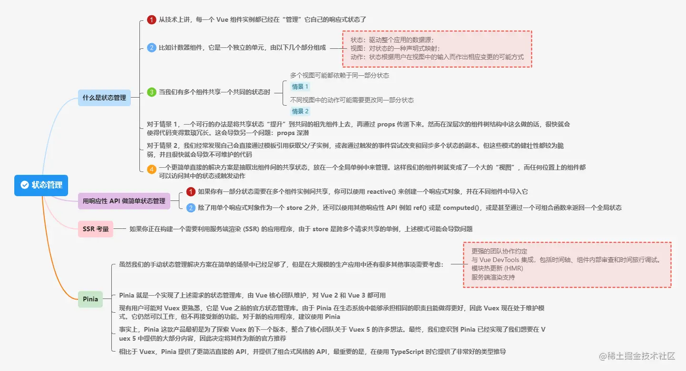
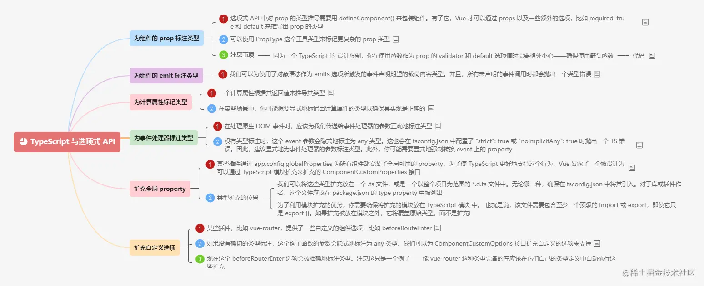
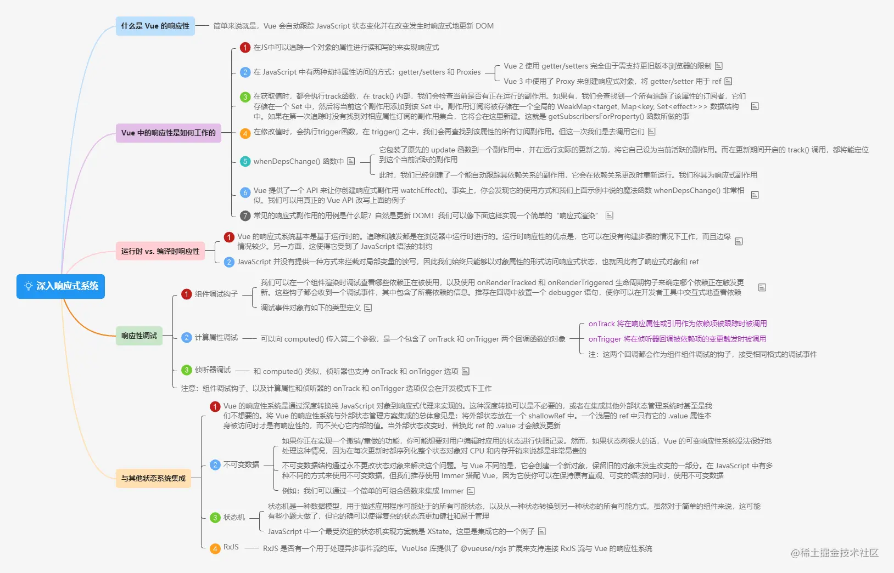

# 焕然一新的 Vue 3 中文文档要来了

> 原文链接：https://juejin.cn/post/7077701166397653028

2022年03月22日 07:39 

新文档地址：[vuejs.org](https://link.juejin.cn/?target=https%3A%2F%2Fvuejs.org%2F)

中文版翻译：[staging-cn.vuejs.org](https://link.juejin.cn/?target=https%3A%2F%2Fstaging-cn.vuejs.org%2F)

看完本篇你将有`2`点**收获**：

> 1. 了解新文档的新变化
> 2. 收获一份 `Vue 3` 新文档学习笔记（`50`张思维导图，附原图及原 `xmind` 文档）

# 前言

大家好，我是`LBJ`，最近参与了 `Vue 3`新文档的翻译和校验工作 ([vuejs/docs contributor](https://link.juejin.cn/?target=https%3A%2F%2Fgithub.com%2Fvuejs%2Fdocs%2Fgraphs%2Fcontributors) 和 [docs-zh-cn contributor](https://link.juejin.cn/?target=https%3A%2F%2Fgithub.com%2Fvuejs-translations%2Fdocs-zh-cn%2Fgraphs%2Fcontributors))

我们知道 `Vue 3` 新文档 ( [`vuejs.org`](https://link.juejin.cn/?target=https%3A%2F%2Fvuejs.org%2F) ) 已经发布一个多月了，但那是英文版的，不知道你看了没？

没有看，那就有福了！**中文版翻译**要来了🎁

为什么说它要来了呢？

一是，原 `Vue 3` 中文文档 ( [v3.cn.vuejs.org](https://link.juejin.cn/?target=https%3A%2F%2Fv3.cn.vuejs.org%2F) ) 尤大已经标注：**旧版**

二是，新文档`vuejs.org` 对应的中文版翻译已经将 *英文版中稳定的页面* 翻译完毕！而且前天官方已经将 `banner` 中的移除 **编写中**、**仅供预览** 等字样，这意味着新的中文文档已经可以开始供大家阅读了

因此，**焕然一新的 `Vue 3` 中文文档它来了**，和我一起先睹为快，看看文档都有哪些新变化吧

以下正文内容将分为两部分：

1. 新文档的新变化
2. `Vue 3` 新文档学习笔记

# 一、新文档的新变化

一图简单小结了`10`点主要的变化，如下

### 1. 新增了深色模式

### 2. 响应式设计

### 3. 在指引、教程和范例中新增API风格切换功能（选择Options或者Composition API）

### 4. 全新的互动教程

### 5. 新增了例子,包括7GUIs的实现

### 6. 更快的查找API

### 7. 重做了指引

#### 重写了 TypeScript 指引

#### 重写了深入响应式系统

#### 重写了渲染机制

#### 全新的可组合函数指引

#### 新的工具链指引

#### 新的性能指引

### 8. 单页面导航+智能预读取视口中的链接

### 9. 使用 VitePress 构建

### 10. 自动水合部分静态内容

# 二、新文档学习笔记

## 开始

### 简介

### 快速开始

## 基础

### 创建 Vue 应用

### 模板语法

### 响应式基础

### 计算属性

### 类与样式绑定

### 条件渲染

### 列表渲染

### 事件处理

### 表单输入绑定

### 生命周期钩子

### 侦听器

### 模板 ref

### 组件基础

## 深入组件

### 组件注册

### Props

### 组件事件

### 透传 attribute

### 插槽

### 依赖注入

### 异步组件

## 可重用性

### 可组合函数

### 自定义指令

### 插件

## 内置组件

### Transition

### TransitionGroup

### KeepAlive

### Teleport

### Suspense

## 升级规模

### 单文件组件

### 工具链

### 路由

### 状态管理

### 测试

### 服务端渲染 (SSR)

## 最佳实践

### 生产环境部署

### 性能

### 无障碍访问

### 安全

## 与TS

### 搭配 TypeScript 使用 Vue

### TypeScript 与组合式 API

### TypeScript 与选项式 API

## 进阶

### 多种方式使用 Vue

### 组合式 API FAQ

### 深入响应式系统

### 渲染机制

### 渲染函数 & JSX

# 附件

- 已将上述思维导图原图及原 `xmind` 文档上传到 `github`，如有需要可自行下载：[传送门](https://github.com/jCodeLife/mind-map/tree/master/Vue3%E6%96%B0%E6%96%87%E6%A1%A3)

# 补充说明

看新的中文文档时，可能你会遇到一些问题，比如有些页面未翻译等等。不要诧异，因为中文版非正式上线，可能存在问题，截止目前仅集中翻译了`src\guide`目录下的文档，正式上线的英文版也还在更新中，所以之后会增加其他稳定页面的翻译和校验，还有很多工作，欢迎一起参与进来🤞

# 结语

以上是本文的所有内容，如有问题欢迎指正 🤞