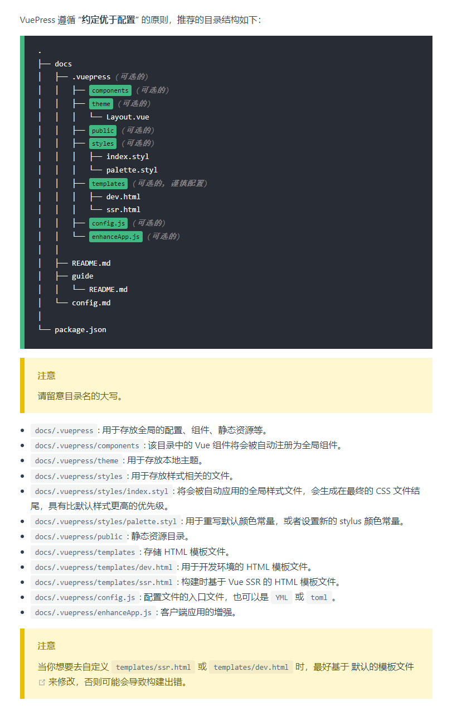

# 使用 VuePress 搭建在线笔记

**提示:** 关于 VuePress 的详细讲解请参见官网文档. 下面安装步骤的说明几乎都来自官网文档.

## 1 安装 Yarn
使用 npm 安装 yarn: `npm install --global yarn`, 检测安装成功与否: `yarn --version`

## 2 创建在线笔记仓库

在 github 上创建一个名为 `1033-docs` 的仓库, 将来要访问的所有在线笔记, 都在这个仓库内.

**Hint:** `1033-docs` （<repo>）仓库中只放 Github 在线各仓库中已经有体系和结构的笔记，比如 Mathematics-learning 中的高中数学笔记，1033-master-blog 中的 Quo 文集...... 零散内容的笔记仍放置在各自的仓库中。


## 3 拉取仓库到本地并初始化

拉取第二步创建的 1033-docs 到本地, 然后进入文件夹下, 使用 yarn 或者 npm 包管理器进行初始化

```sh
yarn init  # npm init
```
## 4 安装 VuePress 本地依赖

使用以下代码将 VuePress 安装为本地依赖, 官网说不推荐全局安装 VuePress
```sh
yarn add -D vuepress  # npm install -D vuepress
```
注意: 如果你的现有项目依赖了 webpack 3.x，我们推荐使用 Yarn 而不是 npm 来安装 VuePress。因为在这种情形下，npm 会生成错误的依赖树。

## 5 创建根文件夹 docs 和主页文件 README.md

在当前仓库中创建一个 docs 文件夹, 然后进入创建一个 README.md 文件, 并给 README.md 创建内容, 你可以进入到对应的文件夹中操作, 但是官网给出的命令行写法如下:
```shell
mkdir docs && echo '# Hello VuePress' > docs/README.md
```
目前为止我们的目录结构如下:
```
.
├── docs
│   ├── README.md
├── node_modules
├── package.json (第 3 步 yarn init 创建时生成)
└── yarn.lock
```

## 6 在 `package.json` 中添加一些 scripts. 

这一步是可选的, 但是 VuePress 官网文档推荐写上. 在上下文中, 会默认这些 scripts 已经被添加.
```json
{
    "scripts": {
        "docs:dev": "vuepress dev docs",
        "docs:build": "vuepress build docs"
    }
}
```

## 7 在本地启动服务器
```sh
yarn docs:dev # npm run docs:dev
```

## 8 目录结构

> 见官网文档

> 

根据上图的官网文档，我们在 `1033-docs` 仓库的 `./docs/` 目录下添加上面的`.vuepress` 文件夹，并在其下面创建基本的 `config.js` 文件，`config.js` 中内容在下面添加, 先不要着急. 这里主要说一下, `.vuepress` 文件夹用来存放 vuepress 项目中需要全局使用的配置, 组件, 静态资源等。

### Add notes:

下面详细说一下笔记中的图片放置，以及在 markdown 中的正确正确路径书写方式。

根据官网的目录结构，静态资源建议放置在 

> `docs/.vuepress/public`: 静态资源目录。

建议：`docs/.vuepress/public/assets/` 下放图片，比如数学笔记的图片可以放在 `math-images` 内，英语笔记的图片放在 `english-images` 内。

在笔记的 markdown 文件中正确书写 img 路径的方式如下
```html
<!-- 1033-docs/docs/pages/high-school-math/4.md -->
<!-- 我们在本地 yarn build 后预览时是不需要添加 1033-docs 的仓库名的，但是如果要部署到 github 的当前仓库，就需要添加绝对路径 `/1033-docs/`，这个配置也即和 congif.js 中的 `base: '/1033-docs/'` 相同 -->
    

```


## 9 默认页面路由

> 见官网文档 

官网文档注释：
```json
{
    "scripts": {
        "docs:dev": "vuepress dev docs",
        "docs:build": "vuepress build docs"
    }
}
```
`scripts` 键表示可运行的脚本, 
- 第一个 `docs:dev` 在第 7 步已经见到过了, `yarn docs:dev` 表示我们在开发环境运行 vuepress 文档(development run vuepress documents)
- 第二个 `docs:build` 表示生成静态文件, 就是我们把整个项目使用 vuepress 构建成一个支持 PWA 的单文件, 整个项目(/笔记)完成后, 就需要运行这个代码生成最终的静态文件.


## 10 基本配置

### 基本文件
> 见官网文档：https://vuepress.vuejs.org/zh/guide/basic-config.html#%E9%85%8D%E7%BD%AE%E6%96%87%E4%BB%B6

配置 `config.js` 文件


### 主题配置

> 参见 [配置](https://vuepress.vuejs.org/zh/config/) 来查看所有可配置的选项。

注：上面官网的 `配置` 文件看起来很不方便，我在当前文档的同级目录中创建了同名的 `config.js.md` 配置文件文档，里面详细罗列了各个配置选项，请根据  [配置](https://vuepress.vuejs.org/zh/config/) 官网来查看。

