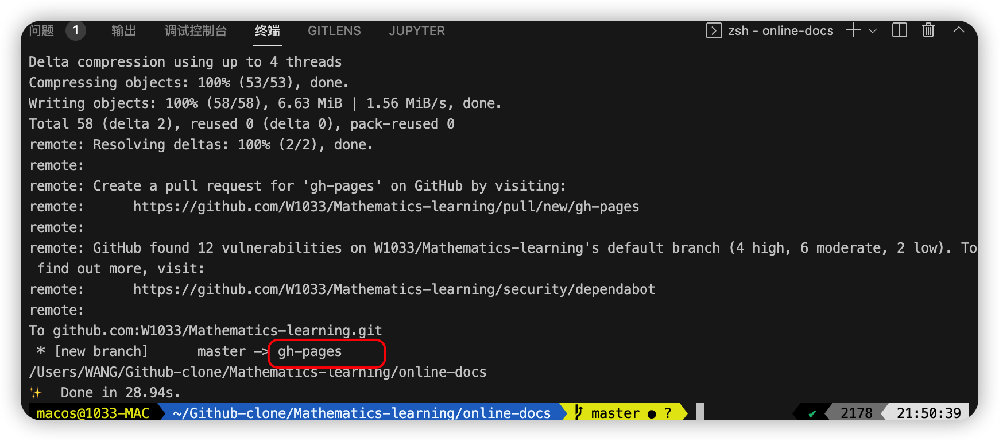

# 一步步搭建 VuePress 及优化

> 视频地址：https://www.bilibili.com/video/BV1vb411m7NY


## Pre-message (前置信息)

本地的第一个 vuepress 静态项目是在 Mathematics-learning 仓库内的 online-docs 文件夹下创建的，开发(dev)、编译(build) 以及部署时都要进入到 online-docs 文件夹下打开命令行，而不是在 Mathematics-learning 仓库下打开命令行。


## P1 01-准备开发环境 06:08 


## P2 02-vuepress 初体验 10:32 


## P3 03-导航栏 12:27 


## P4 04-侧边栏 14:38 


## P5 05-SEO？ 07:02 


## P6 06-更新时间 07:01 


## P7 07-发布到 github.io 07:54 
### 1. 指向 github 仓库
```js
// package.json
{
  "name": "online-docs",
  "version": "1.0.0",
  "main": "index.js",
  "repository": "git@github.com:W1033/Mathematics-learning.git",
  "license": "MIT",
  "author": "w1033",
  // ...
}
```

### 2. 修改 base

```js
// - /online-docs/docs/.vuepress/config.js
module.exports = {
    base: '/online-docs/',
}
```


### 3. 新增部署文件 (deploy.sh)
deploy.sh 文档见下面的

> 官网文档：https://vuepress.vuejs.org/zh/guide/deploy.html#github-pages

接着修改里面的 

```sh
# 如果发布到 https://<USERNAME>.github.io/<REPO>
# tip: 获得 W1033/Mathematics-learning.git 的方式是可以在命令行中使用： git config -l 命令
git push -f git@github.com:W1033/Mathematics-learning.git master:gh-pages
```
接着修改 `package.json` 中的 script 配置
```js
{
    "scripts": {
        "docs:dev": "vuepress dev docs",
        "docs:build": "vuepress build docs",
        "deploy": "bash deploy.sh"
    },
}
```
接着在命令行里执行：`yarn deploy`

执行完毕后，会在当前仓库中生成一个 `gh-pages` 的分支，如下图



### 4. GitHub Pages and Github Actions

> 官网文档：https://vuepress.vuejs.org/zh/guide/deploy.html#github-pages 的 GitHub Pages and Github Actions
>
> 
>
> 1. 创建 [Github access token (opens new window)](https://docs.github.com/en/authentication/keeping-your-account-and-data-secure/creating-a-personal-access-token);
> 2. 在你 github 仓库下，创建一个 [secrets (opens new window)](https://docs.github.com/en/actions/security-guides/encrypted-secrets)，填入刚创建的 `token`
>     + https://docs.github.com/en/actions/security-guides/encrypted-secrets#creating-encrypted-secrets-for-a-repository
>     + 说明：例如 name 可以写成 SECRET_KEY ，value 即为上面的 token.
> 3. 在项目根目录下的 `.github/workflows` 目录（没有的话，请手动创建一个）下创建一个 `.yml` 或者 `.yaml` 文件，如:`vuepress-deploy.yml`;
>
> ```yml
> name: Build and Deploy
> on: [push]
> jobs:
>   build-and-deploy:
>     runs-on: ubuntu-latest
>     steps:
>     - name: Checkout
>       uses: actions/checkout@master
> 
>     - name: vuepress-deploy
>       uses: jenkey2011/vuepress-deploy@master
>       env:
>         ACCESS_TOKEN: ${{ secrets.ACCESS_TOKEN }}
>         TARGET_REPO: username/repo
>         TARGET_BRANCH: master
>         BUILD_SCRIPT: yarn && yarn docs:build
>         BUILD_DIR: docs/.vuepress/dist
>         CNAME: https://www.xxx.com
> ```
>
> 详细使用方法，可以看[jenkey2011/vuepress-deploy(opens new window)](https://github.com/jenkey2011/vuepress-deploy/)
>


### 5. GitHub Pages and Travis CI

> 1. 在 `docs/.vuepress/config.js` 中设置正确的 `base`。
>
>     如果你打算发布到 `https://<USERNAME or GROUP>.github.io/`，则可以省略这一步，因为 `base` 默认即是 `"/"`。
>
>     如果你打算发布到 `https://<USERNAME or GROUP>.github.io/<REPO>/`（也就是说你的仓库在 `https://github.com/<USERNAME>/<REPO>`），则将 `base` 设置为 `"/<REPO>/"`。
>
> 2. 在项目的根目录创建一个名为 `.travis.yml` 的文件；
>
> 3. 在本地执行 `yarn` 或 `npm install` 并且提交生成的 lock 文件（即 `yarn.lock` 或 `package-lock.json`）；
>
> 4. 使用 GitHub Pages 部署提供程序模板并遵循 [Travis 文档 (opens new window)](https://docs.travis-ci.com/user/deployment/pages/)。
>
> ```yaml
> language: node_js
> node_js:
>   - lts/*
> install:
>   - yarn install # npm ci
> script:
>   - yarn docs:build # npm run docs:build
> deploy:
>   provider: pages
>   skip_cleanup: true
>   local_dir: docs/.vuepress/dist
>   github_token: $GITHUB_TOKEN # 在 GitHub 中生成，用于允许 Travis 向你的仓库推送代码。在 Travis 的项目设置页面进行配置，设置为 secure variable
>   keep_history: true
>   on:
>     branch: master
> ```
>
> ### [#](https://vuepress.vuejs.org/zh/guide/deploy.html#gitlab-pages-and-gitlab-ci)


### 4. 验证 gh-pages

### 5. 设置 website，便于他人访问


## P8 08-自定义域名 07:09 


## P9 09-启用 PWA 12:17 


## P10 10-vssue 评论 18:30 


## P11 11-back-to-top 02:15 


## P12 12-谷歌分析 04:24 


## P13 13-分割 config 04:57 


## P14 14-保护隐私信息 05:27 


## P15 15–Markdown 用法进阶 13:19 


## P16 16–自动化部署 Travis-CI 08:46 


## P17 17-逼格徽章 03:52 


## P18 18–图片缩放 04:11 


## P19 19–自动生成侧边栏 05:39 


## P20 20-algolia 替换默认搜索 19:17